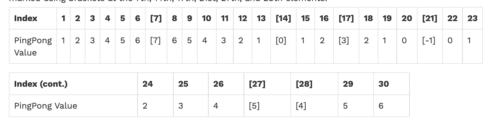

title:: 1.2.1 UCB CS61A Notes

- [Composing Programs - Textbook](https://composingprograms.com/)
- All lectures, labs, discussions, homework and projects are from UC Berkeley [CS61A sp20](https://inst.eecs.berkeley.edu/~cs61a/sp20/)
- # Chapter 1: Building Abstractions with Functions
	- ## 1.1 Getting Started
	  collapsed:: true
		- #### Expressions & Statements
			- Computer programs consist of instructions of either:
				- 1. Compute some value  
				  					2. Carry out some action
				- Statements typically describe actions.
				- Expressions typically describe computations.
		- #### Functions
			- Functions encapsulate logic that manipulates data.
		- #### Objects
			- An object seamlessly bundles together data and the logic that manipulates that data.
		- #### Some guiding principles of debugging are:
			- 1. **Test incrementally:** Every well-written program is composed of small, modular components that can be tested individually. Try out everything you write as soon as possible to identify problems early and gain confidence in your components.  
			  				2. **Isolate errors:** An error in the output of a statement can typically be attributed to a particular modular component. When trying to diagnose a problem, trace the error to the smallest fragment of code you can before trying to correct it.
			  				3. **Check your assumptions:** Interpreters do carry out your instructions to the letter — no more and no less. Their output is unexpected when the behavior of some code does not match what the programmer believes (or assumes) that behavior to be. Know your assumptions, then focus your debugging effort on verifying that your assumptions actually hold.
			  				4. **Consult others:** You are not alone! If you don't understand an error message, ask a friend, instructor, or search engine. If you have isolated an error, but can't figure out how to correct it, ask someone else to take a look. A lot of valuable programming knowledge is shared in the process of group problem solving.
	- ## 1.2 Elements of Programming
	  collapsed:: true
		- #### Execution procedure for `def` statements:
			- 1. Create a function with signature *<name>(<formal parameters>)*  
			  				2. Set the body of that function to be everything indented after the first line (only set not execute)
			  				3. Bind *<name>* to that function in the current frame.
	- ## 1.3 Defining New Functions
	  collapsed:: true
		- #### Procedure for calling/applying user-defined functions:
			- 1. Add a local frame, forming a *new* environment.  
			  				2. Bind the function's formal parameters to its arguments in that frame.
			  				3. Execute the body of the function in that new environment.
		- A function's *signature* has all the information needed to create a local frame.
		- #### Most important two things:
			- An environment is a sequence of frames.
			- A name evaluates to the value bound to that name in the earliest frame of the current environment in which that name is found.
		- Assignment is our simplest means of *abstraction*.
		- The possibility of binding names to values and later retrieving those values by name means that the interpreter must maintain some sort of memory that keeps track of the names, values, and bindings. This memory is called an environment.
		- #### Aspects of a functional abstraction:
			- The *domain* of a function is the set of arguments it can take.
			- The *range* of a function is the set of value it can return.
			- The *intent* of a function is the relationship it computes between inputs and outputs.
	- ## 1.4 Designing Functions
	  collapsed:: true
		- #### What makes a good function? #software-engineer
			- Each function should have exactly one job.
			- Don't repeat yourself is a central tenet of software engineering.
			- Functions should be defined generally.
		- #### Documentation
			- In Python, a function definition will often include documentation describing the function, called a *docstring*.
			- `>>> help(function_name)` will show its docstring.
	- ## 1.5 Control
	  collapsed:: true
		- Python includes several false values, including 0, None, and the boolean value False. All other numbers are true values.
		- Functions that perform comparisons and return boolean values typically begin with is, not followed by an underscore (e.g., *isfinite, isdigit, isinstance*, etc.).
	- ## 1.6 Higher-Order Functions #HOF
	  collapsed:: true
		- ### Functions are first-class:
			- Functions can be manipulated as values in our programming language.
		- ### Higher-order function:
			- A function that takes a function as an argument value or returns a function as a return value.
			- Express general methods of computation.
			- Remove repetition from programs.
			- Separate concerns among functions.
		- ### Nested Definitions
			- We can use functions as general methods:
				- ```python
				  def imporve(update, close, guess=1):
				    	while not close(guess):
				        	guess = update(guess)
				      return guess
				    
				  def golden_update(guess):
				    	return 1/guess + 1
				    
				  def square_close_to_successor(guess):
				    	return approx_eq(guess * guess, guess + 1)
				    
				  def approx_eq(x, y, tolerance=1e-15):
				    	return abs(x - y) < tolerance
				    
				  phi = improve(golden_update, square_close_to_successor)
				  ```
			- Cons of this approach:
				- 1. The global frame becomes cluttered with names of small functions, which must all be unique.
				  2. Users are constrained by particular function signatures.
			- We can use nested definitions to overcome these inconveniences.
			- An Example for computing the square root of a number.
				- ```python
				  def average(x, y):
				    	return (x + y) / 2
				  ```
				- This two-argument update function is incompatible with `improve`
				- ```python
				  def sqrt(a):
				    	def sqrt_update(x):
				        	return average(x, a/x)
				      def sqrt_close(x):
				        	return approx_eq(x * x, a)
				      return improve(sqrt_update, sqrt_close)
				  ```
		- ### [Example: Newton's Method](https://composingprograms.com/pages/16-higher-order-functions.html#example-newton-s-method)
		- ### Currying
			- We can use higher-order functions to convert `f(x, y)` to `g(x)(y)`
			- ```python
			  def curried_pow(x):
			    	def h(y):
			        	return pow(x, y)
			      return h
			  ```
			- Currying is useful when we require a function that takes in only single argument.
			- ```python
			  def map_to_range(start, end, f):
			    	while start < end:
			        	print(f(start))
			          start = start + 1
			          
			  map_to_range(0, 10, curried_pow(2))
			  ```
			- Using lambda:
				- ```python
				  def curry2(f):
				    	def g(x):
				        	def h(y):
				            	return f(x, y)
				          return h
				      return g
				    
				  "Using nested lambda"
				  curry2 = lambda f: lambda x: lambda y: f(x, y)
				  ```
		- ### Lambda Expressions
			- Lambda expressions are not common in Python, but important in general.
			- Lambda expressions in Python cannot contain statements at all.
		- ### Lambda Expressions v.s. `def` Statements
			- Only the `def` statement gives the function an intrinsic name.
		- ### Function Decorators
			- Python provides special syntax to apply higher-order functions as part of executing a `def` statement, called a decorator.
			- ```python
			  def trace(fn):
			    	def wrapped(x):
			        	print('->', fn, '(', x, ')')
			          return fn(x)
			      return wrapped
			    
			  @trace
			  def triple(x):
			    	return 3 * x
			  ```
			- This decorator is equivalent to:
			- ```python
			  def triple(x):
			    	return 3 * x
			    
			  triple = trace(triple)
			  ```
		- ### Why using Higher-order functions?
			- {{video https://www.youtube.com/watch?v=TC_JcE42R2s&list=PL6BsET-8jgYVi-r2ys_l0i-lZFOE9k3TL&index=3}}
		- ### Return
			- TODO  inverse function
				- ```python
				  def search(f):
				    	x = 0
				      while not f(x):
				  		x += 1
				      return x
				    
				  def is_three(x):
				    	return x == 3
				    
				  def square(x):
				    	return x * x
				    
				  def positive(x):
				    	return max(0, square(x) - 100)
				    
				  def inverse(f):
				    	"""Return g(y) such that g(f(x)) ->x"""
				      return lambda y: search(lambda x: f(x) == y)
				  ```
				- ```bash
				  >>> sqrt = inverse(square)
				  >>> square(16)
				  256
				  >>> sqrt(256)
				  16
				  ```
		- ### Self-Reference
			- **Self-reference** refers to a particular design of HOF, where a function eventually returns itself.
			- ```python
			  def print_all(x):
			    	print(x)
			      return print_all
			  ```
			- Self-referencing functions will oftentimes employ helper functions that reference the outer function, such as the example below.
			- ```python
			  def print_sums(n):
			  	print(n)
			      def next_sum(k):
			        	return print_sums(n+k)
			      return next_sum
			    
			  print_sums(1)(3)(5)
			  ```
		- ### Design
			- Naming Tips:
				- `n, k, i` - Usually integers
				- `x, y, z` - Usually real numbers
				- `f, g, h` - Usually functions
		- ### TODO hw02 q3 q4
			- [hw02 q3 q4](https://github.com/QiyanYu/UCB_CS61A/blob/main/hw02/hw02.py)
			- [Questions description](https://inst.eecs.berkeley.edu/~cs61a/sp20/hw/hw02/)
		- ### Disc02 Higher-Order Functions, Self Reference
			- 
		- ### Guerrilla 00: Higher-Order Functions, Environment Diagrams, Control
			- 
			- `is_palindrome` #algorithm #palindrome
				- ```python
				  def is_palindrome(n):
				    	x, y = n, 0
				      f = lambda: y * 10 + x % 10
				      while x > 0:
				        	x, y = x // 10, f()
				      return y == n
				  ```
	- ## 1.7 Recursive Functions
	  collapsed:: true
		- ### Definition:
			- A function is called *recursive* if the body of that function calls itself, either directly or indirectly.
		- ### The anatomy of a Recursive Function
			- The def statement header is similar to other functions.
			- Conditional statements check for base cases.
			- Base cases are evaluated without recursive calls.
			- Recursive cases are evaluated with recursive calls.
		- ### Three common steps in a recursive definition:
			- 1. Figure out your base case: The base case is usually the simplest input possible to the function.
			- 2. Make a recursive call with a simpler argument.
			- 3. Use your recursive call to solve the full problem.
		- One way to go understand recursion is to separate out two things: "internal correctness" and not running forever.
		- ### Sum Digits #algorithm #recursion
			- ```python
			  def split(n):
			    	return n // 10, n % 10
			    
			  def sum_digits(n):
			    	if n < 10:
			        	return n
			      else:
			        	all_but_last, last = split(n)
			          return sum_digits(all_but_last) + last
			  ```
		- ### Iteration vs. Recursion
			- Iteration is a special case of recursion.
		- ### Mutual Recursion
			- Luhn Algorithm: #recursion #mutual-recursion
				- ```python
				  def luhn_sum(n):
				  	if n < 10:
				        	return n
				      else:
				        	all_but_last, last = split(n)
				          return luhn_sum_double(all_but_last) + last
				        
				  def luhn_sum_double(n):
				    	all_but_last, last = split(n)
				      luhn_digit = sum_digits(2 * last)
				      if n < 10:
				        	return luhn_digit
				      else:
				        	return luhn_sum(all_but_last) + luhn_digit
				  ```
			- Another example of mutual recursion:
				- Consider a two-player game. The players take turns, removing either one or two pebbles from the table, and the player who removes the final pebble wins.
				- Alice always removes a single pebble.
				- Bob removes two pebbles if an even number of pebbles is on the table, and one otherwise.
				- ```python
				  def play_alice(n):
				    	if n == 0:
				        	print("Bob wins!")
				      else:
				        	play_bob(n-1)
				          
				  def play_bob(n):
				    	if n == 0:
				        	print("Alice wins!")
				      elif is_even(n):
				        	play_alice(n-2)
				      else:
				        	play_alice(n-1)
				  ```
		- ### Recursion and Iteration
			- Converting recursion to iteration:
				- **Can be tricky:** Iteration is a special case of recursion.
				- **Idea:** Figure out what state must be maintained by the iterative function.
				- Sum digits using iteration:
					- ```python
					  def sum_digits_iter(n):
					    	digit_sum = 0
					      while n > 0:
					        	n, last = split(n)
					          digit_sum += last
					      return digit_sum
					  ```
		- ### Cascade and Inverse Cascade: #recursion
			- ```python
			  def cascade(n):
			    	"""
			  	>>> cascade(1234)
			      1234
			      123
			      12
			      1
			      12
			      123
			      1234
			      """
			      if n < 10:
			        	print(n)
			      else:
			        	print(n)
			          cascade(n//10)
			          print(n)
			          
			          
			  def inverse_cascade(n):
			    	"""
			      >>> inverse_cascade(1234)
			      1 # grow
			      12
			      123
			      1234 # print
			      123 # shrink
			      12
			      1
			      """
			      grow(n)
			      print(n)
			      shrink(n)
			      
			  def f_then_g(f, g, n):
			    	if n: # in Python, all non-zero integers are True
			        	f(n)
			          g(n)
			          
			  grow = lambda n: f_then_g(grow, print, n//10)
			  shrink = lambda n: f_then_g(print, shrink, n//10)
			  ```
		- ### Tree Recursion
			- A function calls itself more than once.
			- {:height 234, :width 592}
		- ### Disc 03: Recursion #recursion
			- 
			- #### Q4: Is Prime
			  collapsed:: true
				- ```python
				  def is_prime(n):
				    	"""Returns True if n is a prime number and False otherwise.
				      	
				      >>> is_prime(2)
				      True
				      >>> is_prime(16)
				      False
				      """
				      def helper(i):
				        	if i > (n ** 0.5): # Could replace with i == n
				            	return True
				          elif n % i == 0:
				            	return False
				          else:
				            	return helper(i + 1)
				      return helper(2) # this is the same as k = 2
				  ```
			- #### Q5: Write a procedure *merge(n1, n2)* which takes numbers with digits in decreasing order and returns a single number with all of the digits of the two, in decreasing order. treat 0 as having no digits.
			  collapsed:: true
				- ```python
				  def merge(n1, n2):
				    	"""
				      Merges two numbers
				      >>>merge(31, 41)
				      4321
				      >>> merge(21, 0)
				      21
				      >>> merge(21, 31)
				      3211
				      """
				      if n1 == 0:
				        	return n2
				      elif n2 == 0:
				        	return n1
				      elif n1 % 10 < n2 % 10:
				        	return merge(n1 // 10, n2) * 10 + n1 % 10
				      else: 
				        	return merge(n1, n2 // 10) * 10 + n2 % 10
				  ```
		- ### HW03 #recursion
			- [HW03-GitHub](https://github.com/QiyanYu/UCB_CS61A/blob/main/hw03/hw03.py)
			- #### Q2: Ping-pong
			  collapsed:: true
				- 
			- #### Q3: Count change
			  collapsed:: true
				- Given a positive integer `total` , a set of coins makes change for `total` if the sum of the values of the coins is `total` . For example, the following sets make change for `7` :
					- 7 1-cent coins
					- 5 1-cent, 1 2-cent coins
					- 3 1-cent, 2 2-cent coins
					- 3 1-cent, 1 4-cent coins
					- 1 1-cent, 3 2-cent coins
					- 1 1-cent, 1 2-cent, 1 4-cent coins
			- #### Q6: Anonymous factorial
			  collapsed:: true
				- To write a recursive function, we have always given it a name using a `def` or assignment statement so that we can refer to the function within its own body. In this question, your job is to define fact recursively without giving it a name!
- # Chapter 2: Building Abstractions with Data
	- ## 2.1 Introduction
		- ### Divisors
			- ```python
			  def divisors(n):
			    	return [1] + [x for x in range(2, n) if n % x == 0]
			  ```
		- ### Execute String
			- ```python
			  >>> 'curry = lambda f: lambda x: lambda y: f(x, y)'
			  'curry = lambda f: lambda x: lambda y: f(x, y)'
			  >>> exec('curry = lambda f: lambda x: lambda y: f(x, y)')
			  >>> curry
			  <function <lambda> at xxxxx>
			  ```
-
-
-
- 