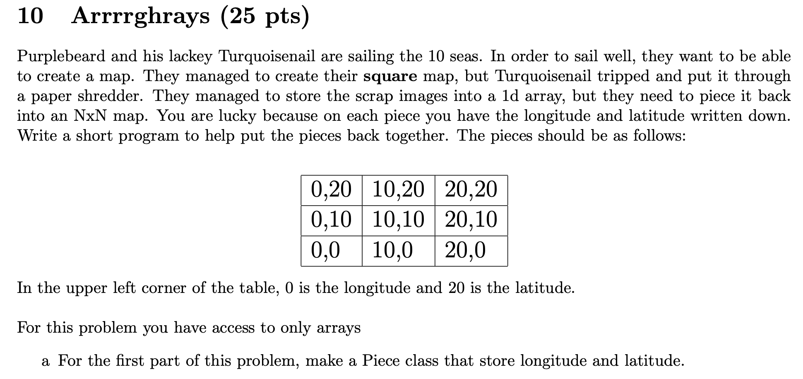

- 
- ```java
  public class Piece {
    	public int longitude;
    	public int latitude;
    	
    	public Piece (int x, int y) {
        	longitude = x;
        	latitude = y;
      }
  }
  ```
- 
- {:height 680, :width 776}
-