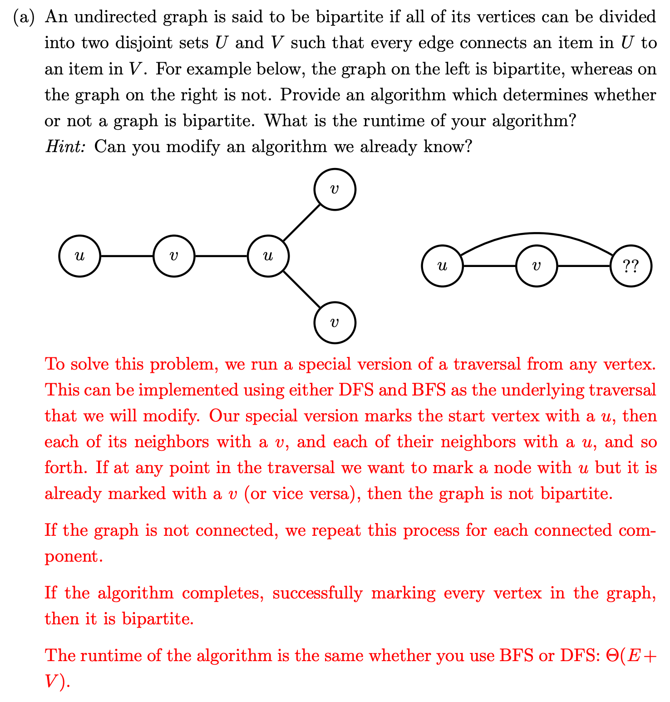

- # Basic
	- 
	- 
	- ### Multi-source BFS
- # Problem
	- ### 1. An undirected graph is said to be bipartite if all of its vertices can be divided into two disjoint sets U and V such that every edge connects an item in U to an item in V . For example below, the graph on the left is bipartite, whereas on the graph on the right is not. Provide an algorithm which determines whether or not a graph is bipartite. What is the runtime of your algorithm?
		- #### Hint: Can you modify an algorithm we already know?
		- 
- # Leetcode
	- [[103. Binary Tree Zigzag Level Order Traversal]]
	- [[104. Maximum Depth of Binary Tree]]
	- [[787. Cheapest Flights Within K Stops]]
	- [[1129. Shortest Path with Alternating Colors]]
	- [[1162. As Far from Land as Possible]]
	- [[2359. Find Closest Node to Given Two Nodes]]
-