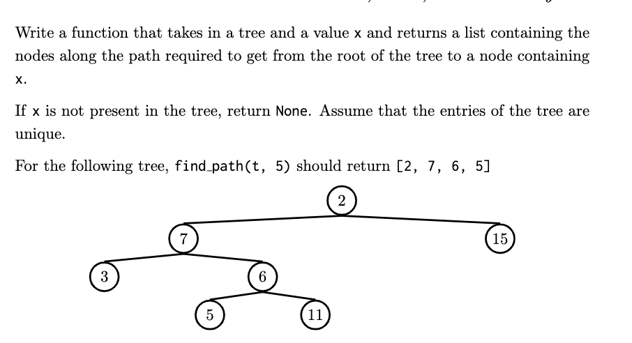

- [GitHub Link](https://github.com/QiyanYu/UCB_CS61A) of My solution for homework and course projects
- # Projects
	- ## CATS
		- [GitHub Link](https://github.com/QiyanYu/UCB_CS61A/blob/main/cats/cats.py)
		- [Description](https://inst.eecs.berkeley.edu/~cs61a/sp20/proj/cats/)
		- ### Problem 5
			- Using `max` or `min` with the optional `key` argument.
			- ```python
			  min(valid_words, key = lambda w: diff_function(user_word, w, limit))
			  ```
		- ### Problem 6
			- ```python
			  # With helper function
			  def sphinx_swap(start, goal, limit):
			    	def helper(s, g, sum):
			          if sum > limit:
			              return sum
			          elif len(s) == 0 or len(g) == 0:
			              return len(s) + len(g) + sum
			          elif s[0] == g[0]:
			              return helper(s[1:], g[1:], sum)
			          else:
			              return helper(s[1:], g[1:], sum+1)
			      return helper(start, goal, 0)
			  ```
			- ```python
			  # Without helper function
			  def sphinx_swap(start, goal, limit):
			    	if limit < 0:
			          return 0
			      elif len(start) == 0 or len(goal) == 0:
			          return len(start) + len(goal)
			      elif start[0] == goal[0]:
			          return sphinx_swap(start[1:], goal[1:], limit)
			      else:
			          return 1 + sphinx_swap(start[1:], goal[1:], limit-1)
			      
			  ```
			- tips:
				- ```python
				  elif len(s) == 0:
				    	return len(g) + sum
				  elif len(g) == 0:
				    	return len(s) + sum
				    
				  # A better solution:
				  elif len(s) == 0 or len(g) == 0:
				    	return len(s) + len(g) + sum
				  ```
			-
		- ### Problem 8
			- Using `zip()`
				- ```python
				  correct = 0
				  for i in range(len(typed)):
				      if typed[i] == prompt[i]:
				          correct += 1
				      else:
				          break
				  # ********** #
				  # Better way:
				  correct = 0
				  for t, p in zip(typed, prompt):
				    	if t == p:
				        	correct += 1
				      else:
				        	break
				  ```
- # Homework
	- ## hw02 q3 q4
		- [hw02 q3 q4](https://github.com/QiyanYu/UCB_CS61A/blob/main/hw02/hw02.py)
		- [Questions description](https://inst.eecs.berkeley.edu/~cs61a/sp20/hw/hw02/)
	- ## HW 03 #recursion #recap
		- [HW03-GitHub](https://github.com/QiyanYu/UCB_CS61A/blob/main/hw03/hw03.py)
		- ### Q2: Ping-pong
			- 
		- ### Q3: Count change
			- Given a positive integer `total` , a set of coins makes change for `total` if the sum of the values of the coins is `total` . For example, the following sets make change for `7` :
				- 7 1-cent coins
				- 5 1-cent, 1 2-cent coins
				- 3 1-cent, 2 2-cent coins
				- 3 1-cent, 1 4-cent coins
				- 1 1-cent, 3 2-cent coins
				- 1 1-cent, 1 2-cent, 1 4-cent coins
			- Second solution, using "linked list":
				- [linked list](https://composingprograms.com/pages/23-sequences.html#linked-lists)
				- ```python
				  def partitions(n,m):
				    	"""Return a linked list of partitions of n using parts of up
				      to m. Each partition is represented as a linked list.
				      """
				      if n == 0:
				        	return link(empty, empty)
				      elif n < 0 or m == 0:
				        	return empty
				      else:
				        	using_m = partitions(n-m, m)
				          with_m = apply_to_all_link(lambda s: link(m, s), using_m)
				          without_m = partitions(n, m-1)
				          return extend_link(with_m, without_m)
				        
				  def print_partitions(n, m):
				    	lists = partitions(n, m)
				      strings = apply_to_all_link(lambda s: join_link(s, " + "), lists)
				      print(join_link(strings, "\n"))
				  ```
		- ### Q6: Anonymous factorial
			- To write a recursive function, we have always given it a name using a `def` or assignment statement so that we can refer to the function within its own body. In this question, your job is to define fact recursively without giving it a name!
- # Labs
	- ## Lab 04 #recursion #recap
	  collapsed:: true
		- [lab 04](https://inst.eecs.berkeley.edu/~cs61a/sp20/lab/lab04/)
		- [lab04-GitHub](https://github.com/QiyanYu/UCB_CS61A/blob/main/lab04/lab04.py)
		- ### Q5: Maximum Subsequence
			- There are two key insights for this problem
				- You need to split into the cases where the ones digit is used and the one where it is not. In the case where it is, we want to reduce `l` since we used one of the digits, and in the case where it isn't we do not.
				- In the case where we are using the ones digit, you need to put the digit back onto the end, and the way to attach a digit `d` to the end of a number `n` is `10 * n + d` .
	- ## Lab 05: Python Lists, Data Abstraction, Trees
	  collapsed:: true
		- [GitHub Link: Lab 05](https://github.com/QiyanYu/UCB_CS61A/blob/main/lab05/lab05.py)
		- ### Q7: Sprout leaves
			- ```python
			  def sprout_leaves(t, values):
			    	# if is_leaf(t):
			      #     branches_list = []
			      #     for v in values:
			      #         branches_list.append(tree(v))
			      #     return tree(label(t), branches_list)
			      # else:
			      #     branches_list = []
			      #     for b in branches(t):
			      #         branches_list.append(sprout_leaves(b, values))
			      # return tree(label(t), branches_list)
			      
			      # *********************** #
			      # Using List Comprehensions:
			      if is_leaf(t):
			          return tree(label(t), [tree(v) for v in values])
			      else:
			          return tree(label(t), [sprout_leaves(b, values) for b in branches(t)])
			  ```
		- ### Q9: Add trees
			- zip() will stop at shortest list, so we need to add the difference of branches back.
				- ```python
				  def add_tree(t1, t2):
				   	branches1, branches2 = branches(t1), branches(t2)
				      label_add = (label(t1) + label(t2)
				      if is_leaf(t1) or is_leaf(t2):
				        	return tree(label_add, (branches1 + branches2))
				      else:
				        	len1, len2 = len(branches1), len(branches2)
				          bran_diff = branches1[len2:] if len1 > len2 else branches2[len1:]
				          return tree(label_add, [add_trees(b1, b2) for b1, b2
				                               in zip(branches1, branches2)] + bran_diff)
				  ```
	- ## Lab 06: Nonlocal & Generators
	  collapsed:: true
		- ### Q3:Scale
			- [description](https://inst.eecs.berkeley.edu/~cs61a/sp20/lab/lab06/#q3)
			- Using `yield from`
			- ```python
			  def scale(it, multiplier):
			    	"""Yield elements of the iterable it scaled by a number multiplier.
			      
			      >>> m = scale([1, 5, 2], 5)
			      >>> type(m) 
			      <class 'generator'>
			      >>> list(m)
			      [5, 25, 10]
			      
			      >>> m = scale(naturals(), 2)
			      >>> [next(m) for _ in range(5)]
			      [2, 4, 6, 8, 10]
			      """
			      yield from map(lambda x: x * multiplier, it)
			  ```
			- Cannot use `yield from [x * multiplier for x in it]`, since it cannot compute infinite sequences.
		- ### Q4: hailstone
			- [description](https://inst.eecs.berkeley.edu/~cs61a/sp20/lab/lab06/#q4)
			- Using recursion and `yield from`
			- ```python
			  def hailstone(n):
			      """
			      >>> for num in hailstone(10):
			      ...     print(num)
			      ...
			      10
			      5
			      16
			      8
			      4
			      2
			      1
			      """
			      def helper(x):
			        	if x == 1:
			            	return [x]
			          else:
			            	return [x] + helper(x//2 if x%2 == 0 else 3*x+1)
			  	yield from helper(n)
			  ```
- # Discussion
	- ## Disc01: Control, Environment Diagrams
	  collapsed:: true
		- 
	- ## Disc02: Higher-Order Functions, Self Reference
	  collapsed:: true
		- 
	- ## Disc 03: Recursion #recursion #recap
	  collapsed:: true
		- 
		- ### Q4: Is Prime
			- ```python
			  def is_prime(n):
			    	"""Returns True if n is a prime number and False otherwise.
			      	
			      >>> is_prime(2)
			      True
			      >>> is_prime(16)
			      False
			      """
			      def helper(i):
			        	if i > (n ** 0.5): # Could replace with i == n
			            	return True
			          elif n % i == 0:
			            	return False
			          else:
			            	return helper(i + 1)
			      return helper(2) # this is the same as k = 2
			  ```
		- ### Q5: Write a procedure *merge(n1, n2)* which takes numbers with digits in decreasing order and returns a single number with all of the digits of the two, in decreasing order. treat 0 as having no digits.
			- ```python
			  def merge(n1, n2):
			    	"""
			      Merges two numbers
			      >>>merge(31, 41)
			      4321
			      >>> merge(21, 0)
			      21
			      >>> merge(21, 31)
			      3211
			      """
			      if n1 == 0:
			        	return n2
			      elif n2 == 0:
			        	return n1
			      elif n1 % 10 < n2 % 10:
			        	return merge(n1 // 10, n2) * 10 + n1 % 10
			      else: 
			        	return merge(n1, n2 // 10) * 10 + n2 % 10
			  ```
	- ## Disc 04: Tree Recursion and Lists #recursion #recap
	  collapsed:: true
		- 
		- Q1, Q2: a tree recursive problem also involves iteration
		- **Q5: Max Product**
			- ```python
			  def max_products(s):
			    	"""Return the maximum product that can be formed using
			      non-consecutive elements of s.
			      >>> max_product([10, 3, 1, 9, 2]) # 10 * 9
			      90
			      >>> max_product([5, 10, 5, 10, 5]) # 5 * 5 * 5
			      125
			      >>> max_product([])
			      1
			      """
			      if s == []:
			        	return 1
			      else:
			        	return max(s[0] * max_product([2:]), max_product(s[1:]))
			  ```
			- If we include the current number, we cannot use the adjacent number.
			- if we don't use the current number, we try the adjacent number.
		- last question, **Whole Numbers**
			- *hole number:*
			- ```python
			  def check_hole_number(n):
			    	"""
			      >>> check_hole_number(123)
			      False
			      >>> check_hole_number(3241968)
			      True
			      >>> check_hole_number(3245968)
			      False
			      """
			      if n // 10 == 0:
			        	return True
			      return ((n//10) % 10) < (n % 10) and ((n//10) % 10) < ((n//100) % 10) \
			    		and check_hole_number(n//100)
			  ```
			- *mountain number:*
			- ```python
			  def check_mountain_number(n):
			    	"""
			      >>> check_mountain_number(103)
			      False
			      >>> check_mountain_number(153)
			      True
			      >>> check_mountain_number(3241968)
			      False
			      >>> check_mountain_number(2345986)
			      True
			      """
			      def helper(x, is_increasing):
			        	if x // 10 == 0:
			            	return True
			          if is_increasing and (x % 10) < ((x // 10) % 10):
			            	return helper(x // 10, is_increasing)
			          return (x % 10) > ((x // 10) % 10) and helper(x // 10, False)
			      return helper(n, True)
			  ```
	- ## Disc 05: Data Abstraction, Trees, Mutability
	  collapsed:: true
		- 
		- ### Q 1.3: #recursion
			- 
			- ```python
			  def find_path(tree, x):
			    	if label(tree) == x:
			        	return [x]
			      for b in branches(tree):
			        	path = find_path(b, x)
			          if path:
			            	return [label(tree)] + path
			  ```
		- ### Q 2.1:
			- ```python
			  lst1 = [1, 2, 3]
			  lst2 = lst1
			  # *******************
			  lst2.extend([5, 6]) # [1, 2, 3, 5, 6]
			  lst1.append([-1, 0, 1]) # [1, 2, 3, 5, 6, [-1, 0, 1]]
			  # *******************
			  lst3 = lst2[:] # lst3 copy lst1, but point to the same [-1,0.1] object
			  lst3[5] is lst2[5] # True
			  ```
			- `append()` vs `extend()` #python
				- `append(el)`: Adds `el` to the end of the list, and returns `None`
				- `extend(lst)`: Extends the list by concatenating it with `lst`, and returns `None`
			- After copy a list, the sublist inside the original list and copied list both point to the same object.
		- ### So Many Options (a): #recursion
			- Implement the following function `partition_options` which outputs all the ways to partition a number `total` using numbers no larger than `biggest`.
			- ```python
			  def partition_options(total, biggest):
			    	"""
			      >>> partition_options(2, 2)
			      [[2], [1, 1]]
			      >>> partition_options(3, 3)
			      [[3], [2, 1], [1, 1, 1]]
			      >>> partition_options(4, 3)
			      [[3, 1], [2, 2], [2, 1, 1], [1, 1, 1, 1]]
			      """
			      if total == 0:
			        	return [[]]
			      elif total < 0 or biggest == 0:
			        	return []
			      else:
			        	with_biggest = partiton_options(total-biggest, biggest)
			          without_biggest = partition_options(total, biggest-1)
			          with_biggest = [[biggest] + elem for elem in with_biggest]
			          return with_biggest + without_biggest
			  ```
		- ### So Many Options (b): #recursion
			- Return the minimum number of elements from the list that need to be summed in order to add up to `T`.The same element can be used multiple times in the sum. For example, for `T = 11` and `lst = [5,4,1]` we should return 3 because at minimum we need to add 3 numbers together (5, 5, and 1). You can assume that there always exists a linear combination of the elements in `lst` that equals `T`.
			- ```python
			  def min_elements(T, lst):
			    	"""
			      >>> min_elements(10, [4, 2, 1]) # 4 + 4 + 2
			      3 
			      >>> min_elements(12, [9, 4, 1]) # 4 + 4 + 4
			      3
			      >>> min_elements(0, [1, 2, 3]) 
			      0
			      """
			      if T == 0:
			        	return 0
			      return min([1 + min_elements(T-i, lst) for i in lst if i <= T])
			  ```
	- ## Disc 06: Nonlocal, Iterators & Generators
		- 
		- ### [#A] Q 1.3 #recursion
			- Write a function that takes in no arguments and returns two functions, `prepend` and `get`, which represent the “add to front of list” and “get the ith item” operations, respectively.  **Do not use any python built-in data structures like lists or dictionaries.**You do not necessarily need to use all the lines.
			- ```python
			  def nonlocalist():
			    	"""
			      >>> prepend, get = nonlocalist()
			      >>> prepend(2)
			      >>> prepend(3)
			      >>> prepend(4)
			      >>> get(0)
			      4
			      >>> get(1)
			      3
			      >>> get(2)
			      2
			      >>> prepend(8)
			      >>> get(2)
			      3
			      """
			      get = lambda x: "Index out of range!"
			      def prepend(value):
			        	nonlocal get
			      	f = get
			          def get(i):
			            	if i == 0:
			                	return value
			              return f(i-1)
			  	return prepend, lambda x: get(x)
			  ```
- # Guerrilla
	- ## Guerrilla 00: Higher-Order Functions, Environment Diagrams, Control
		- 
		- `is_palindrome` #algorithm #palindrome
			- ```python
			  def is_palindrome(n):
			    	x, y = n, 0
			      f = lambda: y * 10 + x % 10
			      while x > 0:
			        	x, y = x // 10, f()
			      return y == n
			  ```
	- ## Guerrilla 01: Python Lists, Recursion, Tree Recursion
		- 
	- ## Guerrilla 02: Data Abstraction, Trees, Nonlocal, Iterators & Generators
		- 
- # Misc
	- ## Sp18 Midterm 2 Problem 4(b): #recursion
		- Implement `combo`, which takes two non-negative integers `a` and `b`. It returns the smallest integer that contains all of the digits of `a` in order, as well as all of the digits of `b` in order.
		- ```python
		  def combo(a, b):
		    	""" Return the smallest integer with all of the digits of a and b (in order)
		      
		      >>> combo(531, 432) # 45312 contains both _531_ and 4_3_2.
		      45312
		      >>> comnbo(531, 4321) # 45321 contains both _53_1 and 4_321.
		      45321
		      >>>combo(0, 321) # The number 0 has no digits, so 0 is not in the result.
		      321
		      """
		      if a == 0 or b == 0:
		        	return a + b
		      elif a % 10 == b % 10:
		        	return combo(a // 10, b // 10) * 10 + a % 10
		      return min(combo(a // 10, b) * 10 + a % 10,
		                 combo(a, b // 10) * 10 + b % 10)
		  ```
		- {{video https://youtu.be/Z3l0XAE2Cas?t=226}}
		- {{youtube-timestamp 226}}
-