title:: CS 61B Course Notes

- All lectures, readings, exams and discussions are from [sp21](https://sp21.datastructur.es/index.html) .
- # Lecture 1: Hello World Java
- # Lecture 2: Defining and Using Classes #java
	- ## **Instance variables/non-static variables**:
		- These must be declared inside the class.
		- In Java, instance variables or non-static variables must be declared inside the class, unlike Python or Matlab. #java #language-comparison
	- ## **Static method and variables** #java
		- All variables inside the static method must be static.
		- Each variables inside the instance method may be static variables.
- # Lecture 5: SLList, Nested Classes, Sentinel Nodes
  collapsed:: true
	- ## **Null** #null
		- [[Languages: Undefined vs Null]]
	- ## [Sentinel Nodes](https://joshhug.gitbooks.io/hug61b/content/chap2/chap22.html) #linked-list
		- We want to keep complexity under control wherever possible. So we need to eliminate special conditions when programming.
	- ## **Golden Rule of Equals** #object #equal
	  id:: 6227ab55-ec12-4e3a-a354-4d57cce5c892
		- Every time you assign a value (make a `=`) or passing the parameter, they are copied the bits from the original variable to the destination. As know as **copied by value**.
		- ((62a14703-246b-4725-8e4a-aa9ac67e4d52))
	- ## **Static Nested class** #java #static-function
		- ```java
		   /** Returns the number of items in the list using recursion. */
		   public int size() {
		     /* Your Code Here! */
		     return size(first);
		   }
		   
		  private static int size(IntNode x) {
		     	if (x.next == null) {
		  	   	return 1;
		      }
		  	return 1 + size(x.next);
		  }
		  ```
- # Lecture 6: DDlists, Arrays
  collapsed:: true
	- ## Two-sentinel or Circular Doubly Linked List #double-linked-list
		- Circular may be better style to implement the Doubly Linked List.
	- ## Generic Types #generic #java
		- Generics only work with reference types. If you need to instantiate a generic over a primitive type, use `Integer`, `Double`, `Character`, `Boolean`, `Long`, `Short`, `Byte`, or `Float` instead of their primitive equivalents.
	- ## Arrays vs. Classes #arrays #class #java
		- ### The key differences between memory boxes:
			- Array boxes are numbered and accessed using `[]` notation, and class boxes are named and accessed using dot notation.
			- Array boxes must all be the same type. Class boxes can be different types.
		- ### One particularly notable impact of these difference between memory boxes:
			- `[]` notation allows us to specify which index we'd like at runtime.
			- **By contrast**, specifying fields in a class is not something we do at runtime.
				- ```java
				  String fieldOfInterest = "mass";
				  Planet p = new Planet(6e24, "earth");
				  double mass = p[fieldOfInterest];
				  ```
			- If we tried compiling this, we'd get a syntax error.
				- ```bash
				  $ javac classDemo
				  FieldDemo.java:5: error: array required, but Planet found 
				  	double mass = earth[fileldOfInterest];
				  ```
			- The same problem occurs if we try to use dot notation:
				- ```java
				  String fieldOfInterest = "mass";
				  Planet p = new Planet(6e24, "earth");
				  double mass = p.fieldOfInterest;	
				  ```
			- There is a way to specify desired fields at runtime call *reflection* ((6227ab55-bb8a-4ef6-b3aa-03ff311acc1c))
		- ### Cannot use dot notation at runtime in Java, use *reflection* instead. #reflection #java
		  id:: 6227ab55-bb8a-4ef6-b3aa-03ff311acc1c
			- In Java, it is considered very bad coding style for typical programs (reflection).
			- In general, programming languages are partially designed to limit the choices of programmers to make code simpler to reason about. By restricting these sorts of features to the special Reflections API, we make typical Java programs easier to read and interpret.
			- [Oracle Refection](https://docs.oracle.com/javase/tutorial/reflect/member/fieldValues.html)
	- ## **Java Arrays vs. Other Languages** #language-comparison
		- Have no special syntax for "slicing" (such as in Python).
		- Cannot be shrunk or expanded (such as in Ruby).
		- Do not have member methods (such as in JavaScript).
		- Must contain values only of the same type (unlike Python).
- # Lecture 7: Alists, Resizing, vs. SLists
  collapsed:: true
	- ## **Alists:**
		- `AList` is an array based list to make `get()` method more quickly which compared to `DDList`.
	- ## **Resizing:**
		- To make sure we have enough capacity to accommodate the new data. We need to build a new array for storing them.
		- When dealing with resizing, an `AList` should not only be efficient in time, but also efficient in space.
			- Define the "usage ratio" `R = size / items.length`
			- Typical solution: Half array size when R < 0.25
	- ## **Generic `AList`:** #java #generic
		- Java does not allow to create an array of generic objects due to an obscure issue with the way generics are implemented.
		- We cannot do:
		  ```java
		  Item[] items = new Item[8];
		  ```
		- Instead, we have to use `casting`:
		  ```java
		  Item[] items = (Item[]) new Object[8];
		  ```
		- This will yield a compilation warning, but it's ok.
	- ## **Nulling out deleted items:** #java #memory #garbage-collect #null
		- When storing objects, we'd better to set unwanted objects to `null`. Otherwise, as we keep references to unneeded objects, Java will not garbage collect the objects and will waste memory.
	- ## Double Array List
		- LATER project 1a
		  :LOGBOOK:
		  CLOCK: [2022-03-20 Sun 16:41:29]--[2022-03-20 Sun 16:41:30] =>  00:00:01
		  CLOCK: [2022-03-20 Sun 16:41:31]--[2022-03-20 Sun 16:41:32] =>  00:00:01
		  :END:
- # Lecture 8: Inheritance, Implements #inheritance #java
  collapsed:: true
	- ## **Override vs. Overloading:** #override #overload
		- ### **Overloading:** Methods with the same name but different signatures.
		- ### **Overriding:**
			- If a "subclass" has a method with the exact same signature as in the "superclass", we say the subclass **overrides** the method.
			- Even if you don't write @Override, subclass still overrides the method.
			- We should always mark every overriding method with the **@Override** annotation (although it's optional).
			- The only effect of this tag is that the code won't compile if it is not actually an overriding method.
			- Why use @Override?
				- Protests against typos.
				- Reminds programmer that method definition came from somewhere higher up in the inheritance hierarchy.
	- ## **Static Type vs. Dynamic Type:**
		- ### Every variable in Java has a "compile-time type", a.k.a. "static type".
			- This is the type specified at **declaration**. Never changes!
		- ### Variables also have a "run-time type", a.k.a. "dynamic type".
			- This is the type specified at **instantiation** (e.g. when using `new`).
			- Equal to the type of the object being pointed at.
		- ### Suppose we call a method of an object using a variable with:
			- compile-time type X
			- run-time type Y
		- ### Then if Y **overrides** the method, Y's method is used instead.
			- This is known as "dynamic method selection".
		- ### **IMPORTANT:** This does not work for overloaded methods!
			- 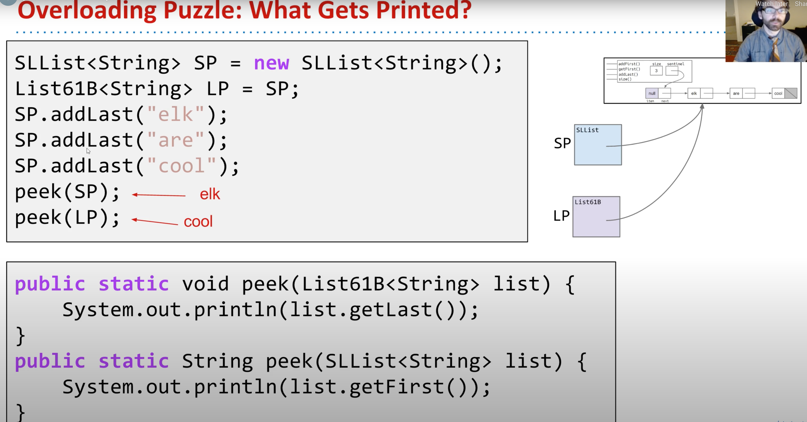
		- ### Dynamic method selection only happens for **overridden** methods.
			- When instance method of subtype overrides some method in supertype.
		- ### Dynamic method selection does not happen for **overloaded** methods.
			- When some other class has two methods, one for the supertype and one for the subtype.
			- Example: peek(SLList) vs. peek(List61B)
	- ## Interfaces
		- > An interface is a formal contract between a class and the outside world.
	- ## **Interface Inheritance vs. Implementation Inheritance:**
		- ### **Interface Inheritance:**
			- Refers to a relationship in which a subclass inherits all the methods/behaviors of the superclass. The interface includes all the method signatures, but not implementations. It's up to the subclass to actually provide those implementations.
			- Allows you to generalize code in a powerful, simple way.
		- ### **Implementation Inheritance:**
			- Refers to when you include `default` keyword and implement a real method.
			- Allows code-reuse: Subclasses can rely on superclasses or interfaces.
			- Gives another dimension of control to subclass designers: Can decide whether or not to override default implementations.
		- ### **Important:** In both cases, we specify "is-a" relationships, not "has-a".
			- Good: Dog implements Animal.
			- Bad: Cat implements Claw.
	- ## **The Dangers of Implementation Inheritance:**
		- Makes it harder to keep track of where something was actually implemented.
		- Rules for resolving conflicts can be arcane. (what if two interfaces both give conflicting default methods?)
		- Encourages overly complex code (Has-a vs. Is-a)
		- Breaks encapsulation!
- # Lecture 9: Extends, Casting, Higher Order Functions #inheritance #java
  collapsed:: true
	- Constructors are not inherited. However, Java will automatically make a call to the superclass's *no-argument* constructor. If you need to involve parameters in the super constructor, you have to call `super(x)` explicitly.
	- Every class extends from `Object`. Interfaces don't extends from `Object`.
	- The `Object` class provides operations that every `Object` should be able to do - like `.equals(Object obj)`, `.hashCode()`, and `toString()`.
	- Never use "Has-a" relationship, use "Is-a".
	- ## Complexity: The Enemy #abstraction #software-construction
		- ### Hierarchical abstraction.
			- Create **layers of abstraction**, with clear abstraction barriers!
		- ### "Design for change" (D.Parnas)
			- Organize program around objects.
			- Let objects decide how things are done.
			- **Hide information** others don't need.
	- ## Inheritance Breaks Encapsulation
		- 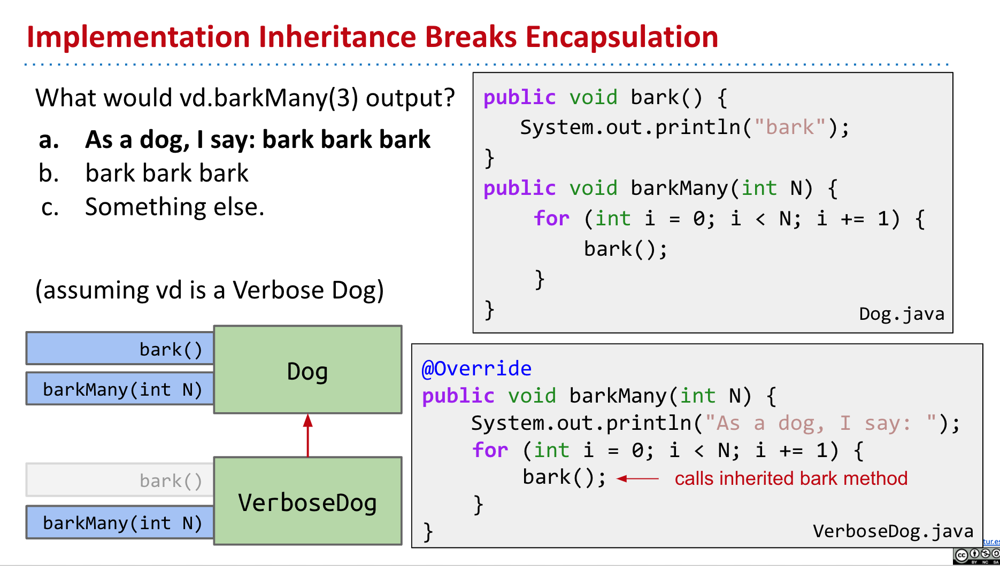
		- 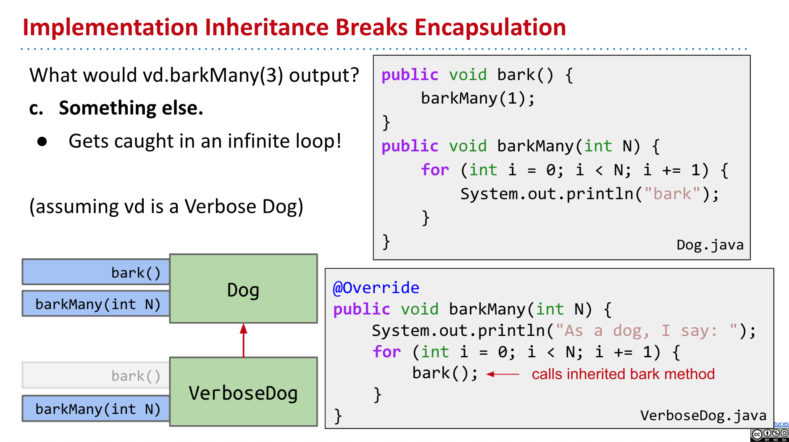
	- ## Dynamic Method Selection
		- If overridden, decide which method to call based on **run-time** type of variable (Also called dynamic type).
		- 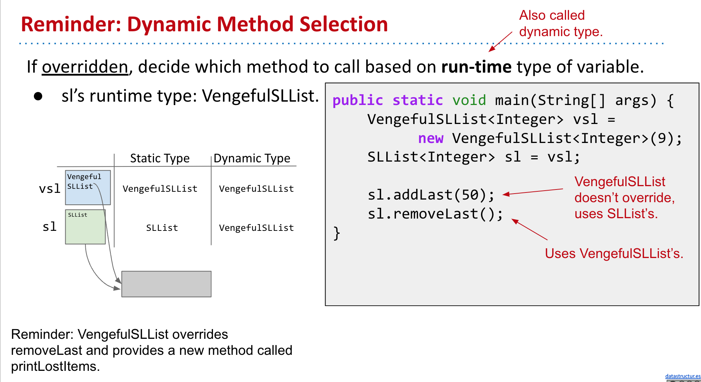
	- ## Compile-Time Type Checking
		- Compiler allows method calls based on **compile-time** type of variable (Also called static type).
		- Compiler also allows assignments based on compile-time types.
		- Compiler plays it as safe as possible with type checking.
		- 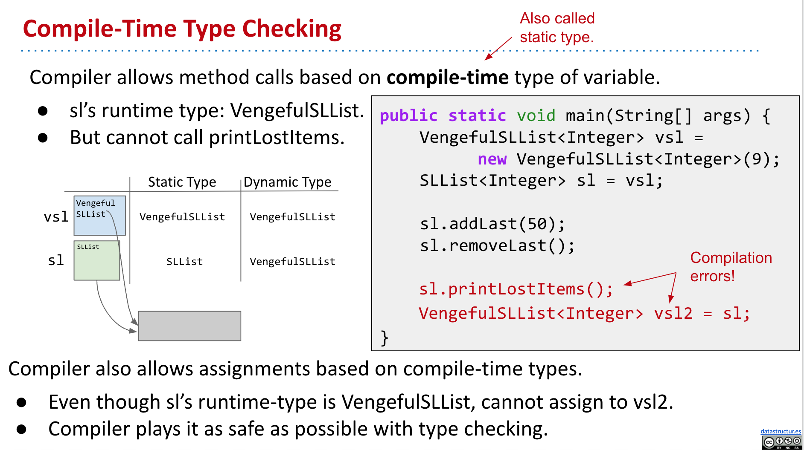
	- ## Casting
		- In Java, every object has a static type (defined at compile-time) and a dynamic type (defined at run-time). Our code may rely on the fact that some variable may be a more specific type than the static type.
		- Tells Java to treat expression as having a different compile-time type.
		- Effectively tells the compiler to ignore its type checking duties.
	- ## Higher Order Functions #functional-programming #language-comparison
		- Higher Order Function: A function that treats another function as data. (e.g. takes a function as input)
		- Old School (Java 7 and earlier): Memory boxes cannot contain pointers to functions.
		- LATER In modern Java, we can just write:
		- We can using inheritance to work around even when Java doesn't allow to do it directly:
			- In Python:
			  ```python
			  def tenX(x):
			    	return 10*x
			    
			  def do_twice(f, x):
			    	return f(f(x))
			  ```
			- In Old Java:
			  ```java
			  public interface IntUnaryFunction {
			    	int apply(int x);
			  }
			  
			  public class TenX implements IntUnaryFunction {
			    	public int apply(int x) {
			        	return 10 * x;
			      }
			  }
			  
			  public class HoFDemo {
			    	public static int do_twice(IntUnaryFunction f, int x) {
			        return f.apply(f.apply(x));
			      }
			  }
			  ```
	- ## Implementation Inheritance Cheatsheet
		- ### VengefulSLList extends SLList means a VenglefulSLList is-an SLList. Inherits all members!
			- Variables, methods, nested classes.
			- Not constructors.
			- Subclass constructor must invoke superclass constructor first.
			- Use super to invoke overridden superclass methods and constructors.
		- ### Invocation of overridden methods follows two simple rules:
			- Compiler allows memory box to hold any subtype.
			- Compiler plays it safe and only lets us do things allowed by **static** type.
			- For <ins>overridden</ins> methods (does not apply to **overloaded** methods) the actual method invoked is based on **dynamic** type  of invoking expression, e.g. Dog.maxDog(d1, d2).bark();
				- Everything else is based on static type, including overloaded methods.
			- Can use casting to overrule compiler type checking.
		- ### **Note: overloaded methods do not apply to dynamic type selection!!!**
		- ### **My way:**
			- First, using static check to make sure all variables and arguments types are matched.
			- Second, make sure the method exists and correct, record this specific function and check out all override function.
			- Lastly, doing dynamic selection, if there is an override function, execute it instead.
				- e.g. 
				  ```java
				  Class Dog extends Animal {
				  }
				  Dog d = new Dog();
				  ((Animal) d).makeNoise(d);
				  ```
				- Type-casting only affect at compile checking period. (static typing checking time)
				- When checking to see if a method exists in Animal, do we check for a `makeNoise(Dog)` method or a `makeNoise(Animal)` method? Yes. In particular, the compiler sees if ANY method exists that accepts Dog. If it happens to have both, then it’ll use `makeNoise(Dog)` because this is the most specifi**c version. THIS IS TOTALLY DISTINCT FROM DYNAMIC METHOD SELECTION.** Has nothing to do with **overriding**.
				- If animal has only `makeNoise(Animal)`, and Dog has both `makeNoise(Animal)` and `makeNoise(Dog)` which gets called?
					- The compiler checks, see that `makeNoise(Animal)` exists, and RECORDS THIS AS **THE** method signature.
					- As a result, we will use `makeNoise(Animal)` (in the dog class, because it **overrides**).
		- ### Great example for **casting and typing**
			- {{youtube https://youtu.be/cUL1LWVv984}}
			- {{youtube-timestamp 7}}
		- ### some exercises:
			- [sp21 - Inheritance and Implements Exam Prep (best exercise)](https://sp21.datastructur.es/materials/discussion/examprep04sol.pdf)
			- https://tbp.berkeley.edu/exams/5990/download/#page=5
			- https://tbp.berkeley.edu/exams/5975/download/#page=5
- # Lecture 10: Subtype Polymorphism vs. Higher order Functions (HoFs) #java
  collapsed:: true
  :LOGBOOK:
  CLOCK: [2022-04-22 Fri 21:03:13]--[2022-04-22 Fri 21:03:14] =>  00:00:01
  :END:
	- ## Hiding #hiding #java
		- What if a subclass has variables with the same name as a superclass?
		- What if subclass has a static method with the same signature as a superclass method?
			- For static methods, we do not use the term overriding for this.
		- These two practices above are called "hiding".
			- It is bad style.
			- There is no good reason to ever do this.
			- The rules for resolving the conflict are a bit confusing to learn.
	- ## Comparable and Comparator Summary #comparable-comparator
		- ### Interfaces provide us with the ability to make _**callbacks:**_
			- #### Sometimes a function needs the help of another function that might not have been written yet.
				- Example: max needs compareTo
				- The helping function is sometimes called a "callback".
			- Some languages handle this using explicit function passing.
			- In Java, we do this by wrapping up the needed function in an interface (e.g. `Arrays.sort` needs compare which lives inside the `comparator` interface)
			- #### `Arrays.sort` "calls back" whenever it needs a comparison.
				- Similar to giving your number to someone if they need information.
			- Since there's only room for one `compareTo` method, if we want multiple ways to compare, we must turn to `Comparator`.
	- ## Polymorphism #polymorphism
		- In Java, polymorphism refers to how objects can have many forms or types.
		- In object-oriented programming, polymorphism relates to how an object can be regarded as an instance of its own class, an instance of its superclass, an instance of its superclass's superclass, and so on.
- # Lecture 11: Exceptions, Iterators, Object Methods #java #object-methods
  collapsed:: true
	- ## Iterator & Iterable #iterator #iterable
		- ### To support the enhanced for loop:
			- Add an `iterator()` method to your class that returns an `Iterator<T>`.
			- The `Iterator<T>` returned should have a useful `hasNext()` and `next()` method.
			- Add `implements Iterable<T>` to the line  defining your class.
		- Iterators are the actual object we can iterate over. An example of this would be an array - we can iterate through the object in the array. Iterables are object that can produce an iterator that somehow iterate over their contents. If we have a class called CS61b, it itself cannot be iterated over, but it can produce an iterator that iterates over all of the students in the class.
	- ## toString #performance #optimization
		- Adding even a single character to a string creates an entirely new string, it's will really slow. Since String in Java is immutable.
		- Using `stringBuilder()` or something to concatenate strings.
		- Using `String.join()` to make a nice string output.
		  `"{" + String.join(", ", listOfItems) + "}";`
	- ## equals
		- Make sure to deal with `null` and non-ArraySet arguments!
		- Used `getClass` to check the class of the passed object.
	- ## ArraySet.of()
		- In order to use `Set<Integer> javaset = Set.of(5, 23, 42);` we should write a function called `.of()`
		- ```java
		  // inside ArraySet class we create this static method
		  // the first Type is generic method type
		  // ... is varied arguments
		  public static <Type> ArraySet<Type> of(Type... stuff) {
		    	ArraySet<Integer> ret = new ArraySet<Type>();
		    	for (Type x : stuff) {
		        	ret.add(x);
		      }
		    	return ret;
		  }
		  ```
- # Lecture 11-sp18: Libraries, Abstract Classes, Packages #java #interface #abstract-class
  collapsed:: true
	- ## Interfaces vs. abstract classes:
		- ### Interfaces:
			- All methods must be public.
			- All variables must be public static final.
			- Cannot be instantiated.
			- All methods are by default abstract unless specified to be `default`.
			- Can implement more than one interface per class.
		- ### Abstract Classes:
			- Methods can be public or private.
			- Can have any types of variables.
			- Cannot be instantiated.
			- Methods are by default concrete unless specified to be `abstract`.
			- Can only implement one per class.
		- ### When to use an Interface vs. Abstract Class
			- > You can think of an interface as defining a "can-do" or an "is-a" relationship, whereas an abstract class should be stricter "is-a" relationship.
			- The difference can be subtle, and you can often use one instead of the other.
			- In practice, large Java libraries often have a hierarchy of interfaces, which are extended by abstract classes that provided default implementations for some methods, and which are in turn ultimately implemented by concrete classes.
			  > interface  -> ... -> interface -> abstract class (with default methods) -> concrete classes
- # Lecture 12-sp18: Pre-Midterm1 Q&A #java
  collapsed:: true
	- ## Comparing strings for equality using == vs. equals: #object #equal
		- For reference types, we should use `.equals` to compare.
		- For primitive types, we can use `==` to compare.
		- **Note:** When two object are both `null`, `.equal()` will return `true`. So check they are not null before comparing if needed.
		- ((6227ab55-ec12-4e3a-a354-4d57cce5c892))
	- > In a non-destructive method which involves change or creation, it is impossible not to use new. We must create a new object for storing.
	- ## What can static methods access and not access? For a class X: #static-function
		- Static methods of X can access other static members of X.
		- Static methods of X cannot access instance members of "the current X", i.e. you can't do `this.value`, and can't do `this.addFirst()`.
		- Static method **CAN** instantiate Xs.
	- ## When called super constructor explicitly? #inheritance
		- If you want to use a different super class constructor, e.g. `super(int a, int b)`.
		- In a subclass, the no-argument super class constructor is automatically called.
		- If you create a one or more argument constructor, your free no-argument constructor is not given.
		- If super class doesn't have any no-argument constructor, then compile error result.
- # Lecture 13-sp18: Generics, Autoboxing #java
  collapsed:: true
	- ## Generics: #generic
		- There are **generic classes** and **generic methods**.
		- You can make only method generic.
			- ```java
			  public <K, V> K someFunction(K key, V value) {}
			  ```
		- Type upper bounds (e.g. `K` extends `Comparable<K>`).
	- ## Autoboxing #autoboxing
		- Primitives cannot be used as actual type arguments, each primitive type, there is a corresponding reference type called a wrapper class.
		- Wrapper types and primitives can be used almost interchangeably.
		- Arrays are never autoboxed/unboxed, e.g. an `Integer[]` cannot be used in place of an `int[]` (or vice versa).
		- Autoboxing/unboxing incurs a measurable performance impact!
		- Wrapper types use MUCH more memory than primitive types.
	- ## Immutability #immutable
		- Pros: Avoids bugs and makes debugging easier.
		- Cons: Must create a new object anytime anything changes.
		- Warning: Declaring a reference as **Final** does not make object immutable.
- # Lecture 15-sp18: Packages, Access Control, Objects #java
  collapsed:: true
	- ## Packages
		- ### To address the fact that classes might share names:
			- A package is a **namespace** that organizes classes and interfaces.
			- Naming convention: Package name starts with website address (backwards).
		- ### Using packages
			- To use a class from package A in a class from package B, we use the **canonical name**.
			- By using an **import** statement, we can use the **simple name** instead.
		- ### The Default Package
			- Any Java class without a package name at the top are part of the "default" package.
			- > You should avoid using the default package except for very small example programs.
			- Ensure that we never have two classes with the same name.
			- **Note:** You cannot import code from the default package!
	- ## JAR Files
		- Sharing dozens of `.class` files in special directories is annoying.
		- Can instead share a single `.jar` file that contains all of your `.class` files.
		- JAR files are really just zip files, but with some extra info added.
			- They do not keep your code sage!
			- Easy to unzip and transform back into `.Java` files.
		- Can run a "Main class" of a package from command line.
	- ## Build Systems
		- Ant
		- Maven
		- Gradle
	- ## Access Control
		- 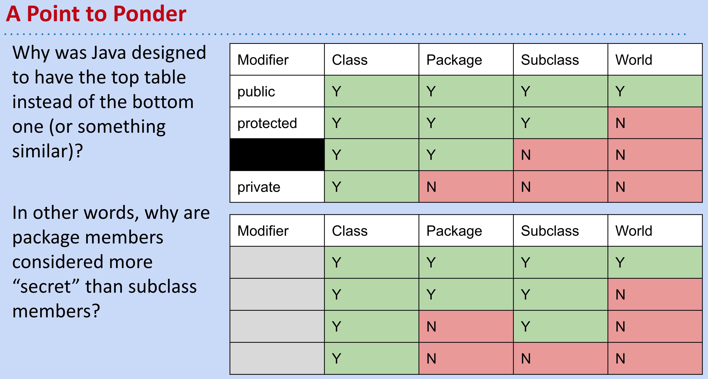
		- ### Package Private
			- This is the default access given to Java members if there is no explicit modifier written.
		- ### Why was Java designed to have the top table instead of the bottom one?
			- Extending classes you didn't write is common.
			- Packages are typically modified only by a specific team of humans.
		- ### Access is Based Only on Static Types
			- For interfaces, the default access for its methods is actually public, and not package-private. Additionally, like this subtitle indicates, the access depends only on the static types.
		-
- # Lecture 16-sp18: Encapsulation, Lists, Delegation vs. Extension
  collapsed:: true
	- ## Efficient Programming:
		- 1. Programming cost.
		  2. Execution cost.
	- ## Some helpful Java features for efficient programming #java #optimization
		- ### Packages:
			- **Pros:** Organizing, making things package private.
			- **Cons:** Specific.
		- ### Static type checking:
			- **Pros:** Checks for errors early, reads more like a story.
			- **Cons:** Not too flexible, (casting).
		- ## Inheritance:
			- **Pros:** Reuse of code.
			- **Cons:** "Is-a", the path of debugging gets annoying, can't instantiate, implement every method of an interface.
	- ## Delegation vs. Extension:
		- Write a `Stack` class using `Linked List` as its underlying data structure. Implement a single function: `push(Item x)`. There are three popular solutions:
		- **Solutions 1:** This solution uses extension. It simply borrow the methods from `LinkedList<Item>` and uses them as its own.
			- ```java
			  public class ExtensionStack<Item> extends LinkedList<Item> {
			  	public void push(Item x) {
			        	add(x);
			      }
			  }
			  ```
		- **Solutions 2:** This approach uses Delegation. It creates a `Linked List` object and calls its methods to accomplish its goal.
			- ```java
			  public class DelegationStack<Item> {
			    	private LinkedList<Item> L = new LinkedList<Item>();
			    	public void push(Item x) {
			        	L.add(x);
			      }
			  }
			  ```
		- **Solution 3:** This approach is similar to the previous one, except it can use any class that implements the `List` interface (`Linked List, ArrayList`, etc.)
			- ```java
			  public class StackAdapter<Item> {
			    	private List L;
			    	public StackAdapter(List<Item> worker) {
			        	L = worker;
			      }
			    	public void push(Item x) {
			        	L.add(x);
			      }
			  }
			  ```
		- ### Extension:
			- Extensions tends to be used when you know what is going on in the parent class. In other words, you know how the methods are implemented. Additionally, with extension, you are basically saying that the class you are extending from acts similarly to the one that is doing the extending.
		- ### Delegation:
			- Delegation is when you do not want to consider your current class to be a version of the class that you are pulling the method from.
- # Lecture 12: Command Line Programming, Git
  collapsed:: true
	- ## Command Line Compilation #cl
	- ## Git: A Command Line Tool #git
		- The git tool we've been using is a command line program.
			- Written in C.
			- Unlike Java, C code is typically compiled into a binary which doesn't require an interpreter.
			- Thus, instead of saying `java git status`, we just type `git status`.
	- ## Git #git
		- TODO Implement Git using Java/Rust.
		- Use a "Hash" as the Version Number.
			- The actual approach employed by Git is to use the "git-SHA1 hash" of a file as its version number.
				- The git-SHA1 hash is a deterministic function of the file's contents.
					- Two identical files will always have the same git-SHA1 hash.
					- git-SHA1 hash is 160 bit long.
			- Might have "collision" problem.
		- Added Benefit of SHA1-Hashing: Security
			- Git uses the git-SHA1 hash to verify file integrity.
			- Hard to sneak in a security vulnerability into a git repository.
		- ### Git Commits
			- #### Every commit in git stores (at least):
				- An author.
				- A date.
				- A commit message.
				- A list of all files and their versions.
					- Versions are git-SHA1 hashes.
				- The parent's commit ID.
			- #### The commit ID is the git-SHA1 hash of the commit.
				- You might object: "A commit is an object, not a file."
				- Imagine a file containing the author, date, commit message, list of files and their versions, and parent ID, then git-SHA1 hash that.
			- ```java
			  public class Commit {
			    	public String author;
			    	public String date;
			    	public String commitMessage;
			    	public String parentID;
			    	...
			  }
			  ```
			- #### Java has a built-in feature called `Serializable` that lets you store arbitrary objects. #java #serializable
				- Easy to use: Just make your class implement `Serializable`.
				- Then use our `Utils` class to write/read objects to/from files.
- # Lecture 13: Asymptotics I #algorithm #complexity
  collapsed:: true
	- ### Big-O notation
	- ### Big-theta notation
- # Lecture 14: Disjoint Sets #union-find
  collapsed:: true
	- ## Quick Find
		- Store connected components as set ids.
	- ## Quick Union
		- Store connected components as parent ids.
	- ## Weighted QuickUnion
		- Modify quick-union to avoid tall trees.
		- Also track the size of each set, and use size to decide on new tree root.
		- **vs. Heighted QuickUnion:** `connect()` function will be much more complex for Heighted QuickUnion.
	- ## Path Compression
		- On calls to `connect()` and `isConnected()`, set parent id to the root for all items seen.
	- |**Implementation**   | Runtime |
	  |---|---|
	  | ListOfSetsDS | O(NM) |
	  | QuickFindDS  | Θ(NM)  |
	  | QuickUnionDS  | O(NM)  |
	  | WeightedQuickUnionDS |  O(N + M log N) |
	  |  WeightedQuickUnionDSWithPathCompression | O(N + M α(N))  |
		- Runtimes are given assuming:
			- We have a DisjointSets object of size N.
			- We perform M operations, where an operation is defined as either a call to connected or isConnected.
- # Lecture 15: Asymptotics II #algorithm #complexity
  collapsed:: true
	- ## There is no magic shortcut for runtime complexity problems.
		- Runtime analysis often requires careful thought.
		- Remember these two math:
			- `1 + 2 + 3 + ... + Q = Q(Q+1)/2 = Θ(Q^2)` Sum of First Natural Numbers.
			- `1 + 2 + 4 + ... + Q (Q is a power of 2) = 2Q - 1 = Θ(Q)` Sum of First Powers of 2.
		- Strategies:
			- Find exact sum.
			- Write out examples.
			- Draw pictures.
	- ## Different solutions to the same problem, e.g. sorting, may have different runtimes.
		- In practice, log time nearly constant time.
		- `N^2` vs. `N logN` is an enormous difference.
		- Going from `N logN` to `N` is nice, but not a radical change.
- # Lecture 16: ADTs, Sets, Maps, BSTs #algorithm #bst
  collapsed:: true
	- ## Java Libraries:
		- 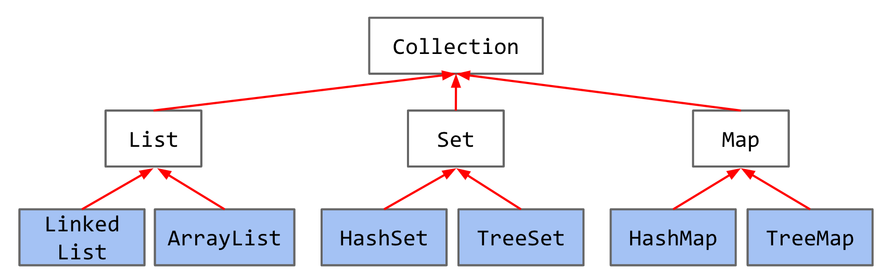
	- ## How to get `Tree` data structure intuitively
		- 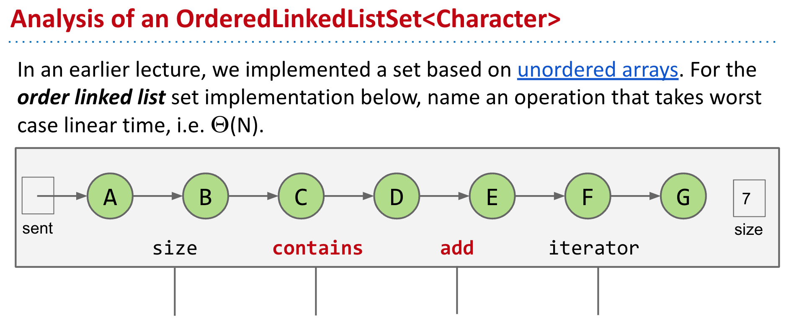
		- 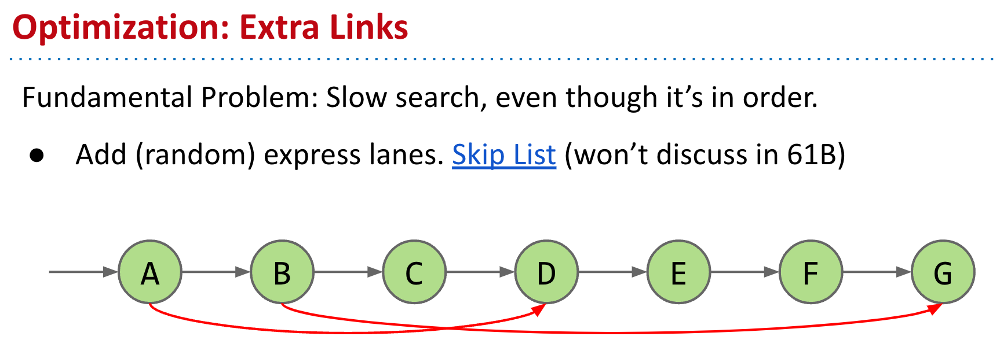
		- 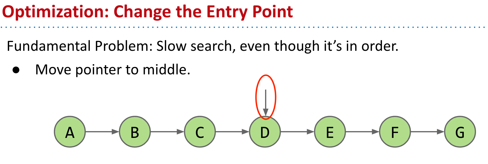
		- 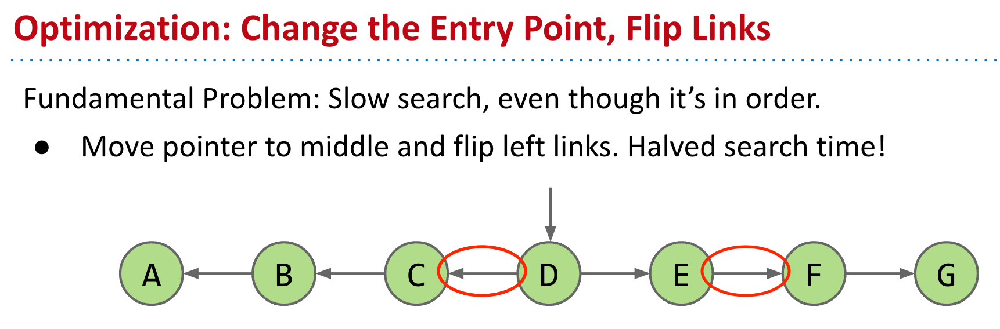
		- 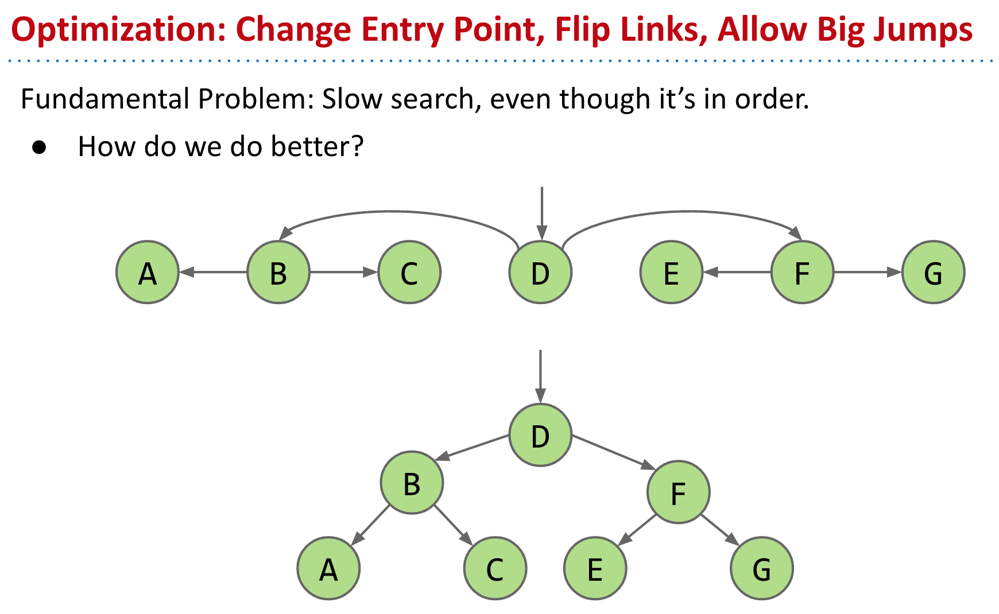
		-
- # Lecture 17: B-Trees (2-3, 2-3-4 Trees) #algorithm #b-tree
  collapsed:: true
	- ## BSTs have:
		- Worst case `Θ(N)` height.
		- Best case `Θ(log N)` height.
		- `Θ(log N)` height if constructed via random inserts.
		  id:: 6254f327-f6f3-4765-8bf9-16cea9f8e2ff
	- ## Real World BSTs:
		- Random trees have `Θ(log N)` average depth and height, they are bushy, not spindly.
		- But bad news: We can't always insert our items in a random order.
			- Data comes in over time, don't have all at once.
	- ## B-Tree
		- Splitting tree is a better name for B-tree.
		- `L`: Max number of items per node.
		- B-trees of order `L=3` are also called a 2-3-4 tree or a 2-4 tree.
		- B-trees of order `L=2` are also called a 2-3 tree.
		- B-trees are most popular in two specific contexts:
			- Small L (`L=2` or `L=3`): Used as a conceptually simple balanced search tree.
			- `L` is very large (say thousands): Used in practice for databases and filesystems (i.e. systems with very large records).
		- #### Two nice invariants:
			- All leaves must be the same distance from the source.
			- A non-leaf node with `k` items must have exactly `k+1` children.
		- These invariants guarantee the tree to be bushy.
		- Tree height: Between `~logL+1(N)` and `~log2(N)`.
			- Largest possible height is all non-leaf nodes have `1` item.
			- Smallest possible height is all nodes have `L` items.
			- Overall height is therefore `Θ(log N)`.
	- ## Summary:
		- BSTs have best case height `Θ(log N)`, and worst case height `Θ(N)`
		- B-Trees are a modification of the binary search tree that avoids `Θ(N)` worst case.
- # Lecture 18: Red Black Trees #algorithm #rb-tree
  collapsed:: true
	- 2-3 trees are a real pain to implement, and suffer from performance problem.
	- > "Beautiful algorithms are, unfortunately, not always the most useful." - Knuth
	- `LLRB`: Left-leaning Red Black Binary Search Tree.
	- 2-3 Tree and LLRB are structurally identical.
	- ## Building red-black BST:
		- When inserting: Use a red link.
		- If there is a right leaning "3-node", we have a **Left Leaning Violation**.
			- _Rotate left_ the appropriate node to fix.
		- If there are two consecutive left links, we have an **Incorrect 4 Node Violation**.
			- _Rotate right_ the appropriate node to fix.
		- If there are any _nodes with two red children_, we have a **Temporary 4 Node**.
			- _Color flip_ the node to emulate the split operation.
		- #### So rules:
			- Right red link -> rotate left
			- Two consecutive left links -> rotate right
			- Red left and red right -> color filp
	- ## Search Trees Summary:
		- **Binary search trees** are simple, but they are subject to imbalance.
		- **2-3 Trees (B Trees)** are balanced, but painful to implement and relatively slow.
		- **LLRBs** insertion is simple to implement (but delete is hard).
		- Java's TreeMap is a re-black tree (not left leaning).
			- Maintains correspondence with 2-3-4 tree (is not a 1-1 correspondence).
			- Allows glue links on either side.
			- More complex implementation, but significantly faster.
	- ## More:
		- Other self balancing trees: AVL trees, splay trees, treaps, etc. There are at least hundreds of different such trees.
		- There are other efficient ways to implement sets and maps entirely.
			- Other linked structures: Skip lists are linked lists with express lanes.
			- Other ideas entirely: Hashing is the most common alternative.
	-
- # Lecture 19: Hashing #algorithm #hashing
  collapsed:: true
	- ### Why using **hashing:**
		- Elements don't need to be comparable.
		- Great runtime performance.
		- Implementations of relatively simple.
	- ### Two separate parts of Hashing algorithm:
		- #### Computing a _hash function_ that transforms the search key into an array index.
			- Easy to compute.
			- Uniformly distributes the keys.
		- #### Since we have to face the possibility of collisions, the second part of a hashing search is a _collision-resolution_ process.
			- _separate chaining_.
			- _linear probing_.
	- Hashing is a classic example of a _time-space tradeoff_. Indeed, we can trade off time and memory in hashing algorithms by adjusting parameters, not by rewriting code.
	- ### The most commonly used method for **hashing integers** is called _modular hashing_:
		- we choose the array size _M_ to be prime and, for any positive integer key _k_, compute the remainder when dividing _k_ by _M_. This function is very easy to compute (`k % M` in Java) and is effective in dispersing the keys evenly between 0 and M-1.
		- Why `M` should be prime: If _M_ is not prime, it may be the case that not all of the bits of the key plays a role, which amounts to missing an opportunity to disperse the values evenly. (if the keys are base-10 numbers and `M` is `10^k`, then only the `k` least significant digits are used.)
		- Why `M` should be small: Lower cost to compute.
	- For **hashing floating-point numbers**: use modular hashing on the binary representation of the key.
	- For **hashing strings**:
		- ```java
		  int hash = 0;
		  for (int i = 0; i < s.length(); i++) 
		    	hash = (R * hash + s.charAt(i)) % M;		
		  ```
		- `R` should be sufficiently small that no overflow occurs and between `0` and `M-1`.
		- `R` uses a small prime integer such as `31` ensures that the bits of all the characters play a role.
	- A bad hash function is a classic example of a _performance bug:_ everything will work properly, but much more more slowly than expected.
	- The easiest way to ensure uniformity is to make sure that all the bits of the key play an equal role in computing every hash value; the most common mistake in implementing hash functions is to ignore significant numbers of the key.
	- ### Two Important Warnings When Using HashMaps/HashSets
		- Never store objects that can change in a `HashSet` or `HashMap`!
			- If an object's variables changes, then its `hashCode` changes. May result in items getting lost.
		- Never override `equals` without also overriding `hashCode`.
			- Can also lead to items getting lost and generally weird behavior.
			- `HashMap`s and `HashSet`s use equals to determine if an item exists in a particular bucket.
		-
- # Lecture 20: Heaps and PQs #algorithm #priority-queue
  collapsed:: true
	- Priority Queue is an Abstract Data Type that optimizes for handling minimum or maximum elements.
	- There can be space/memory benefit to using this specialized data structure.
	-
- # Lecture 21: Tree and Graph Traversals #algorithm #graph
  collapsed:: true
	- ### Trees are a more general concept.
		- File system tree.
	- ### Tree vs. Graph Traversal
		- | Tree        | Graph |
		  |-------------|-------|
		  | Level Order | BFS   |
		  | Preorder | DFS Preorder |
		  | Inorder |  |
		  | Postorder | DFS Postorder |
		- 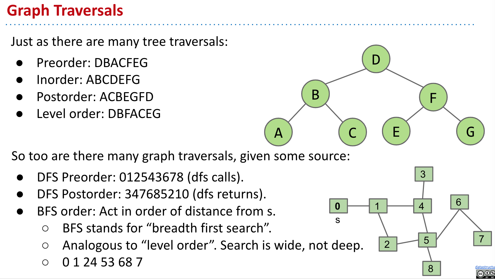
	- ### What good are all these traversals:
		- Preorder Traversal for printing directory listing.
		- Postorder traversal for gathering file sizes.
	- 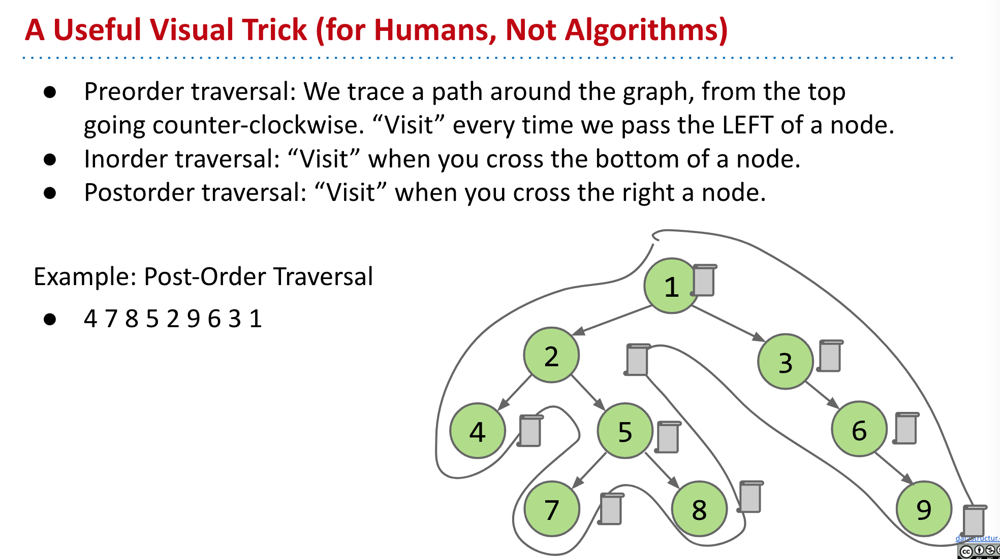
		- {{youtube https://youtu.be/wkkCVWn7au4?t=483}}
		- {{youtube-timestamp 483}}
- # Lecture 22: Graph Traversals and Implementations #algorithm #graph
  collapsed:: true
	- ### Graph printing runtime: (V is the number of vertices, E is the total number of edges.)
		- Best case: `theta(V)`.
		- Worst case: `theta(V^2)`.
		- All cases: `theta(V + E)`.
			- Create `V` iterators.
			- Print `E` times.
		- No matter what "shape" of increasingly complex graphs we generate, as V and E grow, the runtime will always grow exactly as `theta(V+E)`.
			- Example shape 1: Very **sparse** graph where E grows very slowly, e.g. every vertex is connected to its square: 2-4, 3-9, 4-16, etc.
				- E is `theta(sqrt(V))`, runtime is `theta(V+sqrt(V))`, which is just `theta(V)`. (best case)
			- Example shape 2: Very dense graph where E grows very quickly, e.g. every vertex connected to every other.
				- E is `theta(V^2)`, runtime is `theta(V+V^2)`, which is just `theta(V^2)`.(worst case)
	- ### Graph Problems:
		- #### s-t paths:
			- Find a path from s to every reachable vertex.
			- DFS
			- Runtime is `O(V+E)`:
				- Based on cost model: `O(E)` dfs calls and `O(V)` marked[w] checks.
				- Can't say `O(E)` because creating marked array.
				- Note, can't say `theta(V+E)`, example: Graph with no edges touching source.
			- Space is `theta(V)`:
				- Need arrays of length V to store information.
		- #### s-t shortest paths:
			- Find a shortest path from s to every reachable vertex.
			- BFS
			- Runtime is `O(V+E)`.
				- Based on same cost model: `O(E)` `.next()` calls and `O(V)` marked[w] checks.
			- Space is `theta(V)`.
				- Need arrays of length V to store information.
	- ### What graph traversal algorithm uses a stack rather than a queue for its fringe? #recursion #iteration
		- DFS traversal.
		- **ANY** recursive algorithm can be implemented using iteration and a stack.
		- In 61C, we'll learn how recursive calls are implemented at a low level using a stack, i.e. in REAL recursive code, there is an explicit stack being utilized.
- # Lecture 23: Shortest Paths #algorithm #dijkstra
  collapsed:: true
	- ### Algorithm Pseudocode:
		- #### Dijkstra's:
			- `PQ.add(source, 0)`
			- For other vertices `v`, `PQ.add(v, infinity)`
			- While PQ is not empty:
				- `p = PQ.removeSmallest()`
				- Relax all edges from p
		- **Relaxing** an edge p -> q with weight w:
			- `If distTo[p] + w < distTo[q]:`
				- `distTo[q] = distTo[p] + w`
				- `edgeTo[q] = p`
				- `PQ.changePriority(q, distTo[q])`
	- Dijkstra's is guaranteed to return a correct result if all edges are non-negative.
	- ### Algorithm Runtime:
		- Priority Queue operation count, assuming binary heap based PQ:
			- add: V, each costing `O(logV)` time.
			- removeSmallest: V, each costing `O(logV)` time.
			- changePriority: E, each costing `O(logV)` time.
		- Overall runtime: `O(V*logV + V*logV + E*logV)`.
			- Assuming E>V, this is just `O(E logV)` for a connected graph.
	- ### A* Algorithm #A*
		- Visit vertices in order of d(Denver, v) + h(v, goal), where h(v, goal) is an estimate of the distance from v to our goal NYC.
		- #### How do we get our estimate?
			- Estimate is an arbitrary heuristic h(v, goal).
			- heuristic: “using experience to learn and improve”
			- Doesn’t have to be perfect!
			- h(v, goal) DOES NOT CHANGE as algorithm runs.
		- **The choice of heuristic matters**, and if you make **a bad choice**, **A* can give the wrong answer.**
	- ### A* vs. Dijkstra's Algorithm
		- If edge weights are all equal, Dijkstra's algorithm is just breadth first search.
	- ### Summary: Shortest Paths Problems
		- Single Source, Multiple Targets:
			- Can represent shortest path from start to every vertex as a shortest paths tree with V-1 edges.
			- Can find the SPT using Dijkstra's algorithm.
		- Single Source, Single Target:
			- Dijkstra's is inefficient (searches useless parts of the graph).
			- Can represent shortest path as path (with up to V-1 vertices, but probably far fewer).
			- A* is potentially much faster than Dijkstra's.
				- Consistent heuristic guarantees correct solution.
- # Lecture 24: Minimum Spanning Trees #algorithm
	- ### Prim's Algorithm Runtime:
		- Priority Queue operation count, assuming binary heap based PQ:
			- Insertion: V, each costing `O(logV)` time.
			- Delete-min: V, each costing `O(logV)` time.
			- Decrease priority: E, each costing `O(logV)` time.
		- Overall runtime: `O(V*logV + V*logV + E*logV)`.
			- Assuming E>V, this is just `O(E logV)` for a connected graph.
	- ### Prim's vs. Dijkstra's
		- Prim’s and Dijkstra’s algorithms are exactly the same, except Dijkstra’s considers “distance from the source”, and Prim’s considers “distance from the tree.”
	- ### Kruskal's Runtime
		- 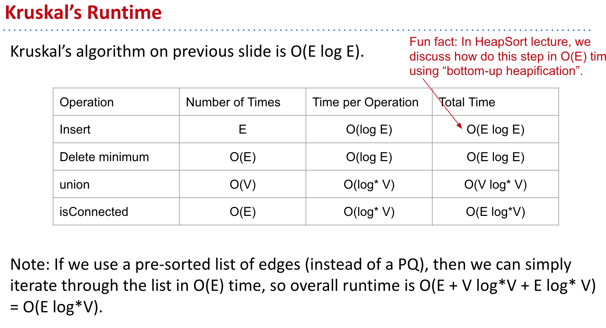
	- ### Shortest Paths and MST Algorithms Summary
		- 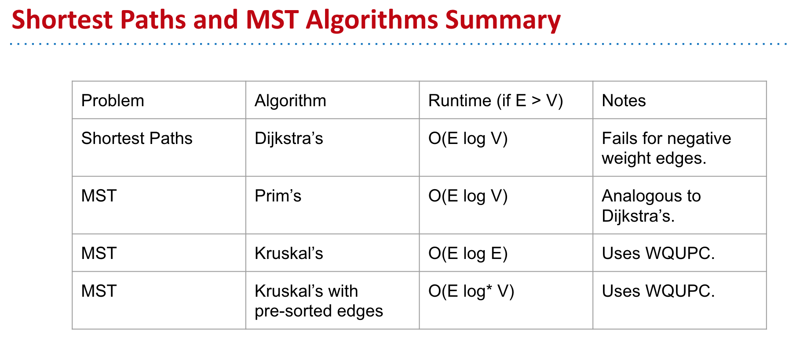
	-
- # Lecture 25: Range Searching and Multi-Dimensional Data #algorithm
	-
-
-
-
-
-
- # Guides
	- [[cs61b lecture guides]]