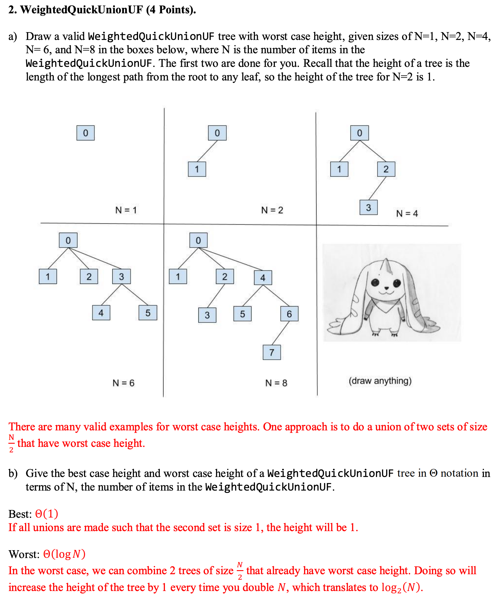

- All labs, projects and homework are from [sp18](https://sp18.datastructur.es/).
- # Discussion
	- ## Linked Lists
		- ### Even Odd #algorithm #linked-list
			- Implement the method evenOdd by destructively changing the ordering of a given
			  `IntList` so that even indexed links **precede** odd indexed links.
			  
			  For instance, if `lst` is defined as `IntList.list(0, 3, 1, 4, 2, 5)`, `evenOdd(lst)`
			  would modify `lst` to be `IntList.list(0, 1, 2, 3, 4, 5)`.
			  
			  **Hint:** Make sure your solution works for lists of odd and even lengths.
			- ```java
			  public static void evenOdd(IntList lst) {
			    	if (lst == null || lst.rest == null) {
			        	return;
			      }
			    
			    	IntList oddList = lst.rest;
			    	IntList second = lst.rest;
			    	
			    	while (lst.rest != null && oddList.rest != null) {
			        	lst.rest = lst.rest.rest;
			        	oddList.rest = oddList.rest.rest;
			        	lst = lst.rest;
			        	oddList = oddList.rest;
			      }
			    
			    	lst.rest = second;
			  }
			  ```
		- ### Partition #algorithm #linked-list
		  collapsed:: true
			- Implement `partition`, which takes in an `IntList lst` and an integer `k`, and _destructively_ partitions `lst` into `k`  `IntLists` such that each list has the following
			  properties:
			  
			      1. It is the **same** length as the other lists. If this is not possible, i.e. `lst` cannot
			  be equally partitioned, then the later lists should be **one** element smaller.
			  For example, partitioning an `IntList` of length 25 with k = 3 would result in
			  partitioned lists of lengths 9, 8, and 8.
			      2. Its ordering is consistent with the ordering of `lst`, i.e. items in earlier in `lst`
			  must **precede** items that are later.
			  
			  These lists should be put in an array of length `k`, and this array should be returned.
			  For instance, if `lst` contains the elements 5, 4, 3, 2, 1, and k = 2, then a **possible**
			  partition (note that there are many possible partitions), is putting elements 5, 3, 2
			  at index 0, and elements 4, 1 at index 1.
			  
			  You may assume you have the access to the method `reverse`, which destructively reverses the ordering of a given `IntList` and returns a pointer to the reversed `IntList`.
			  You may not create any `IntList` instances. You may not need all the lines.
			  
			  **Hint**: You may find the % operator helpful.
			- ```java
			  public static IntList[] partition(IntList lst, int k) {
			  	IntList[] array = new IntList[k];
			  	int index = 0;
			  	IntList L = reverse(lst);
			    
			  	while (L != null) {
			        	// take previous IntList
			  		IntList prevAtIndex = array[index];
			        	// Store next IntList
			  		IntList next = L.rest;
			        	// replace current IntList
			  		array[index] = L;
			  		array[index].rest = prevAtIndex;	
			        	L = next;
			        	//modify index at one single line
			  		index = (index + 1) % array.length; 
			      }
			    
			  	return array;
			  }
			  ```
		- ### `Insert` and `Reverse` method in `Linked List` #linked-list #algorithm
		  collapsed:: true
			- ```java
			  public class SLList {
			    	private class IntNode {
			        	public int item;
			        	public IntNode next;
			        	public IntNode(int item, IntNode next) {
			            	this.item = item;
			            	this.next = next;
			          }
			      }
			    
			    	private IntNode first;
			    
			    	public void addFirst(int x) {
			        	first = new IntNode(x, first);
			      }
			  }
			  ```
			- Implement `SLList.insert`. (5 -> 6 -> 2, insert(10, 1) results in 5 -> 10 -> 6 -> 2)
				- ```java
				  public void insert(int item, int position) {
				    	if (this.first == null || position == 0) {
				        	this.addFirst(item);
				      }
				    	
				    	IntNode curr = first;
				    	while (position > 1 && curr.next != null) {
				        	position--;
				        	curr = curr.next;
				      }
				    	
				    	IntNode insertedNode = new IntNode(item, curr.next);
				    	curr.next = insertedNode;
				  }
				  ```
			- Implement `reverse()` method **recursively**.
				- ```java
				  public void reverse() {
				    	this.first = reverseHelper(this.first);
				  }
				  
				  private IntNode reverseHelper(IntNode node) {
				    	if (node == null || node.next == null) {
				        	return node;
				      }
				    
				    	IntNode reversed = reverseHelper(nodex.next);
				    	node.next.next = node; // move the first one to the last position
				    	node.next = null; // cut the connection to others
				    	return reversed;
				  }
				  ```
			- Implement `reverse()` method **iteratively**.
				- ```java
				  public void reverse() {
				    	IntNode frontOfReversed = null;
				    	IntNode nextNodeToAdd = this.first;
				    	
				    	while (nextNodeToAdd.next != null) {
				        	// replace each pointer consequentially
				        	IntNode remaiderOfOriginal = nextNodeToAdd.next;
				        	nextNodeToAdd.next = frontOfReversed;
				        	frontOfReversed = nextNodeToAdd;
				        	nextNodeToAdd = remainderOfOriginal;
				      }
				    
				    	this.first = frontOfReversed;
				  }
				  ```
		- ### Remove Duplicates #algorithm #linked-list
		  collapsed:: true
			- ```java
			  public class IntList {
			    	public int first;
			    	public IntList rest;
			    	public IntList (int f, IntList r) {
			        	this.first = f;
			        	this.rest = r;
			      }
			    
			    	/**
			      * Given a sorted linked list of items - remove duplicates.
			      * For example given 1 -> 2 -> 2 -> 2 -> 3,
			      * Mutate it to become 1 -> 2 -> 3 (destructively)
			      */
			    	public static void removeDuplicates(IntList p) {
			        	if (p == null) {
			            	return;
			          }
			        
			        	IntList current = p.rest;
			        	IntList previous = p;
			        	while (current != null) {
			            	if (current.first == previous.first) {
			                	previous.next = current.next;
			              } else {
			                	previous = current;
			              }
			            current = current.rest;
			          }
			      }
			  }
			  ```
	- ## Abstract Data Types / Data Structures #data-structure
		- ### Solving problems with ADTs
			- Given an unsorted array of integers, return the array sorted from least to
			  greatest. #[[PriorityQueue & Heap]]
				- Use a priority queue. For each integer in the unsorted array, enqueue the
				  integer with a priority equal to its value. Calling dequeue will return the
				  largest integer; therefore, we can insert these values from index length-1 to 0
				  into our array to sort from least to greatest.
			- Implement the forward and back buttons for a web browser. #stack
				- Use two stacks, one for each button. Each time you visit a new web page,
				  add the previous page to the back button’s stack. When you click the back
				  button, add the current page to the forward button stack, and pop a page from
				  the back button stack. When you click the forward button, add the current
				  page to the back button stack, and pop a page from the forward button stack.
				  Finally, when you visit a new page, clear the forward button stack.
		- #### Define a `Queue` class that implements the `push` and `poll` methods of a queue ADT using only a `Stack` class which implements the stack ADT. #algorithm #queue #stack #java
		  collapsed:: true
			- ```java
			  // Two stacks
			  public class Queue<E> {
			    	private Stack<E> stack = new Stack<>();
			    	
			    	public void push(E element) {
			        	stack.push(element);
			      }
			    
			    	public E pop() {
			        	Stack<E> temp = new Stack<>();
			        	while (!stack.isEmpty()) {
			            	temp.push(stack.pop());
			          }
			        	E toPop = temp.pop();
			        	while (!temp.isEmpty()) {
			            	stack.push(temp.pop());
			          }
			        	return toPop;
			      }
			  }
			  ```
			- [#A] Using only one stack and recursion #recursion
			- ```java
			  
			  public class Queue {
			    	private Stack<E> stack = new Stack<>();
			    
			    	public void push(E element) {
			        	stack.push(element);
			      }
			    	
			    	public E pop() {
			        	return pop(stack.pop());
			      }
			    
			    	private E pop(E previous) {
			        	if (stack.isEmpty()) {
			            	return previous;
			          }
			        	E current = stack.pop();
			        	E toReturn = pop(current);
			        	push(previous);
			      }
			  }
			  ```
		- #### Using Java build-in data structures to find the `k` least common words in a document. #map #[[PriorityQueue & Heap]] #java
			- Keep a count of all the words in the document using a `HashMap <String, Integer>`. After we go through all of the words, each word will be mapped to how many times it’s appeared. What we can then do is put all the words into a `MaxPriorityQueue<String>`, using a custom comparator that compares words based on the counts in the HashMap. We can then pop off the `k` most common words by just calling `poll()` on the MaxPriorityQueue `k` times.
			- ```java
			  public static void topKPopularWords(String[] words, intk) {
			    	Map<String, Integer> counts = new HashMap<>();
			    
			    	for (String s: words) {
			        	if (!counts.contains(s)) {
			            	counts.put(s, 1);
			          } else {
			            	counts.put(s, counts.get(s) + 1);
			          }
			      }
			    
			    	// We can create a costomized comparator to Priority Queue
			    	// Using lambda
			    	PriorityQueue<String> pq = new PriorityQueue<>(new Comparator<String>() {
			        	@Override
			        	public int compare(String a, String b) {
			            	return counts.get(b) - counts.get(a);
			          }
			      });
			    
			    	for (String s : counts.keySet()) {
			        	pq.add(s);
			      }
			    	
			    	for (int i = 0; i < k; i++) {
			        	System.out.println(pq.poll());
			      }
			  }
			  ```
	- ## Selecting ADTs
	  collapsed:: true
		- ### Design a Parking Lot #[[PriorityQueue & Heap]]
		  collapsed:: true
			- Design a ParkingLot package that allocates specific parking spaces to cars in a smart way. Decide what classes you’ll need, and design the API for each. Time permitting, select data structures to implement the API for each class. Try to deal with annoying cases (like disobedient humans).
				- Parking spaces can be either regular, compact, or handicapped-only.
				- When a new car arrives, the system should assign a specific space based on the type of car.
				- All cars are allowed to park in regular spots. Thus, compact cars can park in both compact spaces and regular spaces.
				- When a car leaves, the system should record that the space is free.
				- Your package should be designed in a manner that allows different parking lots to have different numbers of spaces for each of the 3 types.
				- Parking spots should have a sense of closeness to the entrance. When parking a car, place it as close to the entrance as possible. Assume these distances are distinct.
			- Car:
				- ```java
				  public class Car {
				    	// creates a car with given size and permissions
				    	public Car(boolean isCompact, boolean isHandicapped);
				    	// returns whether or not a car fit in a compact space
				    	public boolean isCompact();
				    	// returns whether or not a car may park in a handicapped space
				    	public boolean isHandicapped();
				    	// attempts to park this car in a spot, returning true if successful
				    	public boolean findSpotAndPark(ParkingLot lot);
				    	// vacates this car's spot
				    	public void leaveSpot();
				  }	
				  ```
			- Spot:
				- ```java
				  // The Spot class can be declared private and encapsulated by the 
				  // ParkingLot class.
				  private class Spot {
				  	// creates a spot of a given type and proximity.
				    	private Spot(String type, int proximity);
				    	// returns true if this is reserved for handicapped drivers.
				    	private boolean isHandicapped();
				    	// returns true if this parking space can only accomodate compact cars.
				    	private boolean isCompact();
				  }
				  ```
			- Parking Lot:
				- ```java
				  public class ParkingLot {
				    	// creates a parking lot containing handicappedDistances.length
				    	// handicapped spaces, each with a distance corresponding to an
				    	// element of handicappedDistances. Also initializes the 
				    	// appropriate compact and regular spaces.
				    	public ParkingLot(int[] handicappedDistances, 
				                        int[] compactDistances,
				                        int[] regularDistances);
				    	// attempts to find a spot and park the given car. Returns
				    	// false if no spots are available.
				    	public boolean findSpotAndPark(Car toPark);
				    	// records when a spot has been vacated, and makes the spot
				    	// avaiable for parking again.
				    	public void removeCarFromSpot(Car toRemove);
				  }
				  ```
			- Prioritization of closeness in parking space selection can be handled using several priority queues (one for each kind of parking space). Occupied spaces (which are dequeued when they are assigned) can be tracked with a `Map<Car, Spot>`.
		- ### AltList #linked-list
		  collapsed:: true
			- A normal generic linked list contains objects of only one type. But we can imagine a generic
			  linked list where entries alternate between two types. AltList is an implementation of such a
			  data structure:
			- ```java
			  public class AltList<X, Y> {
			    	private X item;
			    	private AltList<Y, X> next;
			    
			    	AltList(X item, AltList<Y, X> next) {
			        	this.item = item;
			        	this.next = next;
			      }
			  }
			  ```
			- Let’s construct an AltList instance:
			- ```java
			  AltList<Integer, String> list = 
			    	new AltList<Integer, String>(5, 
			  		new AltList<String, Integer>("cat",
			              new AltList<Integer, String>(10, 
			                  new AltList<String, Integer>("dog", null))));
			  ```
			- This list represents `[5 cat 10 dog]`. In this list, assuming indexing begins at 0, all even-index
			  items are `Integers` and all odd-index items are `String`s.
			- Write an instance method called `pairsSwapped()` for the `AltList` class that returns a copy
			  of the original list, but with adjacent pairs swapped. Each item should only be swapped once. This method should be non-destructive: it should not modify the original `AltList` instance.
			- For example, calling list.pairsSwapped() should yield the list [cat 5 dog 10]. There were two swaps: "cat" and 5 were swapped, then "dog" and 10 were swapped. You may assume that the list on which pairsSwapped() is called has an even non-zero length. Your code should maintain this invariant.
			- **Solution:**
			- ```java
			  public class AltList<X, Y> {
			    	// ... continued from above
			    
			    	public AltList<Y, X> pairsSwapped() {
			        	AltList<Y, X> ret = new AltList<Y, X>(next.item, new AltList<X, Y>(item, null));
			        	if (next.next != null) {
			            	ret.next.next = next.next.pairsSwapped();
			          }
			        	return ret;
			      }
			  }
			  ```
	- ## Iterable/Iterator
	  collapsed:: true
		- ### Filtered List #linked-list #iterator #iterable #lazy-calculation
		  collapsed:: true
			- We want to make a `FilteredList` class that selects only certain elements of a `List`
			  during iteration. To do so, we’re going to use the `Predicate` interface defined below.
			  Note that it has a method, `test` that takes in an argument and returns `True` if we
			  want to keep this argument or `False` otherwise.
			- ```java
			  public interface Predicate<T> {
			    	boolean test(T x);
			  }
			  ```
			- For example, if L is any kind of object that implements `List<String>` (that is, the
			  standard `java.util.List`), then writing
			  `FilteredList<String> FL = new FilteredList<>(L, filter);`
			  gives an `iterable` containing all items, `x`, in `L` for which `filter.test(x)` is `True`.
			  Here, `filter` is of type `Predicate`. Fill in the `FilteredList` class below.
			- **Solution 1: (More efficient)**
			- ```java
			  import java.util.*;
			  public class FilteredList<T> implements Iterable<T> {
			    	private List<T> list;
			    	private Predicate<T> filter;
			    	
			    	public FilteredList (List<T> L, Predicate<T> filter) {
			        	this.list = L;
			        	this.filter = filter;
			      }
			    
			    	@Override
			    	public Iterator<T> iterator() {
			        	return new FLIterator();
			      }
			    	
			    	private class FLIterator() implements Iterator<T> {
			        	int index;
			        
			        	public FLIterator() {
			            	index = 0;
			            	moveIndex();
			          }
			        
			        	@Override
			        	public boolean hasNext() {
			            	return index < list.size();
			          }
			        
			        	@Override
			        	public T next() {
			            	if (!hasNext()) {
			                	throw new NoSuchElementException();
			              }
			            	T answer = list.get(index);
			            	index++;
			            	moveIndex();
			            	return answer;
			          }
			        
			        	private void moveIndex() {
			            	while (hasNext() && !filter.test(list.get(index))) {
			                	index++;
			              }
			          }
			      }
			  }
			  ```
			- **Solution2: (non-efficient)**
			- ```java
			  private class FilteredListIterator implements Iterator<T> {
			    	LinkedList<T> items;
			    
			    	public FilteredListIterator() {
			        	items = new LinkedList<>();
			        	for (T item: list) {
			            	if (pred.test(item)) {
			                	items.add(item);
			              }
			          }
			      }
			    
			    	@Override
			    	public boolean hasNext() {
			        	return !items.isEmpty();
			      }
			    
			    	@Override
			    	public T next() {
			        	if (!hasNext()) {
			            	throw new NoSuchElementException();
			          }
			        	return items.removeFirst();
			      }
			  }
			  ```
			- **Difference:**
			- The first one is more efficient than the second one. Imagine you only want the first couple items from the iterable. Is it worth processing the entire list in the constructor? It is not ideal in the case that our list is millions of elements long. The first solution is different in that we "lazily" evaluate the list, only processing our index on every call to `next()` and `hasNext()`.
		- ### Iterator of Iterators #linked-list #iterator #iterable #lazy-calculation
		  collapsed:: true
			- Implement an `IteratorOfIterators` which will accept as an argument a `List` of
			  `Iterator` objects containing `Integers`. The first call to `next()` should return the
			  first item from the first iterator in the list. The second call to `next()` should return
			  the first item from the second iterator in the list. If the list contained n iterators,
			  the `n+1`th time that we call `next()`, we would return the second item of the first
			  iterator in the list.
			- Note that if an iterator is empty in this process, we continue to the next iterator.
			  Then, once all the iterators are empty, `hasNext()` should return `false`. For example,
			  if we had 3 `Iterators` `A`, `B`, and `C` such that `A` contained the values [1, 3,
			  4, 5], `B` was empty, and `C` contained the values [2], calls to `next()` for our
			  `IteratorOfIterators` would return [1, 2, 3, 4, 5].
			- **Solution 1: (more efficient)** This is lazy calculation
			- Using LinkedList like a queue to loop the `iterators`.
			- ```java
			  import java.util.*;
			  public class IteratorOfIterators implements Iterator<Integer> {
			    	LinkedList<Iterator<Integer>> iterators;
			    
			    	public IteratorOfIterators(List<Iterator<Integer>> a) {
			        	iterators = new LinkedList<>();
			        	for (Iterator<Integer> iterator: a) {
			            	if (iterator.hasNext()) {
			                	iterators.add(iterator);
			              }
			          }
			      }
			    
			    	@Override
			    	public boolean hasNext() {
			        	return !iterators.isEmpty();
			      }
			    
			    	@Override
			    	public Integer next() {
			        	if (!hasNext()) {
			            	throw new NoSuchElementException();
			          }
			        	Iterator<Integer> iterator = iterators.removeFirst();
			        	int ans = iterator.next;
			        	if (iterator.hasNext()) {
			            	iterators.addLast(iterator));
			          }
			        	return ans;
			      }
			  }
			  ```
			- **Solution 2:** Not efficient
			- ```java
			  public class IteratorOfIterators implements Iterator<Integer> {
			    	LinkedList<Integer> l;
			    
			    	public IteratorOfIterators(List<Iterator<Integer>> a) {
			        	l = new LinkedList<>();
			        	while (!a.isEmpty()) {
			            	Iterator<Integer> curr = a.remove(0);
			            	if (curr.hasNext()) {
			                	l.add(curr.next());
			                	a.add(curr);
			              }
			          }
			      }
			    
			    	@Override
			    	public boolean hasNext() {
			        	return !l.isEmpty();
			      }
			    
			    	@Override
			    	public Integer next() {
			        	if (!hasNext()) {
			            	throw new NoSuchElementException();
			          }
			        	return l.removeFirst();
			      }
			  }
			  ```
	- ## Disjoint Sets #union-find #algorithm #disjoint-set
	  collapsed:: true
		- 
			- Good explanation for `logN` complexity.
		-
	- ## Asymptotic #algorithm
	  collapsed:: true
		- ### Log time decrease #complexity
			- ```java
			  public static void f4(int N) {
			  	if (N == 0) {return;}
			  	f4(N / 2);
			  	f4(N / 2);
			  	f4(N / 2);
			  	f4(N / 2);
			  	g(N); // runs in Θ(N^2) time
			  }
			  ```
			- `O(N^2 log N)`, since f4(N / 2) will result O(N).
			- ```java
			  public static void f5(int N, int M) {
			  	if (N < 10) {return;}
			  	for (int i = 0; i <= N % 10; i++) {
			  	f5(N / 10, M / 10);
			  	System.out.println(M);
			  	}
			  }
			  ```
			- `O(N)` as long as we decrease i by dividing it, running time will be `O(N)`.
- # Lab
	- ## Lab 2: JUnit Tests and Debugging #java #test
	  collapsed:: true
		- If you have some terrible bug that is hard to fix, you can use `git` to revert back to a state when your code was working properly according to the JUnits tests. #debug #git
		- JUnit tests are short-circuiting – as soon as one of the asserts in a method fails, it will output the failure and move on to the next test. #junit
	- ## Lab 3: Timing Tests and Randomized Comparison Tests
	  collapsed:: true
		- For small inputs, results are unreliable for two reasons: The variance in runtime is high (due to issues like caching, process switching, branch prediction, etc.), and the accuracy of our timer (milliseconds) is insufficient to resolve the difference between N = 1000 and N = 2000. For this reason, when we run empirical timing tests, we want to focus on the behavior for large N. #timing #profiling
		- Set up an "Execution Breakpoint" to debug. #debug
			- If the test fails, the message that we get is something like:
			- ```
			  java.lang.ArrayIndexOutOfBoundsException: Index 7 out of bounds for length 7 
			  at randomizedtest.BuggyAList.resize(BuggyAList.java:31)
			  ```
			- click `Run -> View Breakpoints`, click on the checkbox on the left that says "any exception" and then click on that says "Condition:" and in the window and enter exactly:
			  `this instanceof java.lang.ArrayIndexOutOfBoundsException`
			  and then click "Enabled"
		- If you want to have your tests timeout after a certain amount of time (to prevent infinite loops), you can declare your test like this:
		  `@Test(timeout = 1000)`
		  The given parameter specifies the maximum time in milliseconds. #junit
	- ## Lab 4: Git and Debugging #git #debug
	  collapsed:: true
		- If we want to roll back to previous version, use `checkout`
			- `$ git checkout 9f955d85359fc8e4504d7220f13fad34f8f2c62b ./recipes/tofu`
			- **Important:** The checkout command does not change the commit history.
			- **Also Important:** Make sure to specify a file (or directory) when you use checkout. Otherwise, you're using a more powerful version of checkout that will probably confuse you.
		- If we want to actually roll back to this version, we'd have to commit:
			- `git commit -m "rolled back"`
			- We don't need to use `git add` since `git checkout` does an automatic `git add` for us.
		- `Stashing`
			- `Stash` ing allows you to save your changes onto a stack without making a more permanent commit. It is equivalent to picking up your work-in-progress and placing it in a box to get back to later. In the meantime, your desk is now clean.
			- Why might you want to use this?
				- You modified files but accidentally modified them on the wrong branch. Then you can `stash` your changes, switch branches, and unstash your changes so that they are all in the new branch.
				- You modified multiple files, but you dislike your changes and you would just like to get things back to how they were after your most recent commit. Then you can `stash` your code and then drop that stash rather than having to manually revert multiple files.
		- **`Rebasing`**
			- `Rebase` can be used as an alternative to `merge` for integrating changes from one branch to another. It is quite different from `merge` in that `merge` creates a new commit that has both parent branch commits as parents. Rebasing takes one set of commits from a branch and places them all at the end of the other branch.
			- `rebase` leads to a cleaner history when working with many different branches and team members.
		- **`Reset`**
			- Perhaps you decide that you want things to be how they were a certain number of commits ago. You can use `reset` if you are absolutely sure that you don't want the last few commits.
		- **`Revert`**
			- `Revert` allows you to reverse the changes introduced by certain commits by recording new commits to undo the changes. This is a safer option that simply throwing away past commits.
		- **`Cherry Pick`**
			- `Cherry pick` allows you to apply the changes introduced by some existing commits.
- # Project
	- ## Project 1 Gold
		- Autoboxing causing `NullPointerException` #autoboxing #java
			- This error happens because Java will freely convert from Integer (boxed type) to int (primitive type). This is called unboxing. However, only reference types can be null, so if you try to automatically convert a null Integer to an int, you’ll get a NullPointerException in your own code.