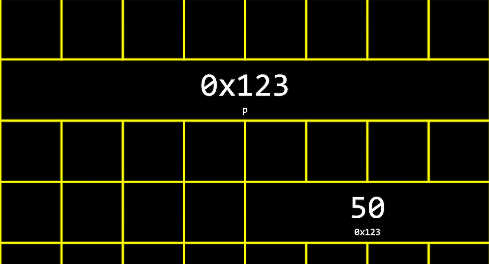
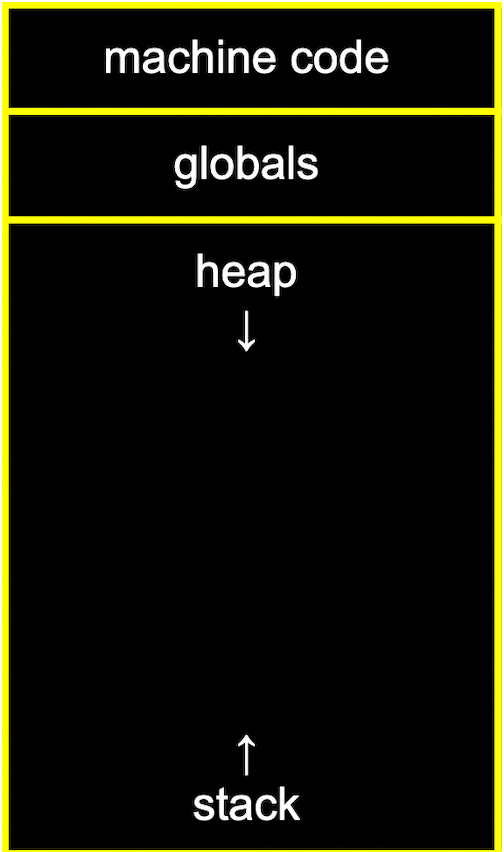
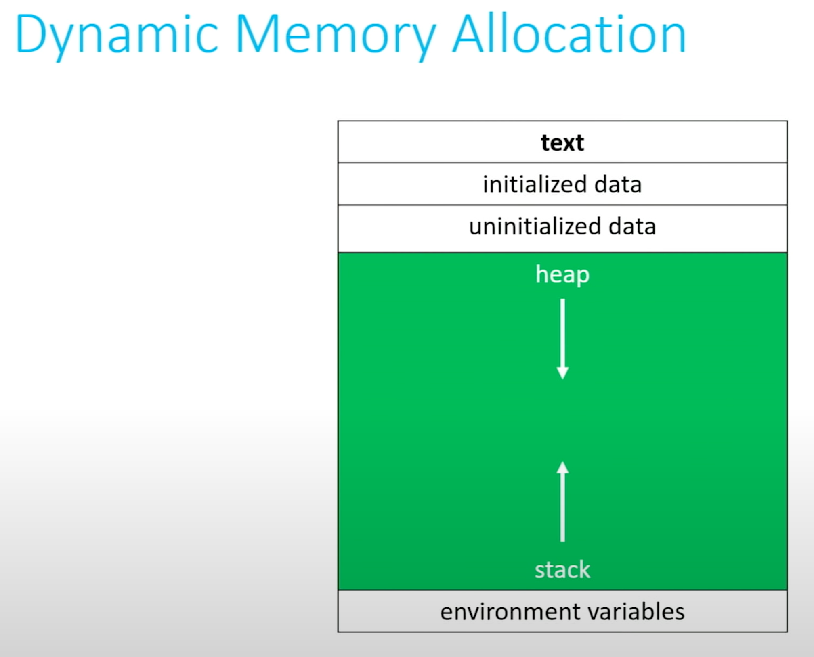
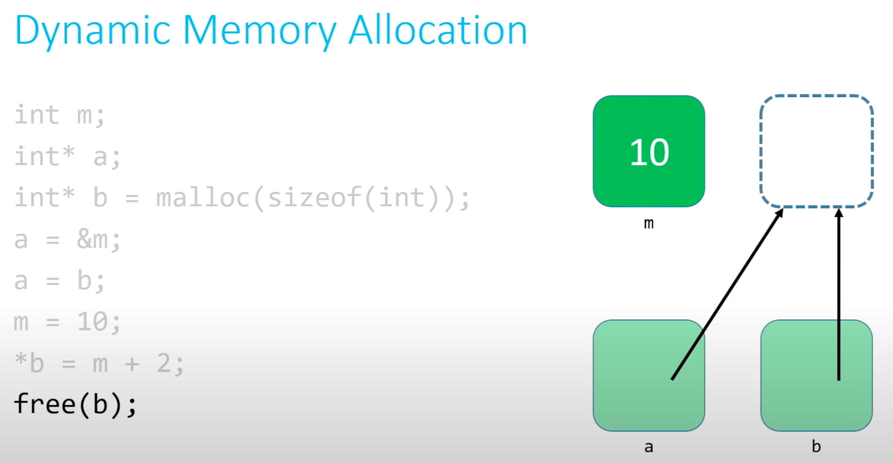
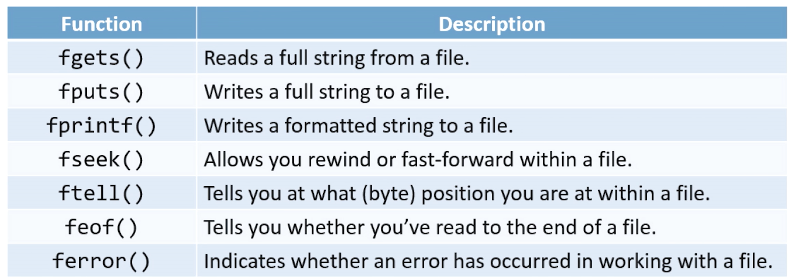

title:: CS50 Lecture 4: Memory

- #introduction #cs50
- ## Lecture
	- ### Hexadecimal:
		- One hex digit for 4 bit, so you need 2 hex digits to represent a byte.
	- ###  `pointers`
	- Stack overflow, heap overflow, buffer overflow or segmentation fault, means you touch the memory that you shouldn't or not belonged to you.
	- Why pointers takes up 8 bytes? (p is pointer)
		- {:height 234, :width 467}
		- For a long time, pointer used 4 bytes, which is 32 bits to represent. 32 bits can count up to 4 billion bytes(since 32 bits represent -2 billion to 2 billion, so total is 4 billion for address of byte), that is about 4 GB of memory. But nowadays in modern computer system, 64 bits are used in order to address the billions of bytes of memory available. (this is why our system is 64 bit and why PC using 32 bits CPU cannot add memory more than 4 GB)
	- Location of storing different data types: (by convention)
		- char *s: always stores in higher place of memory
		- int, float: they end up lower in memory
	- Pointers Arithmetic:
		- When adding pointers, the complier knows what the explicit data type is. So when `int *i`, adding `*(i + 1)` means the pointer moves 4 bits to right. Because integer in C takes 4 bits. **It's not 1 bits!!!**
	- Arrays in C are automatically treated as pointer. `int numbers[]` you can just `pintf("%i\n", *numbers);` so `numbers` is the pointer itself.
	- Sometimes there is no error or warning as the output of running a C program, so execute `valgrind ./program`
	- Don't forget to initialize variables. Since this might get random result from these variables.
	- ### Memory Layout
		- {:height 324, :width 190}
			- The **machine code** section is our compiled program's binary code. When we run our program, that code is loaded into memory.
			- **globals** are global variables we declared in our program.
			- The **heap** section is an empty area from where `malloc` can get free memory for our program to use. As we call `malloc`, we start allocating memory from the top down.
			  id:: 61d8ea07-679b-4b4f-a43d-21539723a012
			- The **stack** section is used by functions and local variables in our program as they are called, and grows upwards.
		- If we call `malloc` for too much memory, we will have a **heap overflow**. Or, if we call too many functions without returning from them, we will have a **stack overflow**.
		- Visualizing swap.c
			- {{youtube https://youtu.be/nvO1sq_b_zI?t=7436}}
			- {{youtube-timestamp 7436}}
	- #### Scanf
		- If we need to `scanf` a string, we have to `malloc` before `scanf` to provide room for the string.
	-
- ## Shorts
	- #### Pointer:
		- Pointers provide an alternative way to pass data between functions.
			- Recall that up to this point , we have passed all data **by value**, with one exception.
			- When we pass data by value, we only pass a copy of that data.
		- If we use pointers instead, we have the power to pass the actual variable itself.
			- That means that a change that is made is made in one function *can* impact what happens in a different function.
			- Previously, this wasn't possible!
		- When we talking about **memory**, we talking about **RAM** not disk drive.
			- Disk drives are just storage space, we can't directly work there. Manipulation and use of data can only take place in RAM, so we have to move data there.
			- Memory is basically a huge array of 8-bit wide bytes.
		- | Data Type | Size(in bytes) |
		  | int | 4 |
		  | char | 1 |
		  | float | 4 |
		  | double | 8 |
		  | long long | 8 |
		  | string --> char* | 4 or 8 (depends on system 64-bit machine is 8 and 32-bit machine is 4) |
		- **POINTERS ARE JUST ADDRESSES**
		- A **pointer**, then, is a data item whose
			- *value* is a memory address
			- *type* describes the data located at that memory address
		- As such, pointers allow data structures. and/or variables to be shared among functions
		- Pointers make a computer environment more like the real world.
		- The simplest pointer available to us in C is the NULL pointer.
		- **NULL Pointer**: When you create a pointer and you don't set its value immediately, you should **ALWAYS** set the value of the pointer to NULL. (See Problem Set Notes!!!)
			- Can you guess what might happen if we try to dereference a pointer whose value is NULL?
			- **Segmentation fault**
			- Surprisingly, this is actually good behavior! It defends against accidental dangerous manipulation of unknown pointers.
				- That's why we recommend you set your pointers to NULL immediately if you aren't setting them to a known, desired value.
		- You can check whether a pointer is NULL using the equality operator(==).
		- An array's name, then, is actually just a pointer to its first element.
		- The main purpose of a pointer is to allow us to modify or inspect the location to which it points.
			- We do this by **dereferencing** the pointer.
			- If we have a pointer-to-char called `pc`, then `*pc` is the data that lives at the memory address stored inside the variable `pc`.
			- Used in this context, `*` is known as the **dereference operator**
			- It "goes to the reference" and accesses the data at that memory location, allowing you to manipulate it at will.
			- This is just like visiting your neighbor. Having their address isn't enough. You need to <ins>go to</ins> the address and only then can you interact with them.
		- Again, Syntax:
			- `int* p`
			- The value of `p` is an address.
			- We can dereference `p` with the `*` operator.
			- If we do, what we'll find at that location is an int.'
		- ```c
		  int* px, py, pz; // this is one pointer called px and two int called py and px
		  int *px, *py, *pz; // this is three pointers
		  ```
		-
	- #### Defining Custom Type
		- `typedef <old name> <new name>`
		- ```c
		  struct car
		  {
		  	int year;
		    	char model[10];
		    	char plate[7];
		    	double engine_size;
		  };
		  
		  typedef struct car car_t;
		  ```
		- In a short way:
		  ```c
		  typedef struct car
		  {
		  	int year;
		    	char model[10];
		    	char plate[7];
		    	double engine_size;
		  }
		  car_t;
		  ```
	- #### Dynamic Memory Allocation
		- We can use pointers to get access to a block of dynamically allocated memory at runtime.
		- Dynamically allocated memory comes from a pool of memory known as the **heap**.
		- Prior to this point, all memory we've been working with has been coming from a pool of memory known as the **stack**. See notes in lecture: ((61d8ea07-679b-4b4f-a43d-21539723a012))
		- {:height 470, :width 536}
		- `malloc()` will return `NULL` when there is not enough space for allocation. So after calling `malloc()`,  we need to check `malloc()  != NULL` to make sure we got the enough memory.
		- ```c
		  // statically obtain an integer, this is on STACK
		  int x;
		  
		  // dynamically obtain an integer, this is on HEAP 
		  int *px = malloc(sizeof(int));
		  ```
		- When you finish working with dynamically-allocated memory, you must `free()` it. Otherwise, it results in a **memory leak** which can compromise your system's performance.
		- Three golden rules:
			- 1. Every block of memory that you `malloc()` must subsequently be `free()`d.
			  2. Only memory that you `malloc()` should be `free()`d.
			  3. Do not `free()` a block of memory more than once.
		- 
			- When you `free(b);`, you are not free the pointer b, actually you are freeing the memory that b pointing to.
	- #### Call Stacks
		- When you call a function, the system sets aside space in memory for that function to do its necessary work.
			- We frequently call such chunks of memory **stack frames** or **function frames**.
		- More than one function's stack frame may exist in memory at a given time. If `main()` calls `move()`, which then calls `direction()`, all three functions have open frames.
			- But in general, only one of those frames will ever be active. Only one of those functions is ever running at a given time.
		- These frames are arranged in a **stack**. The frame for the most-recently called function is always on the top of the stack.
		- When a new function is called, a new frame is **pushed** onto the top of the stack and becomes the active frame. And others stay in a waiting status.
		- When a function finishes its work, its frame is **popped** off of the stack, and the frame immediate below it becomes the new, active, function on the top of the stack. This function picks up immediately where it left off.
	- #### File Pointers
		- The ability to read data from and write data to files is the primary means of storing **persistent data**, data that does not disappear when your program stops running.
		- The abstraction of files that C provides is implemented in a data structure known as a `FILE`.
			- Almost universally when working with files, we will be using pointers to them, `FILE*`.
		- The file manipulation functions all live in `stdio.h`
			- All of them accept `FILE*` as one of their parameters, except for the function `fopen()`, which is used to get a file pointer in the first place.
		- Some of the most common file input/output(I/O) functions that we'll be working with are:
			- `fopen() fclose() fgetc() fputc() fread() fwrite()`
			- `fopen()`
				- Opens a file and returns a file pointer to it.
				- Always check the return value to make sure you don't get back NULL. (otherwise when you dereference it, it will go the NULL address and causing segmentation fault)
				- `FILE* ptr = fopen(<filename>, <operation>);`
				- `<operation> "a"` append content to a existed file.
			- `fclose()`
				- closes the file pointed to by the given file pointer
				- `fclose(ptr1);`
			- `fgetc()`
				- Reads and returns the next character from the file pointed to.
				- **Note:** The operation of the file pointer passed in as a parameter must be "r" for read, or you will suffer an error.
				- `char ch = fgetc(<file pointer);`
				- The ability to get single characters from files, if wrapped in a loop, means we could read all the characters from a file and print them to the screen, one-by-one, essentially.
				- collapsed:: true
				  ```c
				  char ch;
				  while ((ch = fgetc(ptr)) != EOF)
				  {
				  	printf("%c", ch);
				  }
				  ```
				- We might put this in a file called cat.c, after the Linux command "cat" which essentially does just this.
				- `EOF` is a special value that's defined in <stdio.h>
			- `fputc()`
				- Writes or appends the specified character to the pointed-to file.
				- **Note:** The operation of the file pointer. passed in as a parameter must be "w" for write or "a" for append, or you will suffer an error.
				- `fputc(<character>, <file pointer>);`
				- ```c
				  char ch; 
				  while ((ch = fgetc(ptr)) != EOF)
				  {
				    	fputc(ch, ptr2);
				  }
				  ```
				- We might put this in a file called `cp.c`, after the Linux command "cp" which essentially does just this.
			- `fread()`
				- Reads <qty> units of size <size> from the file pointed to and stores them in memory in a buffer (usually an array) pointed to by <buffer>
				- Note: The operation of the file pointer passed in as a parameter must be "r" for read, or you will suffer an error.
				- `fread(<buffer>, <size>, <qty>, <file pointer>);`
			- `fwrite()`
				- Writes <qty> units of size <size> to the file pointed to by reading them from a buffer (usually an array) pointed to by <buffer>.
				- Note: The operation of the file pointer passed in as a parameter must be "w" for write or "a" for append, or you will suffer an error.
				- `fwrite(<buffer>, <size>, <qty>, <file pointer>)`
		- Some other useful functions:
			- `fgets() fputs() fprintf() fseek() ftell() feof() ferror()`
			- 
- ##  Lab & Problem Sets
	- [Lab4: Volume](https://cs50.harvard.edu/x/2022/labs/4/)
		- [Github](https://github.com/code50/31525880/tree/main/filter-more)
	- [1. Filter](https://cs50.harvard.edu/x/2022/psets/4/filter/more/)
		- [Github](https://github.com/code50/31525880/tree/main/filter-more)
	- [2. Recover](https://cs50.harvard.edu/x/2022/psets/4/recover/)
		- [Github](https://github.com/me50/QiyanYu/blob/2dbb2580373080cf111c5d139ae32a1b0c1e910d/recover.c)
		- Note: Don't forget to initial pointer to `NULL` before compare it.
- ## Lab & Problem Sets Notes (rewrite)
	- `getopt()` in POSIX
		- a super useful function for getting arguments and using flags in command line
		- [[POSIX: getopt()]]
	- [[malloc vs calloc]]
	- Allocate memory for 2D-array using a pointer to array
		- ```c
		  	// Allocate memory for image
		      RGBTRIPLE(*image)[width] = calloc(height, width * sizeof(RGBTRIPLE));
		  ```
	- `fseek()`
		- Using `fseek()` to move cursor. Note: Keep in mind that `fread` should in 4 bytes times. So we need to skip over padding.
		- ```c
		  // Determine padding for scanlines
		      int padding = (4 - (width * sizeof(RGBTRIPLE)) % 4) % 4;
		  
		      // Iterate over infile's scanlines
		      for (int i = 0; i < height; i++)
		      {
		          // Read row into pixel array
		          fread(image[i], sizeof(RGBTRIPLE), width, inptr);
		  
		          // Skip over padding
		          fseek(inptr, padding, SEEK_CUR);
		      }
		  ```
	- `fputc()`
		- Using `fputc()` to put padding character back.
		- ```c
		  // Write new pixels to outfile
		      for (int i = 0; i < height; i++)
		      {
		          // Write row to outfile
		          fwrite(image[i], sizeof(RGBTRIPLE), width, outptr);
		  
		          // Write padding at end of row
		          for (int k = 0; k < padding; k++)
		          {
		              fputc(0x00, outptr);
		          }
		      }
		  ```
	- `__attribute__((__packed__))`
		- `packed` means it will use the smallest possible space for `struct`.
		- [[code: __attribut__((__packed__))]]
	-