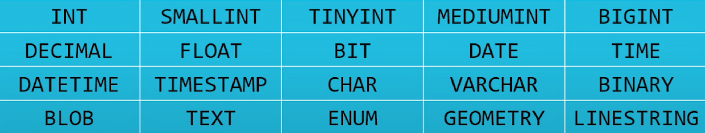

- #cs50 #introduction
- ## Lecture
	- relational database
		- `csv` is flat-file database with no hierarchy.
		-
		-
- ## Short
- #### SQL
	- SQL (the Structured Query Language) is a programming language whose purpose is to **query** a database.
	- Data types:
		- 
		- `CHAR` & `VARCHAR`:
			- `CHAR` is fixed-length string
			- `VARCHAR` refers to a variable-length string
	- Primary keys enable rows of a table to be uniquely and quickly identified.
		- Choosing your primary key appropriately can make subsequent operations on the table much easier.
	- It is also possible to establish a joint primary key - a combination of two columns that is always guaranteed to be unique.
	- `ISNERT`
		- Add information to the table.
		- ```sql
		  INSERT INTO
		  <table>
		  (<columns>)
		  VALUES
		  (<values>)
		  ```
		- When defining the column that ultimately ends up being your table's primary key, it's usually a good idea to have that column be an integer.
		- Moreover, so as to eliminate the situation where you may accidentally forget to specify a real value for the primary key column, you can configure that column to **auto-increment**, so it will pre-populate that column for you automatically when rows are added to the table.
	- `SELECT`
		- Extract information from a table.
		- ```sql
		  SELECT
		  <columns>
		  FROM
		  <table>
		  WHERE
		  <condition>
		  ORDER BY 
		  <column>
		  ```
	- `SELECT (JOIN)`
		- Extract information from multiple tables
		  ```sql
		  SELECT
		  <columns>
		  FROM
		  <table1>
		  JOIN
		  <table2>
		  ON
		  <predicate>
		  ```
	- `UPDATE`
		- Modify information in a table.
		  ```sql
		  UPDATE
		  <table>
		  SET
		  <column> = <value>
		  WHERE
		  <predicate>
		  ```
	- `DELETE`
		- Remove information from a table.
		- ```sql
		  DELETE FROM
		  <table>
		  WHERE
		  <predicate>
		  ```
	-