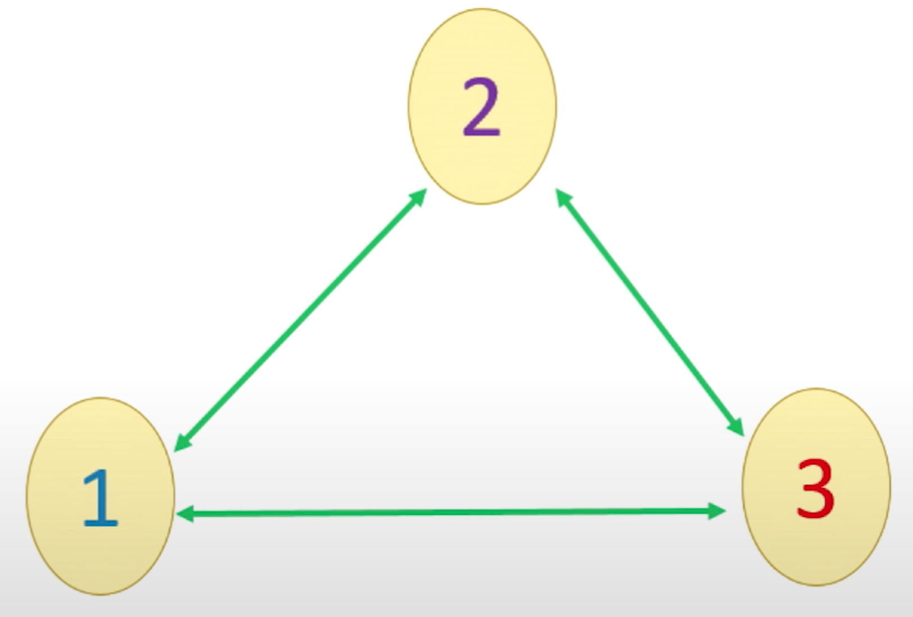
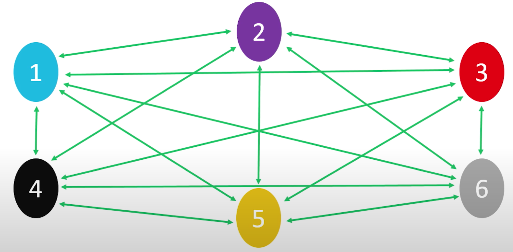
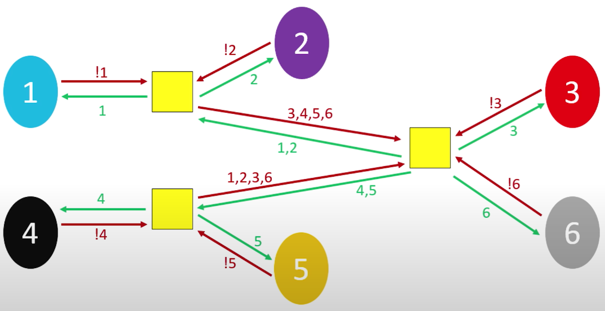
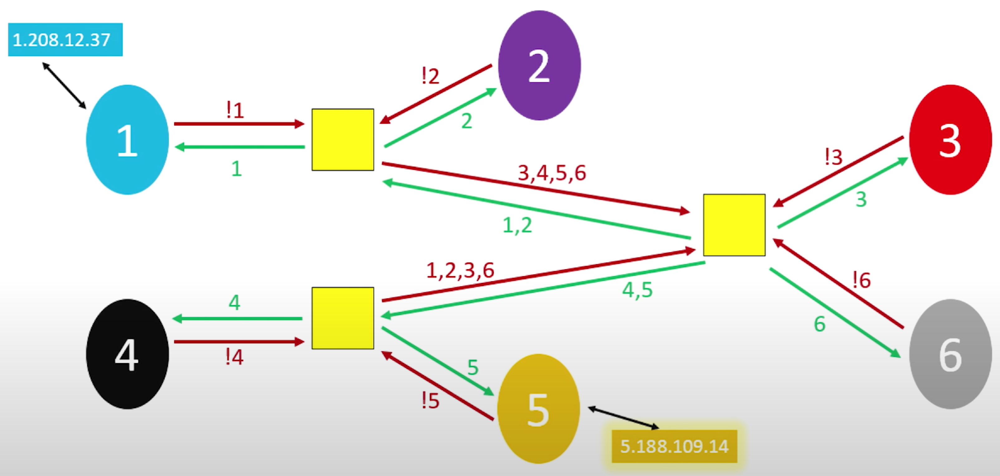
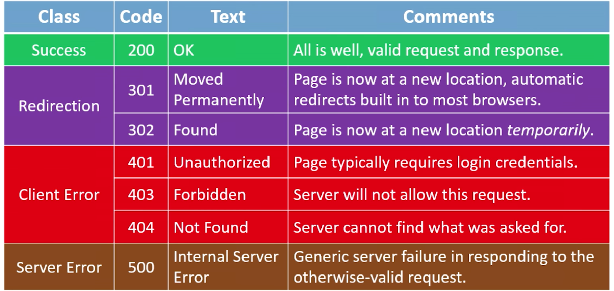

- #cs50 #introduction
- ## Lecture
- ## Shorts
	- ### Internet Primer
	  collapsed:: true
		- #### IP Address
		  collapsed:: true
			- In order for your machine to uniquely identify itself on the Internet, it needs an address.
				- This way, it can send information out and also receive information back to the correct location.
			- The addressing scheme used by computers is known as IP addressing.
			- As originally developed, the IP addressing scheme would effectively allocate a unique 32-bit address to each device hoping to connect to the internet.
			- Instead of representing these 32-bit addresses as hexadecimal, we represent them as four clusters of 8bits using decimal notation.
			- `w.x.y.z`
			  Each of w, x, y, and z can be a nonnegative value in the range [0, 255]
			- If each IP address is 32 bits, that means there are roughly 4 billion addresses to give out.
			- The population of the world is somewhere in excess of 7 billion, and most folks in the western world have more than 1 device capable of Internet connectivity.
		- **IPv6 Address**
		  collapsed:: true
			- In recent years, we've been slowly phasing out this old scheme(IPv4) and replacing it with a newer scheme(IPv6) that assigns computers 128-bit addresses, instead of 32-bit addresses. 
			  ~~`4,294,967,296`~~
			  `340,282,366,920,938,463,463,374,607,431,768,211,456`
			- `s:t:u:v:w:x:y:z`
			- Each of s, t, u, v, w, x, y, and z is represented by 1 to 4 hexadecimal digits in the range [0, ffff].
		- **DHCP**
		  collapsed:: true
			- How do we get an IP address in the first place though? Somewhere between  your computer and the Internet at large exists a *Dynamic Host Configuration Protocol*(DHCP) server, whose role is to assign IP addresses to devices.
		- **DNS**
		  collapsed:: true
			- Odds are, you've never actually tired to visit a website by typing its IP address into your browser.
			- The Domain Name System (DNS) exists to help us translate IP addresses to more memorable names that are more human-comprehensible.
			- In this way, DNS is somewhat like the yellow pages of the web.
			- Much like there is no yellow pages of the world, there is really no DNS record of the entire internet.
			- Rather, large DNS server systems (like Google's own) are more like aggregators, collecting smaller sets of DNS information and pooling them together, updating frequently.
			- In that way, large DNS servers are like libraries that stock many different sets of local yellow page books. In order to have the most up-to-date phone numbers fro businesses, libraries must update the books they have on hand.
			- Dns record sets are thus fairly decentralized.
		- **Access Points**
		  collapsed:: true
			- One of the ways we've dealt with the IPv4 addressing problem is to start assigning multiple people to the same IP address.
			- The IP address is assigned to a *router*, whose job it is to act as a traffic cop that allows data requests from all of the devices on your local network(your home or business, e.g.) to be processed through a single IP address.
			- Modern home networks consist of access points that combine a router, a modem, a switch, and other technologies together into a single device.
			- Modern business networks or large-scale wide-area networks(WANs) still frequently have these as separate devices to allow the size of their network to scale more easily.
	- ### IP (Internet Protocol)
	  collapsed:: true
		- `The Internet` is really an *interconnected network* comprised of smaller networks woven together and agreeing to communicate with one another.
		- How do these networks know how to communicate with one another? This is the responsibility of the Internet Protocol(IP).
		- Though it's admittedly on an extremely small scale, this picture is misleading as it pertains to network communication. 
		  {:height 198, :width 272}
		- {:height 261, :width 481}
		- With only six networks, things are rapidly getting out of hand. And the modern Internet consists of a lot more than six networks. We simply can't afford to wire them together such that each directly connects with every other.
		- But still, we need each network to be able to talk to each other network, or we end up with pieces of the network that are unable to speak to other parts of the network.
		- This is where **routers** come back into play.
		- What if, instead of being connected to every other network, each network was connected to a limited number of routers(each of which was connected to other nearby routers), and each router had instructions built into it on how to move information toward its destination?
		- This information might be stored in a routing table, inside of the router.
		- For this illustration, let's assume each network has IP addresses in the range of `n.x.x.x`, where `n` is its network number, and each `x` is in the range [0, 255].
			- A generalization of the way things actually work!
			- {:height 327, :width 627}
		- Now the networks are not directly connected to each other at all, and rely on routers to distribute communications.
		- On a small scale, this configuration may actually be more inefficient than just having direct connections.
		- on a large scale, this configuration can dramatically reduce the costs of network infrastructure.
		- 
		- In reality, if 1.208.12.37 (me) is sending an e-mail, FTP file transfer, or web browser request to 5.188.109.14(you), the data isn't being sent as one huge block.
		- Any slowdown that was caused by sending such a large amount of data would have a ripple effect that would throttle the network for all the other users. (like huge truck on the highway can block the traffic)
		- As such, another crucial part of IP is splitting data into *packets*. (small cars are much more easy)
		- IP is also known as a *connectionless* protocol. There is not necessarily a defined path from the sender to the receiver, and vice versa.
		- This means that in response to traffic that might be "clogging" up one particular path through the Internet, some packets can be "re-routed" around the traffic jam to follow the most optimal path, based on the current state of the network.
	- ### TCP (Transmission Control Protocol)
	  collapsed:: true
		- If the Internet Protocol(IP) is thought of as protocol for getting information from a sending machine to a receiving machine, then TCP can be thought of as directing the transmitted packet to the correct program on the receiving machine.
		- As you might imagine, it is important to be able to identify both *where* the receiver is and *what* the packet is for, so TCP and IP are almost an inseparable pair: TCP/IP.
		- Each program/utility/service on a machine is assigned a *port number*. Coupled with an IP address, we can now uniquely identify a specific program on a specific machine.
		- The other thing that TCP is crucial for is guaranteeing delivery of packets, which IP alone does not do.
		- TCP does this by including information about how many packets the receiver should expect to get, and in what order, and transmitting that information alongside the data.
		- Some ports are so commonly used that they have been standardized across all computers.
			- FTP (file transfer) uses port **21**.
			- SMTP (e-mail) uses port **25**.
			- DNS uses port **53**.
			- HTTP (web browsing) uses port **80**.
			- HTTPS (secure web browsing) uses port **443**.
		- Steps of the TCP/IP process:
			- 1. When a program goes to send data, TCP breaks it into smaller chunks and communicates those packets to the computer's network software, adding a TCP layer onto the packet. 
			  2. IP routes the individual packets from sender to receiver; this info is part of the IP layer surrounding the packet. 
			  3. When the destination computer gets the packet, TCP looks at the header to see which program it belongs to; and since the routes packets take may differ, TCP also must present those packets to the destination program in the proper order.
		- If at any point along the way a router delivering information using the Internet Protocol *dropped* a packet, TCP would use additional information inside the headers to request that the sender pass along the extra packet so ti could complete assembly.
		- After the packets have arrived, TCP ensures they are organized the correct order and can then be reassembled into the intended unit of data and delivered to the correct service.
		-
	- ### HTTP (Hypertext Transfer Protocol)
	  collapsed:: true
		- In addition to protocols that dictate how information is communicated from machine to machine and application to application (IP and TCP, respectively), it is frequently the case that the application itself has a system of rules for how to interpret the data that was sent.
		- HTTP is one such example of an application layer protocol, which specifically dictates the format by which clients <ins>request</ins> web pages from a server, and the format via which servers <ins>return</ins> information to clients.
		- Other application layer protocols include:
			- File Transfer Protocol (FTP)
			- Simple Mail Transfer Protocol (SMTP)
			- Data Distribution Service (DDS)
			- Remote Desktop Protocol (RDP)
			- Extensible Message and Presence Protocol (XMPP)
		- A line of the form
		  `method request-target http-version`
		  is a simple example of an HTTP request line, a crucial part of an overall HTTP request that a client may make to a server.
		- The host name (domain name of the server) is also included as a separate line of the overall HTTP request.
		- Taken together, the host name and the request target from the request line specify a specific resource being sought.
		- Based on whether the resource exists and whether the server is empowered to deliver that resource pursuant to the client's request, a number of status codes can result.
		- 
		-
	- ### HTML (Hypertext Markup Language)
	  collapsed:: true
		- HTML is a fundamental component of every website.
		- HTML is a language, but it is <ins>not</ins> a programming language. It lacks concepts of variables, logic, functions, and the like.
		- Rather, it is a markup language, using angle-bracket enclosed tags to semantically define the structure of a web page, causing the plain text inside of sets of tags to be interpreted by web browsers in different ways.
		- Notice how the markup allows us to convey extra information about the text we've written.
		- There are over 100 HTML tags.
		- **Common Used Tags**
			- `<b> </b>` `<u> </u>` `<i> </i>`
			- `
 
`
			- `<hX> </hX>` X = 1, 2, 3, 4...
			- `<ul> unordered list</ul>`  `<ol>ordered list</ol>` `<li>each list</li>`
			- `<table> </table>` `<tr> table row</tr>`  `<td> table data</td>`
			- `<form> </form>` `
 arbitrary division 
`
			- `<input name=X type =Y />` self closing tag
			- `` ancor
			- ``
			- `<!DOCTYPE html>` Specific to HTML5
			- `<!-- comment -- >`
			- It is important that the HTML you write be well-formed. Every tag you open should be closed(unless it is a self-closing tag), and tags should be closed in reverse order of when they were opened.
			- Unlike C, your HTML will not necessarily fail with syntax errors if not well-formed, so it's up to you to be vigilant.
			- Because it can be an arduous task to investigate this, be sure to use online HTML validators to help!
	- ### CSS (Cascading Style Sheets)
	  collapsed:: true
		- CSS is another language we use to when constructing websites.
			- If HTML is used to organize the content that we aim to display on our pages, then CSS is the tool we use to customize our website's look and feel.
		- Like HTML, CSS is not a programming language; it lacks logic. Rather, it is a styling language and its syntax describes how certain attributes of HTML elements should be modified.
		- A style sheet is constructed by identifying a selector and then an open curly brace to indicate the beginning of the style sheet for that selector.
		- In between the curly brace you place a list of key-value pairs of style properties and values for those properties, each *declaration* ending with a semicolon.
		- Then a closing curly brace terminates the style sheet.
	- ### JavaScript
	  collapsed:: true
		- JavaScript is a modern programming language that is derived from the syntax at C.
		- JavaScript, HTML, and CSS make up the three languages defining most of the user experience on the web.
		- Unlike Python which runs *server-side*, JavaScript applications run *client-side*, on your own machine.
		- JavaScript variables are similar to Python variables.
			- No type specifier.
			- When a local variable is first declared, preface with the `var` keyword.
	- ### DOM (Document Object Model)
		- The *document object* is one way of employing this paradigm, whereby that object organizes the entire contents of a web page.
		- By organizing an entire page into a JavaScript object, we can manipulate the page's elements programmatically.
		-
	-