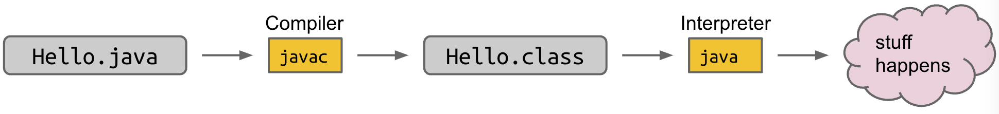

- ## Compilation in Java
  id:: 6362b02f-cbf9-4298-a7ca-67db5df542cc
	- ### The standard tools for executing Java programs use a two step process:
		- 
	- ### Why make a class file at all?
		- .class file has been type checked. Distributed code is safer.
		- .class files are ‘simpler’ for machine to execute. Distributed code is faster.
		- Minor benefit: Protects your intellectual property. No need to give out source.