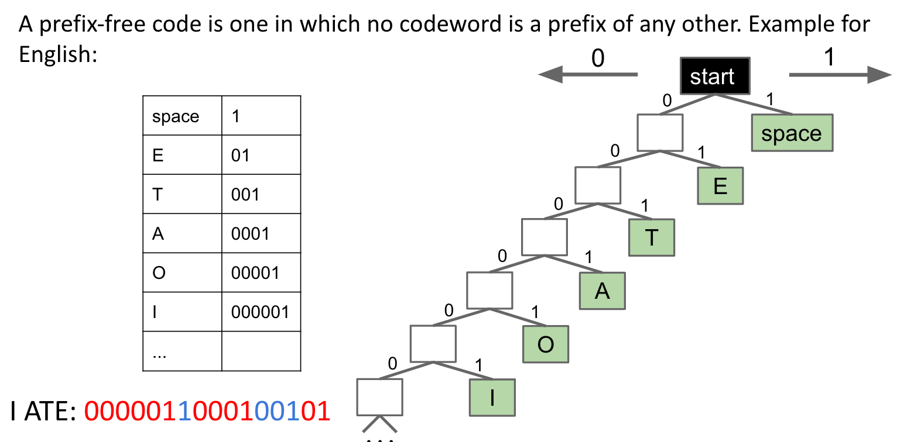
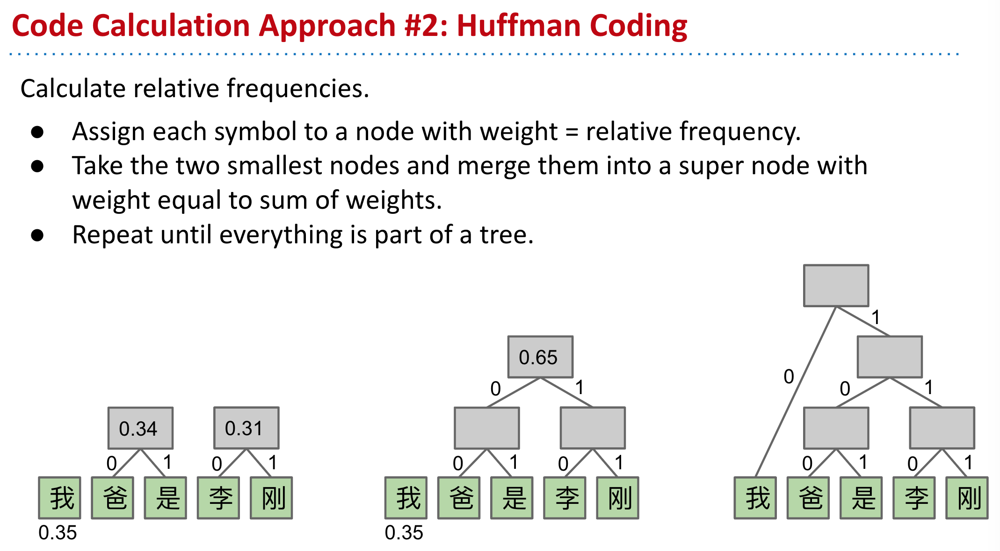

- ## Prefix-Free Codes
	- A prefix-free code is one in which no codeword is a prefix of any other.
	- 
	-
- ## Huffman Coding
	- ### Given a file X.txt that we’d like to compress into X.huf:
		- Consider each b-bit symbol (e.g. 8-bit chunks, Unicode characters, etc.) of X.txt, counting occurrences of each of the 2b possibilities, where b is the size of each symbol in bits.
		- Use Huffman code construction algorithm to create a decoding trie and encoding map. Store this trie at the beginning of X.huf.
		- Use encoding map to write codeword for each symbol of input into X.huf.
		- 
	- ### To decompress X.huf:
		- Read in the decoding trie.
		- Repeatedly use the decoding trie’s longestPrefixOf operation until all bits in X.hug have been converted back to their uncompressed form.
	- 
	- 
	- LATER [Huffman Implementation](https://algs4.cs.princeton.edu/55compression/Huffman.java)
-
-