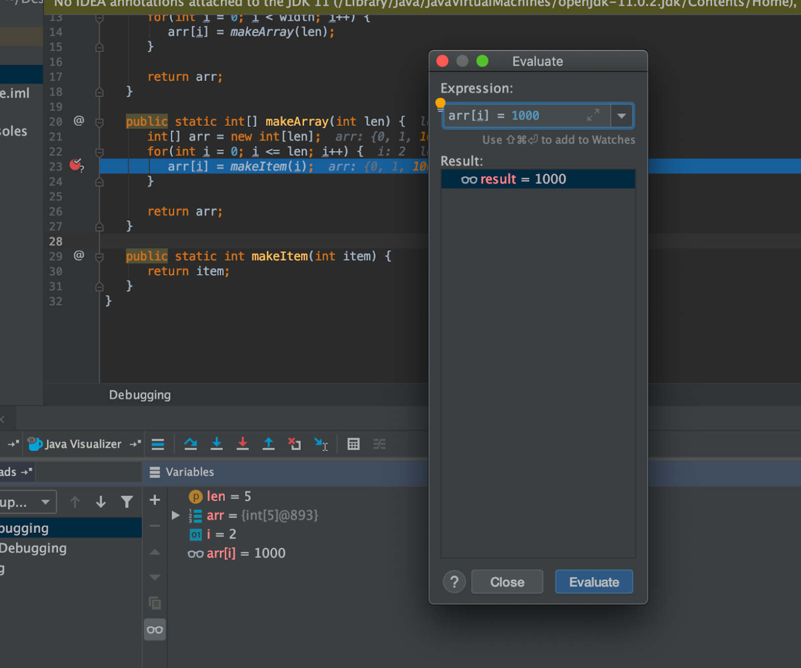

- ## Lecture
	- [[Lec01. Intro, Hello World Java]]
	- [[Lec02. Defining and Using Classes]]
	- [[Lec03. Testing]]
	- [[Lec04: References, Recursion, and Lists]]
	- [[Lec05: SLLists, Nested Classes, Sentinel Nodes]]
	- [[Lec06: DDLists, Arrays]]
- ## Discussion
	- ### 02: Introduction To Java
		- [[Fibonacci]]
- ## Project
	- [[project0: 2048]]
- ## Lab
	- [Lab2: JUnit Tests and Debugging](https://sp21.datastructur.es/materials/lab/lab2/lab2)
		- [Debugging Guide](https://sp21.datastructur.es/materials/guides/debugging-guide.html)
		- ### evaluate expression
			- A good use of this functionality is to ensure that two objects in your code are equal (rather than being two instances of the same class) by evaluating a == b which can be difficult to tell from the Variables Panel alone. This has the added benefit of not changing any values in the code, so you don’t have to worry about accidentally modifying the behavior you trying to observe.
			- 
			-