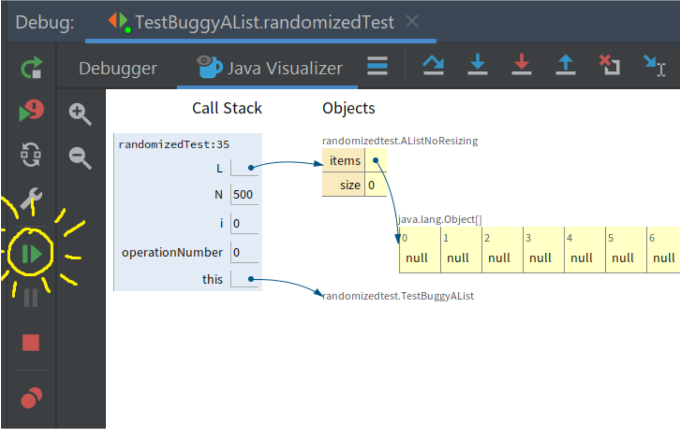

- #debug
- [Debugging Guide](https://sp21.datastructur.es/materials/guides/debugging-guide.html)
- ### evaluate expression
	- A good use of this functionality is to ensure that two objects in your code are equal (rather than being two instances of the same class) by evaluating a == b which can be difficult to tell from the Variables Panel alone. This has the added benefit of not changing any values in the code, so you don’t have to worry about accidentally modifying the behavior you trying to observe.
	- 
- ### Resume:
	- Every time you click resume, the code is running (as if you pressed step-over a bunch of times) until it gets back to the breakpoint again.
	- 
- ### Conditional breakpoint
	- Right-click on the breakpoint.
	- 
	- Click resume, and the code will run until the condition of the breakpoint is met, i.e. the size is 12.
- ### Execution Breakpoint
	- You’ll notice that every time the test fails, the message that we get is something like:
	  
	  ```
	  java.lang.ArrayIndexOutOfBoundsException: Index 7 out of bounds for length 7
	  
	  at randomizedtest.BuggyAList.resize(BuggyAList.java:31)
	  ```
	  
	  One way to do this would be to set a conditional breakpoint on line 31 of  `BuggyAList.java`  with the condition  `i == items.length` . This will work fine, and you’re welcome to try it.
	  
	  However, we’ll take this opportunity to instead show you how to set up an “Execution Breakpoint” so that we can stop the code and visualize what’s going on when your code crashes.
	  
	  To this, click “Run -> View Breakpoints”. You should see a window like this pop up:
	   
	  
	  Click on the checkbox on the left that says “any exception” and then click on that says “Condition:” and in the window and enter exactly:
	  
	  ```
	  this instanceof java.lang.ArrayIndexOutOfBoundsException
	  ```
	  
	  Once you’ve done this, your breakpoints window should look like:
	   
	  
	  Click the debug button and your code should stop right at the moment the exception is about to occur. Click the visualizer and try to figure out why the code is crashing. Now the real problem solving can start!
	-
	- **NOTE: If you use the debug feature without specifying a condition, your code will stop in some various mysterious places. Make sure you never have “Any Exception” checked without having a specified condition.** This is because the process of starting JUnit tests generates a bunch of exceptions that ultimately get ignored. This is well beyond the scope of our class. If you’re done using an execution breakpoint, you should uncheck the “Java Exceptions Breakpoints” box in the top left.
-