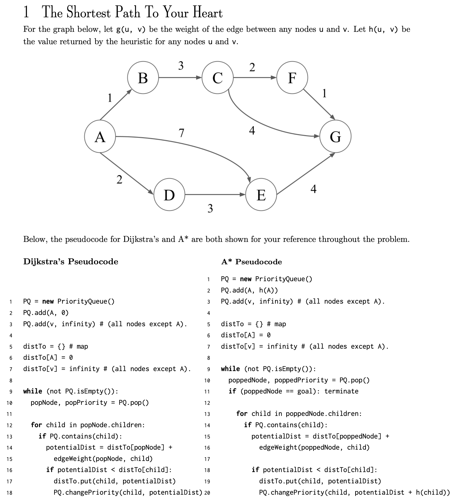
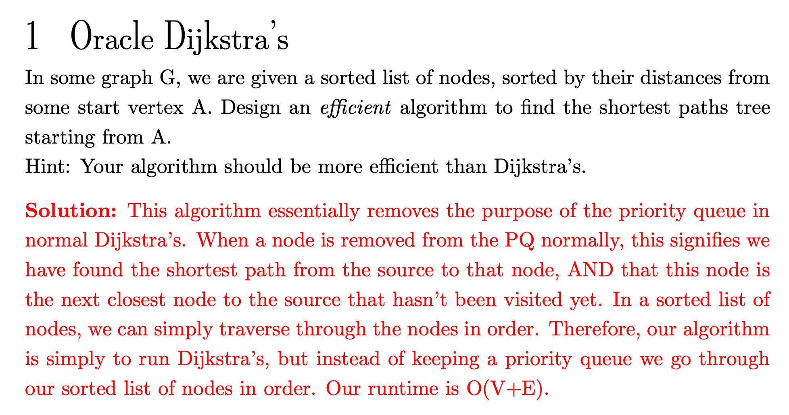

- ## Basic
	- 
	- We know that the heap-optimized Dijkstra algorithm is actually a variation of BFS, where the queue in BFS is transformed into a priority queue, and a relaxation operation is added when expanding new states.
- ## Pseudocode
	- {:height 643, :width 573}
- # Problem
	- ## 1. Oracle Dijkstra’s
		- 
- # Leetcode
	- LATER [[787. Cheapest Flights Within K Stops]]
	- [[1162. As Far from Land as Possible]]