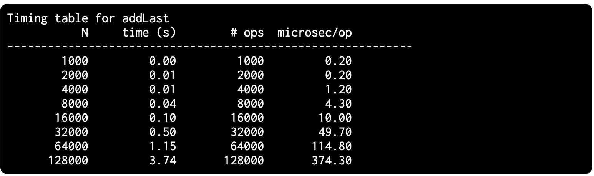

- #profiling #test #java
- [Lab 3 website](https://sp21.datastructur.es/materials/lab/lab3/lab3)
- 
- ### For small inputs, results are unreliable for two reasons:
	- The variance in runtime is high (due to issues like caching, process switching, branch prediction, etc.)
	- and the accuracy of our timer (milliseconds) is insufficient to resolve the difference between N = 1000 and N = 2000.
		- For this reason, when we run empirical timing tests, we want to focus on the behavior for large N.
- ### Randomized Function Calls
	- In principle, it’s possible to carefully craft a set of comparison tests that will eventually find the bug. However, an alternate and complementary strategy is to use a randomized approach where we make random calls to both implementations and use JUnit methods to verify that they always return the same values.
-