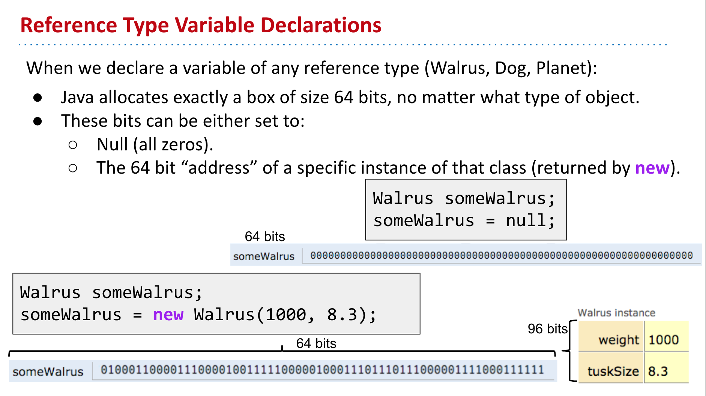
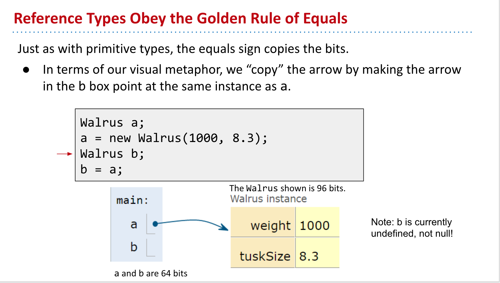

title:: Languages: Undefined vs Null

- #language-comparison #null #undefined
-
- ## Java
	- **Null**
		- All zeros in memory. For all reference types, the default value is `null`.
		- Both static and instance members of reference type not explicitly initialized are set to null by Java. The same rule applies to array members.
		- **Note** that the above rule excludes local variables: they must be initialized explicitly, otherwise the program will not compile.
		- 
	- **Undefined**
		- After declared the variable and before initiation. **Note: this is because it's a local variable and haven't assign a value yet. If we didn't give it a value at the end, it's a compiler error. So in this specific situation, `Walrus b` is undefined, not `null`**. [Java 8 Initial Values of Variables](https://docs.oracle.com/javase/specs/jls/se8/html/jls-4.html#jls-4.12.5)
		- 
	-
- ## JavaScript
	- That's why JS has these two primitive types. `undefined` & `null`.
	-