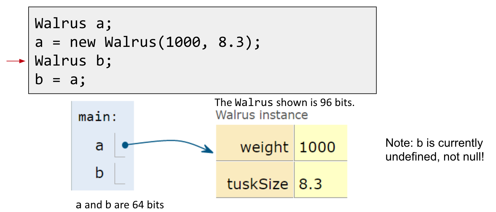

- #java
-
- ((6227ab55-ec12-4e3a-a354-4d57cce5c892))
- ### Reference Types
  collapsed:: true
	- There are 8 primitive types in Java:
		- byte, short, **int**, long, float, **double**, boolean, char
	- Everything else, including arrays, is a **reference type.**
- ### Reference Types Variable Declarations
	- When we declare a variable of any reference type (Walrus, Dog, Planet):
		- Java allocates exactly a box of size 64 bits, no matter what type of object.
		- These bits can be either set to:
			- Null (all zeros).
			- The 64 bit "address" of a specific instance of that class (return by *new*).
		- Before the box been set, it's undefined, not null.
			- 
- ### Reference Types Obey the Golden Rule of Equals
	- Just as with primitive types, the equals sign copies the bits.
		- In terms of our visual metaphor, we “copy” the arrow by making the arrow in the b box point at the same instance as a.
- ### The Golden Rule of Equals (and Parameter Passing)
	- Passing parameters obeys the same rule: Simply **copy the bits** to the new scope.
- ### Static Nested Classes
	- If the `IntNode` class never uses any variable or method of the `SLList` class, we can turn this class static by adding the “static” keyword.
	- Static nested classes are useful when you want to group related classes together, or when you want to define a class that is only used within the context of its outer class. They can also be useful for creating utility classes that can be used by other classes in the same package.
-