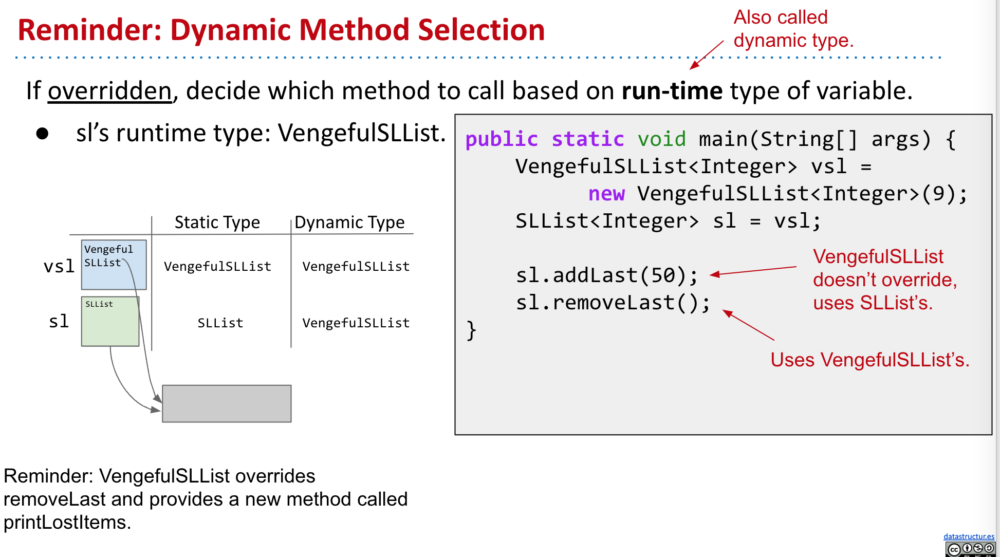
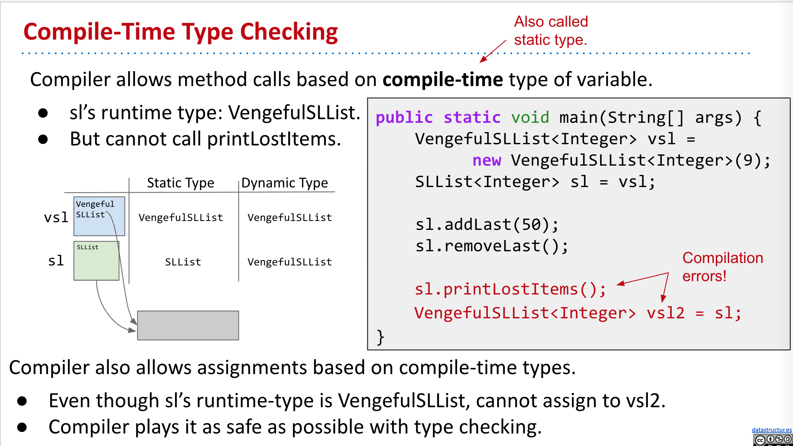
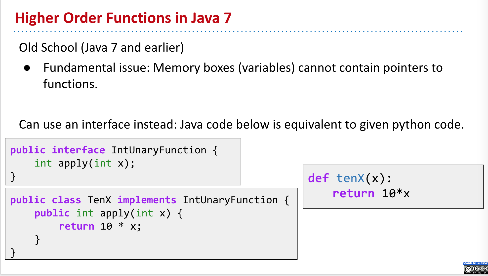
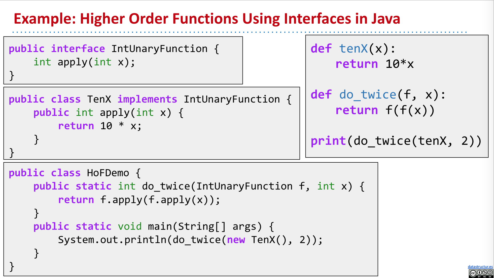
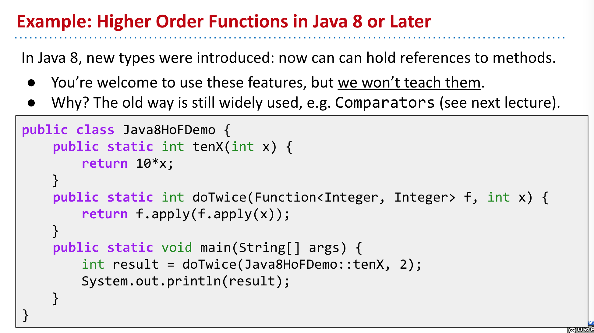
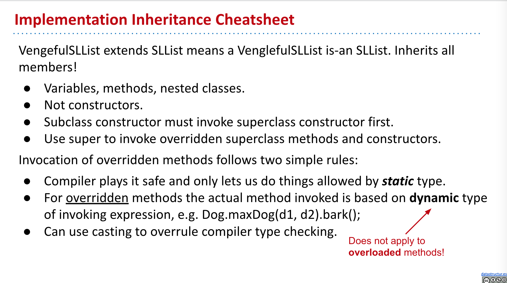

- ### Calling Other Constructors
	- If you want to use a super constructor other than the no-argument constructor, can give parameters to super.
	- ```java
	  public VengefulSLList(Item x) {
	    	super(x); // calls SLList(Item x);
	    	deletedItems = new SLList<Item>();
	  }	
	  ```
	- Not equivalent! Code to the bottom makes implicit call to `super()`, not `super(x)`.
	- ```java
	  public VengefulSLList(Item x) {
	    	deletedItems = new SLList<Item>();
	  }
	  ```
- ### [#A] Implementation Inheritance Breaks Encapsulation
	- [CS 61b Lecture Video](https://youtu.be/EfxYiAN6YME)
	- 
	- 
		- `vd.barkMany(3)` will call Dog's `bark()`, but vd's dynamical type is `VerboseDog`, so `bark()` method will call `VerboseDog`'s `barkMany()` method, which will gets caught in an infinite loop!
- ### Dynamic Method Selection
	- If overridden, decide which method to call based on **run-time** type of variable.
		- 
- ### Compile-Time Type (Static Type) Checking
	- Compiler allows method calls based on **compile-time** type of variable.
		- 
- ### Higher Order Functions
	- A function that treats another function as data.
	- Example in Python:
		- ```python
		  def tenX(x):
		  	return 10*x
		    
		  def do_twice(f, x):
		    	return f(f(x))
		    
		  print(do_twice(tenX, 2))
		  ```
	- In Java 7:
		- 
		- 
	- In Java 8:
		- 
- ### Implementation Inheritance Cheatsheet
	- 
-