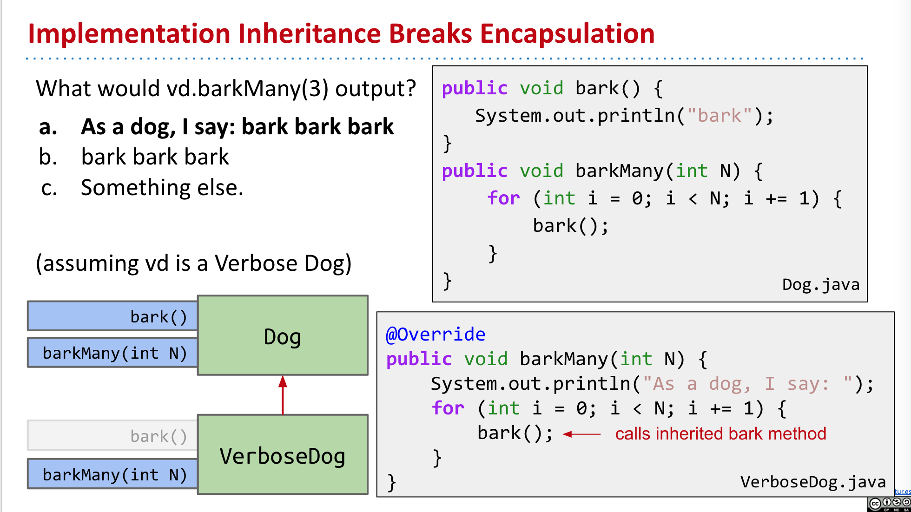
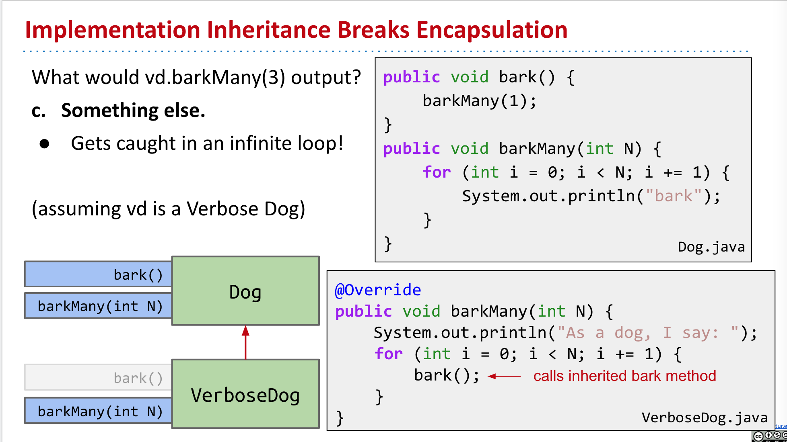

- ### [#A] Implementation Inheritance Breaks Encapsulation
	- [CS 61b Lecture Video](https://youtu.be/EfxYiAN6YME)
	- 
	- 
		- `vd.barkMany(3)` will call Dog's `bark()`, but vd's dynamical type is `VerboseDog`, so `bark()` method will call `VerboseDog`'s `barkMany()` method, which will gets caught in an infinite loop!
	-