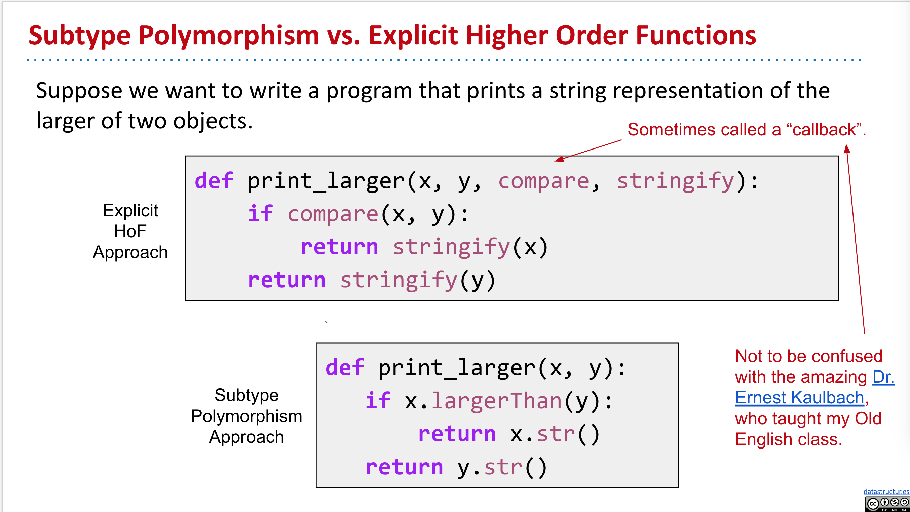
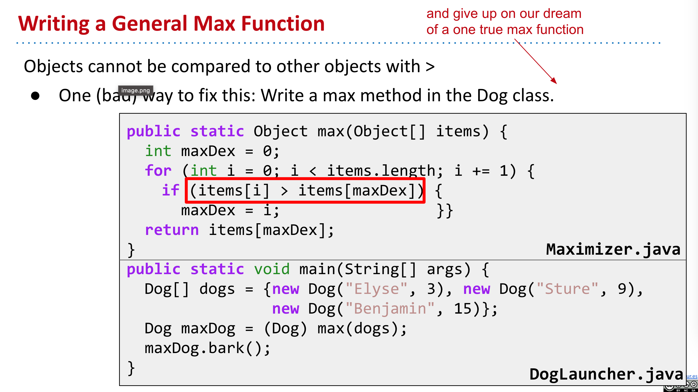
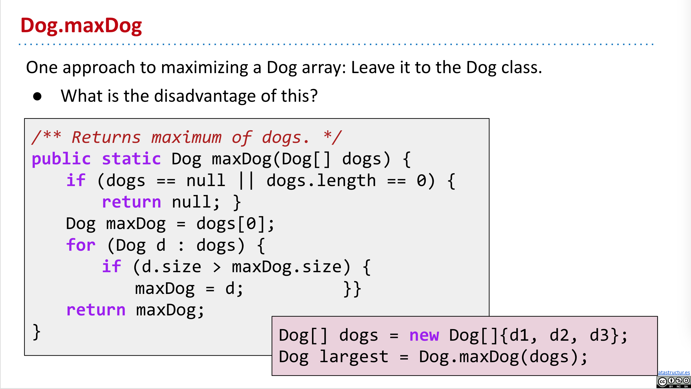

title:: Lec10: Subtype Polymorphism vs. HoFs

- ### Subtype Polymorphism vs. Explicit Higher Order Functions
	- 
- ### Why should use `Comparable`
	- 
	- 
	- The disadvantage of this method is we have to get every animals a new method.
- ### `Comparable` vs. `Comparator`
	- `Comparable` comparing itself to other objects. `Comparator` compares two other objects.
	- Since you can only have one `comparable` function, if you want to have multiple comparable functions, you have to use `comparator`.
-