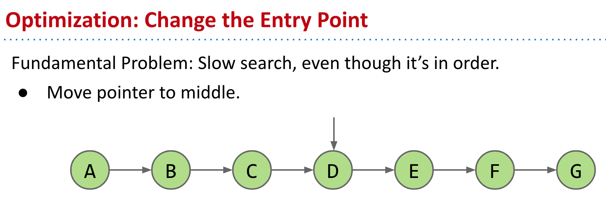
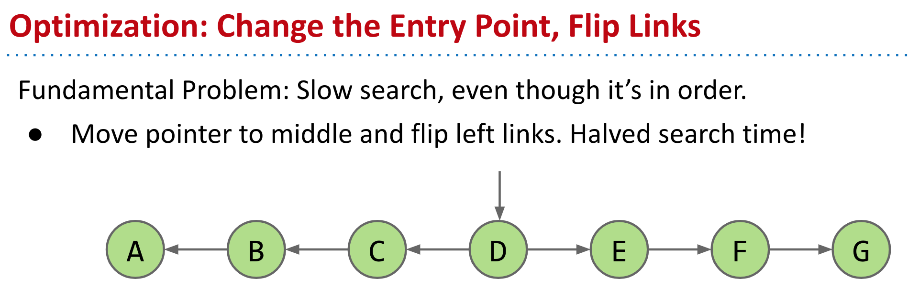
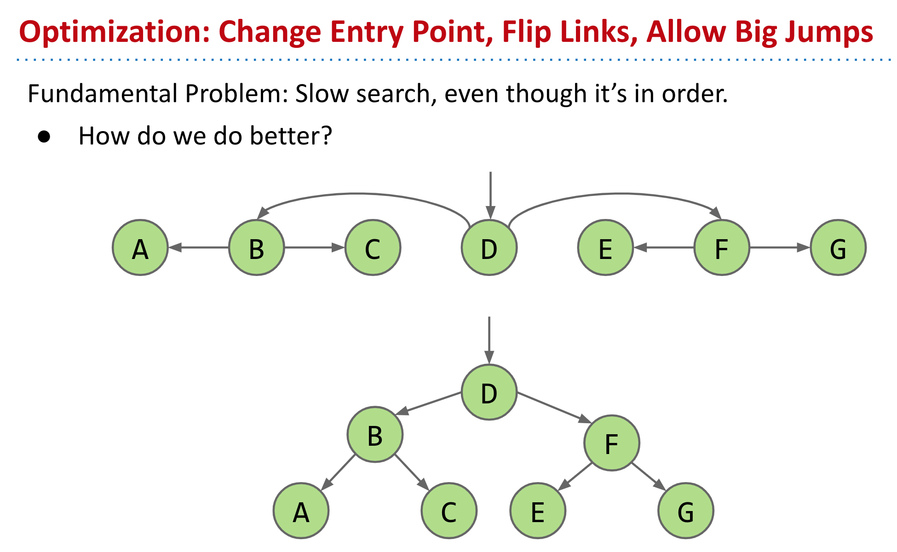

- ### Abstract Data Types
	- ADTs are defined in terms of operations, not implementation.
	- Several useful ADTs: Disjoint Sets, Map, Set, List.
- ### From Linked List to BST
	- 
	- 
	- {:height 460, :width 734}
- ### Inserting a New Key into a BST
	- ```
	  static BST insert(BST T, Key ik) {
	    if (T == null)
	      return new BST(ik);
	    if (ik ≺ T.key)
	      T.left = insert(T.left, ik);
	    else if (ik ≻ T.key)
	      T.right = insert(T.right, ik);
	    return T; // !!! if ik == T.key, return T
	  }
	  ```
	- A common bad habit to avoid:
		- ```
		    if (T.left == null)
		      T.left = new BST(ik);
		    else if (T.right == null)
		      T.right = new BST(ik);
		  ```
	- We should trust our recursion function and trust our base cases.
-