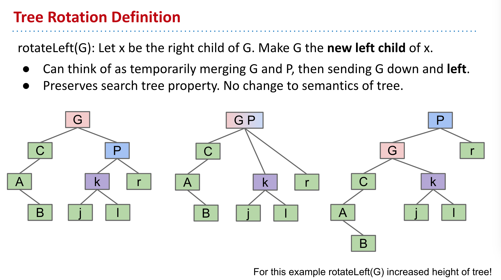
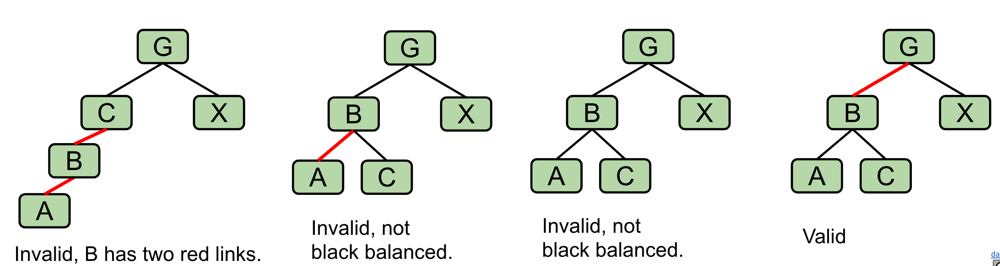

- ### Tree Rotation Definition
	- 
- ### Rotation for Balance
	- #### Rotation:
		- Can shorten (or lengthen) a tree.
		- Preserves search tree property.
- ### Left-Leaning Red Black Binary Search Tree (LLRB)
	- #### Some handy LLRB properties:
		- No node has two red links [otherwise it’d be analogous to a 4 node, which are disallowed in 2-3 trees].
		- Every path from root to ~~a leaf~~(This should say “a null reference”, not “a leaf”) has same number of **black links** [because 2-3 trees have the same number of links to every leaf]. LLRBs are therefore balanced.
		- 
- ### LLRB Rules:
	- When inserting: Use a red link.
	- If there is a *right leaning “3-node”*, we have a **Left Leaning Violation.**
		- Rotate left the appropriate node to fix.
	- If there are *two consecutive left links*, we have an **Incorrect 4 Node Violation.**
		- Rotate right the appropriate node to fix.
	- If there are any *nodes with two red children*, we have a **Temporary 4 Node.**
		- Color flip the node to emulate the split operation.**
- ### LLRB Runtime
	- The runtime analysis for LLRBs is simple if you trust the 2-3 tree runtime.
		- LLRB tree has height O(log N).
		- Contains is trivially O(log N).
		- Insert is O(log N).
			- O(log N) to add the new node.
			- O(log N) rotation and color flip operations per insert.
- ### LLRB Implementation
	- **Amazingly, turning a BST into an LLRB requires only 3 clever lines of code.**
	- ```java
	  private Node put(Node h, Key key, Value val) {
	  	if (h == null) { return new Node(key, val, RED); }
	   
	  	int cmp = key.compareTo(h.key);
	      if (cmp < 0)      { h.left  = put(h.left,  key, val); }
	      else if (cmp > 0) { h.right = put(h.right, key, val); }
	      else              { h.val   = val;                    }
	   
	  	if (isRed(h.right) && !isRed(h.left))      { h = rotateLeft(h);  }
	  	if (isRed(h.left)  &&  isRed(h.left.left)) { h = rotateRight(h); }
	  	if (isRed(h.left)  &&  isRed(h.right))     { flipColors(h);      } 
	   
	  	return h;
	  }
	  ```
	- [Implementation](https://algs4.cs.princeton.edu/33balanced/RedBlackBST.java.html)
- ### Summary Search Trees
	- #### In the last 3 lectures, we talked about using search trees to implement sets/maps.
		- **Binary search trees** are simple, but they are subject to imbalance.
		- **2-3 Trees (B Trees)** are balanced, but painful to implement and relatively slow.
		- **LLRBs** insertion is simple to implement (but delete is hard).
			- Works by maintaining mathematical bijection with a 2-3 trees.
		- Java’s [TreeMap](https://github.com/AdoptOpenJDK/openjdk-jdk11/blob/999dbd4192d0f819cb5224f26e9e7fa75ca6f289/src/java.base/share/classes/java/util/TreeMap.java) is a red-black tree (not left leaning).
			- Maintains correspondence with 2-3-4 tree (is not a 1-1 correspondence).
			- Allows glue links on either side (see [Red-Black Tree](http://en.wikipedia.org/wiki/Red%E2%80%93black_tree)).
			- More complex implementation, but significantly (?) faster.
	- #### There are many other types of search trees out there.
		- Other self balancing trees: AVL trees, splay trees, treaps, etc. There are at least hundreds of different such trees.
	- #### And there are other efficient ways to implement sets and maps entirely.
		- Other linked structures: Skip lists are linked lists with express lanes.
		- Other ideas entirely: Hashing is the most common alternative. We’ll discuss this very important idea in our next lecture.