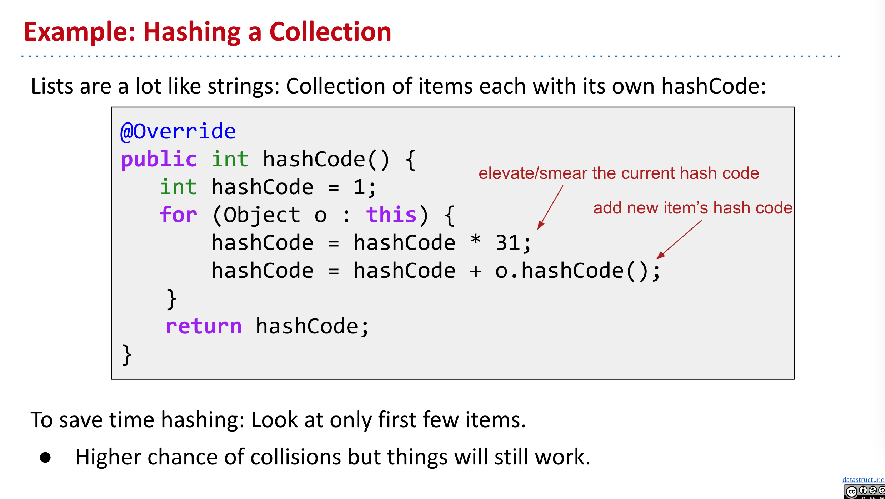
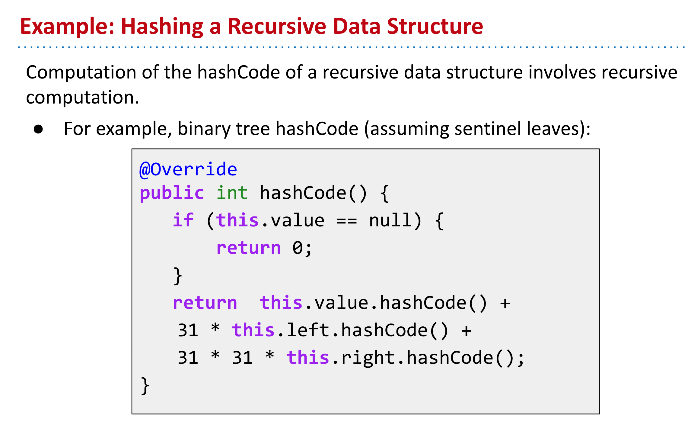
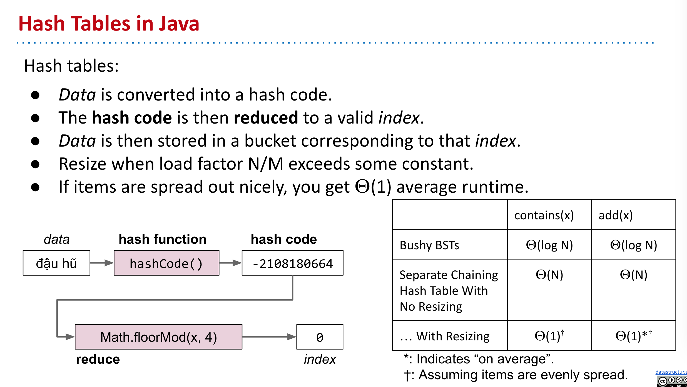

- ### Hash Code
	- A hash code “projects a value from a set with many (or even an infinite number of) members to a value from a set with a fixed number of (fewer) members.
- ### The Ubiquity of Hash Tables
	- #### Hash tables are the most popular implementation for sets and maps.
		- Great performance in practice.
		- Don’t require items to be comparable.
		- Implementations often relatively simple.
		- Python dictionaries are just hash tables in disguise.
- ### Two Important Warnings When Using HashMaps/HashSets
	- #### Warning # 1: Never store objects that can change in a HashSet or HashMap!
		- If an object’s variables changes, then its hashCode changes. May result in items getting lost.
	- #### Warning # 2: Never override equals without also overriding hashCode.
		- Can also lead to items getting lost and generally weird behavior.
		- HashMaps and HashSets use equals to determine if an item exists in a particular bucket.
- ### Hash Function
	- #### Hash Function in Java
		- ```java
		  @Override
		  public int hashCode() {
		      int h = cachedHashValue;
		      if (h == 0 && this.length() > 0) {
		          for (int i = 0; i < this.length(); i++) {
		              h = 31 * h + this.charAt(i);
		          }
		          cachedHashValue = h;
		      }
		      return h;
		  }
		  ```
	- #### Hash Code Base
		- `31` is used in Java.
		- A typical hash code base is a small prime.
			- Why Prime?
				- Never even: Avoids the overflow issue.
				- Lower chance of resulting hashCode having a bad relationship with the number of buckets.
			- Why small?
				- Lower cost to compute.
	- #### Examples:
		- 
		- 
- ### Summary:
	- 