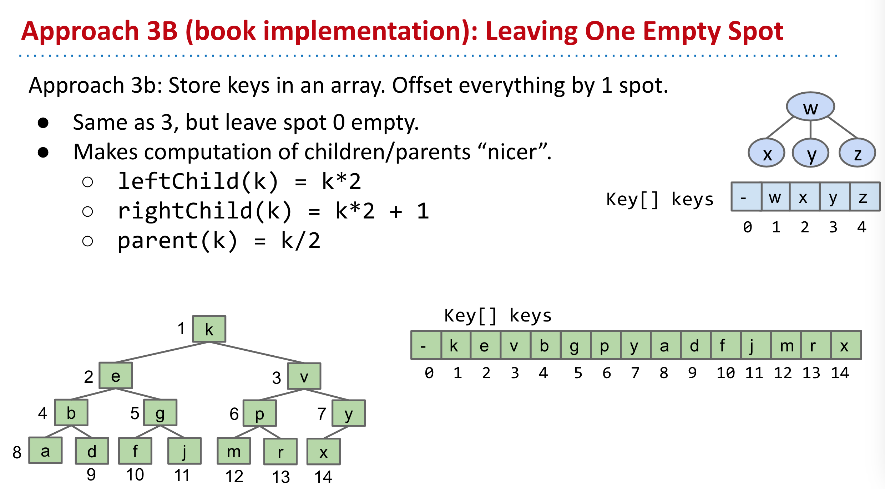
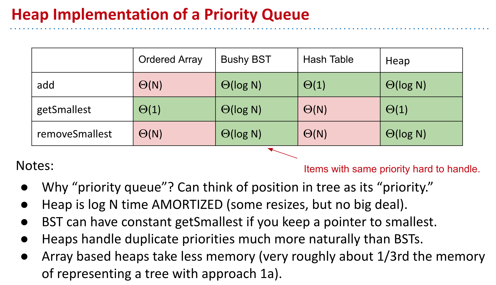

- ### Heaps
	- Heaps are not at all related to "The Heap" on the computer.
	- Binary min-heap: Binary tree that is ***complete*** and obeys ***min-heap property***.
		- Min-heap: Every node is less than or equal to both of its children.
		- Complete: Missing items only at the bottom level (if any), all nodes are as far left as possible.
- ### Implementation
	- 
	- 
	-