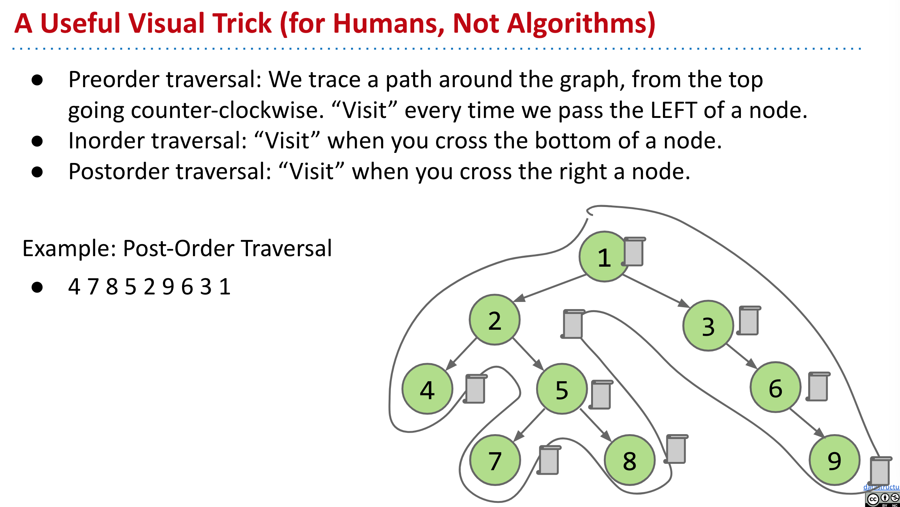
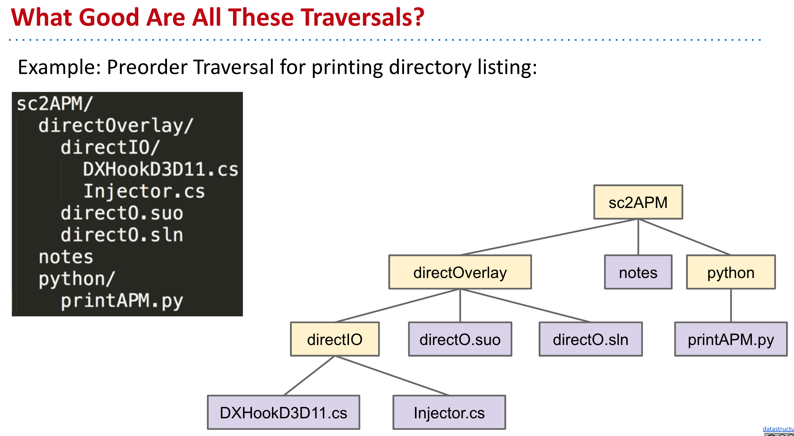
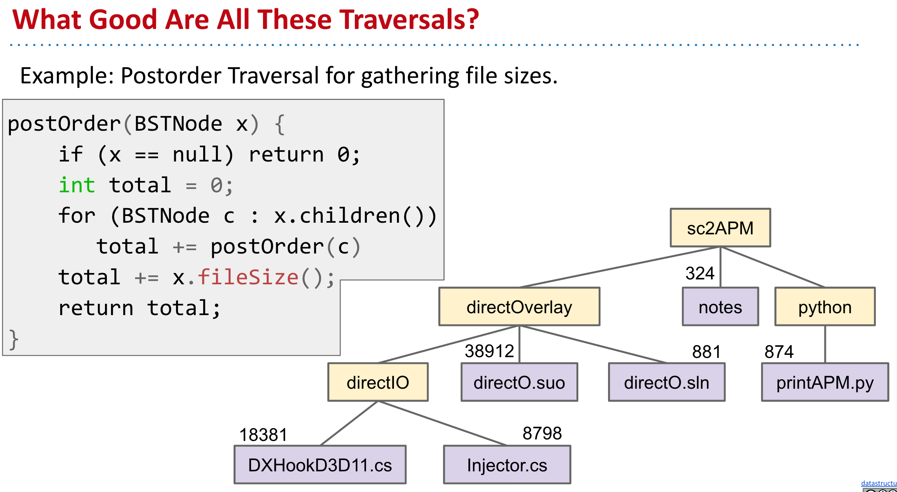
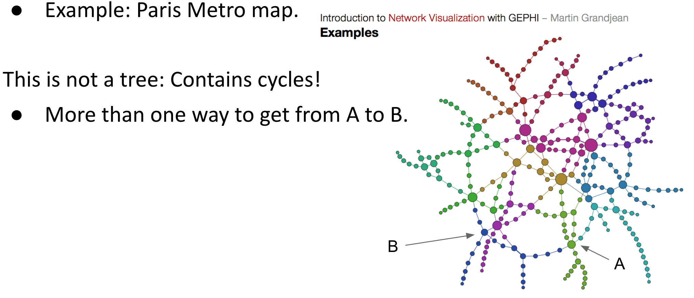
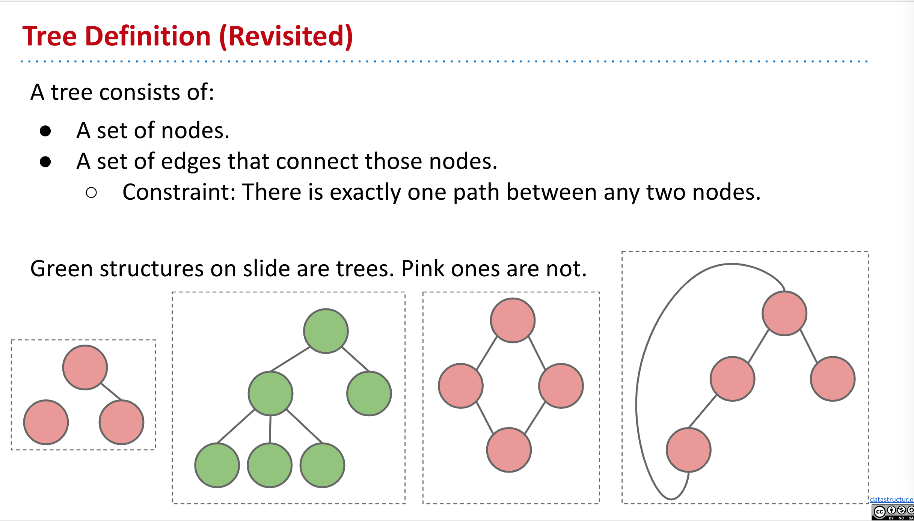
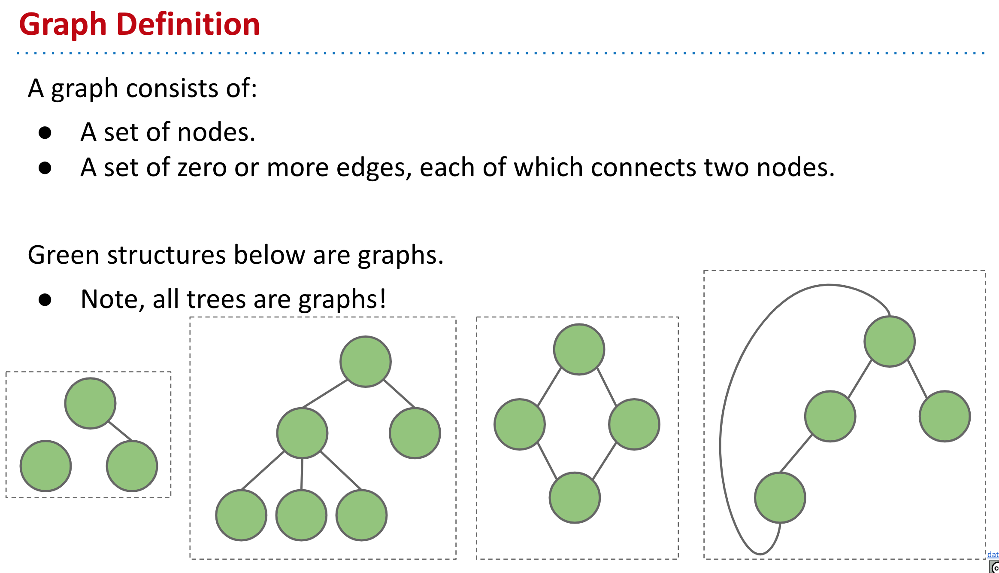
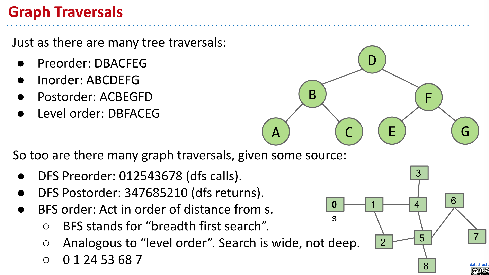

- ### File System Tree
	- To find the total size of all files in a folder, we need to do "tree traversal".
- ### Tree Traversal Orderings
	- #### Depth First Traversals:
		- 3 types: Preorder, Inorder, Postorder
		- Basic (rough) idea: Traverse "deep nodes" before shallow ones.
		- Note: Traversing a node is different than "visiting" a node.
	- 
	- 
	- 
- ### Trees and Hierarchical Relationships
	- #### Trees are fantastic for representing strict hierarchical relationships.
		- But Not every relationship is hierirchical.
		- 
- ### Tree Definition
	- 
- ### Graph Definition
	- 
- ### Graph Traversals
	- 
- ### Summary
	- #### Graphs are a more general idea than a tree.
		- A tree is a graph where there are no cycles and every vertex is connected.
		- Key graph terms: Directed, Undirected, Cyclic, Acyclic, Path, Cycle.
	- #### Graph problems vary widely in difficulty.
		- Common tool for solving almost all graph problems is traversal.
		- A traversal is an order in which you visit / act upon vertices.
		- Tree traversals:
			- Preorder, inorder, postorder, level order.
		- Graph traversals:
			- DFS preorder, DFS postorder, BFS.
		- By performing actions / setting instance variables during a graph (or tree) traversal, you can solve problems like s-t connectivity or path finding.
-
-