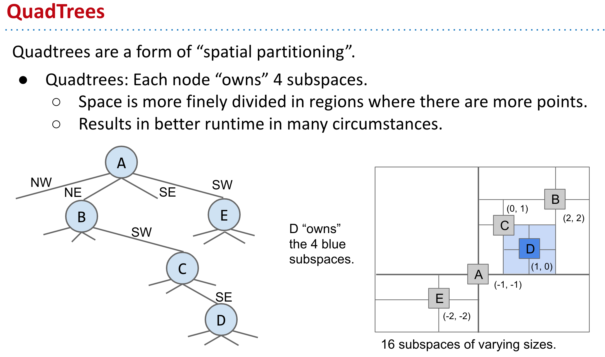
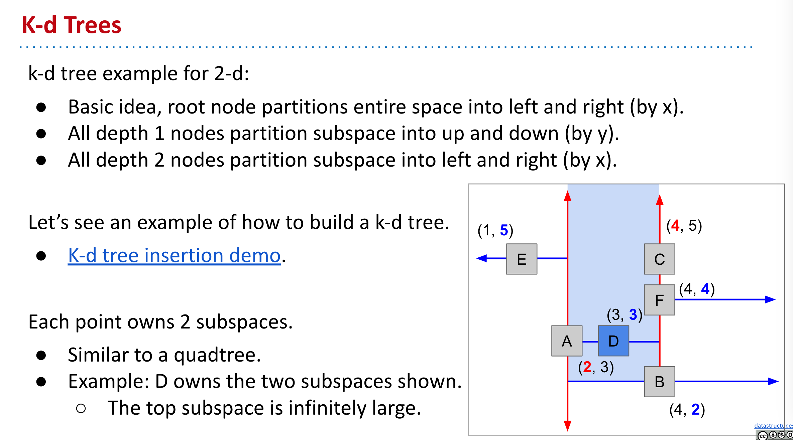
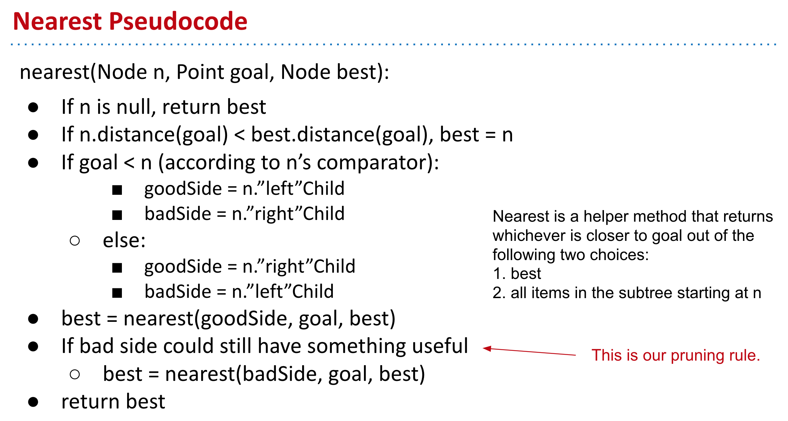
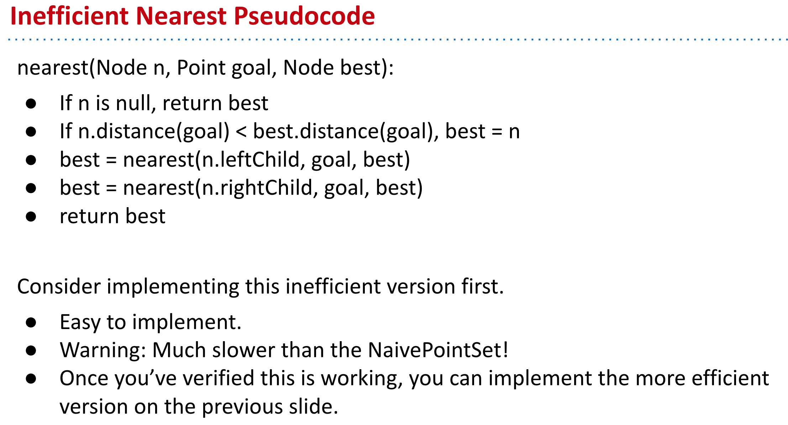
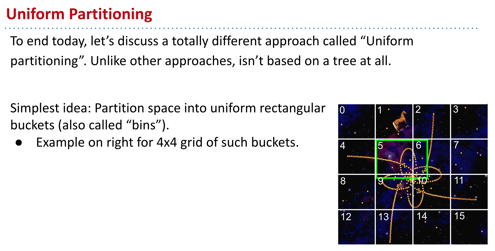

- ## Sets and Maps on 2D Data
	- Not all data can be compared along a single dimension.
- ## QuadTree
	- Every Node has **four** children.
	- 
- ## K-D Tree
	- k-d means "k dimensional".
	- 
	- 
	- 
- ## Uniform Partitioning
	- 
- ## Multi-Dimensional Data Summary
	- ### Set operations can be more complex than just contains, e.g.:
		- **Range Finding**: What are all the objects inside this (rectangular) subspace?
		- **Nearest**: What is the closest object to a specific point?
			- Note: Can be generalized to k-nearest.
	- ### The most common approach is **spatial partitioning**:
		- **Quadtree**: Generalized 2D BST where each node “owns” 4 subspaces.
		- **K-d Tree**: Generalized k-d BST where each node “owns” 2 subspaces.
			- Dimension of ownership cycles with each level of depth in tree.
		- **Uniform Partitioning**: Partition space into uniform chunks.
	- Spatial partitioning allows for **pruning** of the search space.**