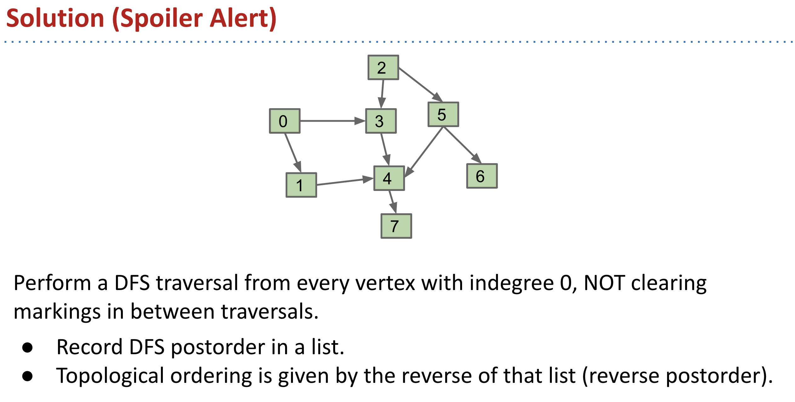
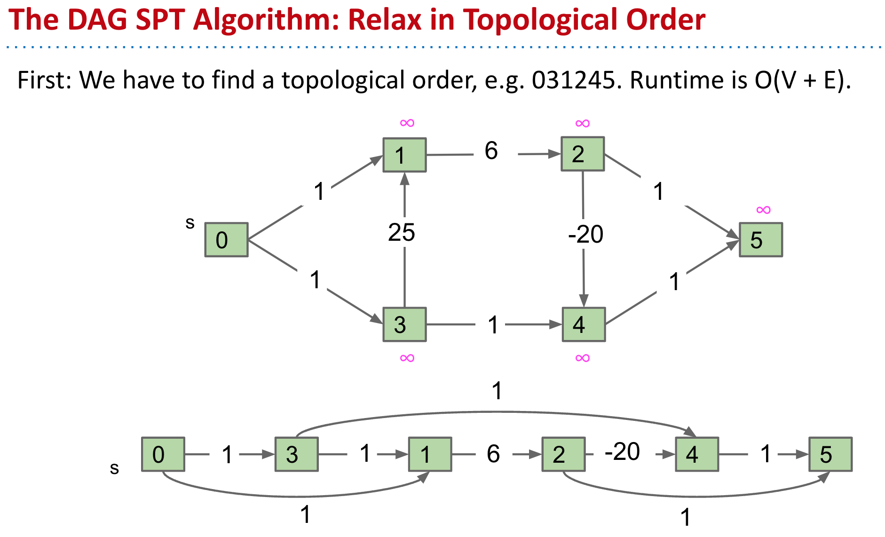
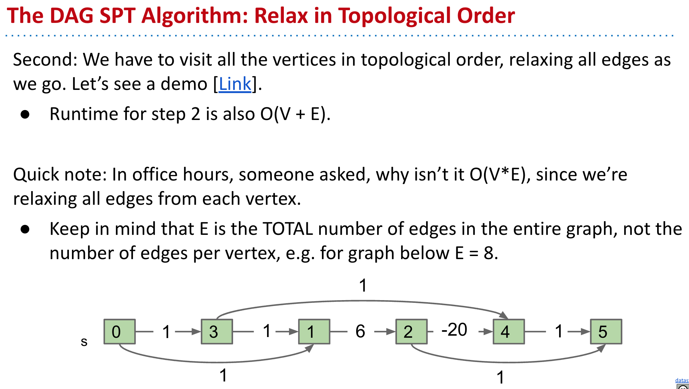
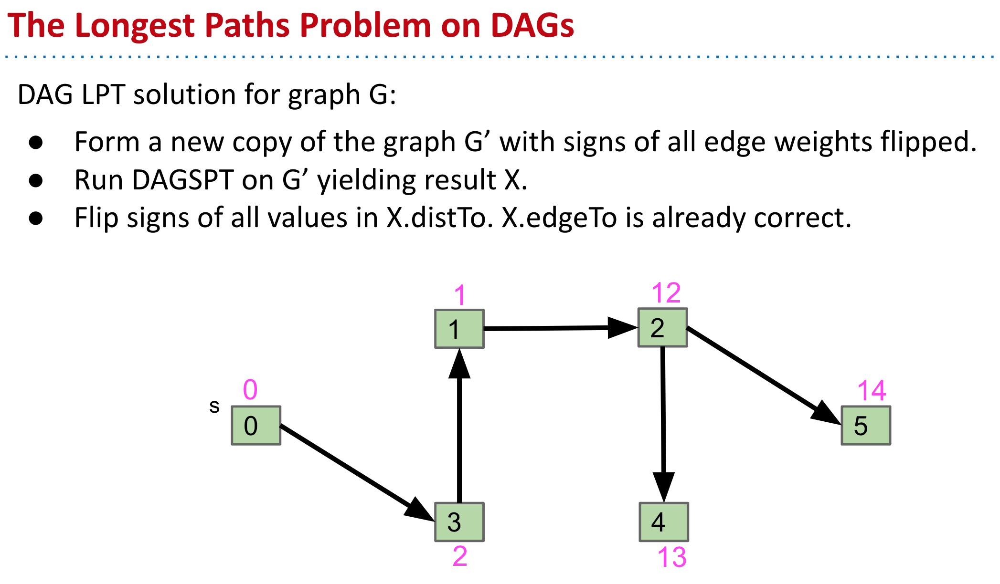
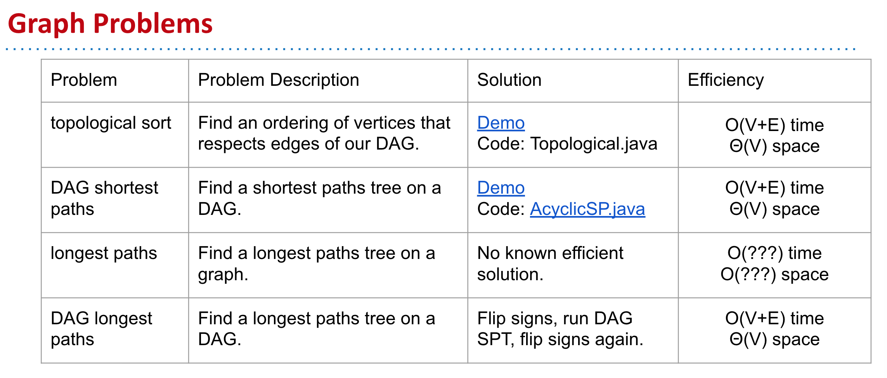

- ## Topological Sorting
	- 
	- A topological sort only exists if the graph is a directed acyclic graph (DAG).
- ### Shortest Paths on DAGs
	- 
	- 
- ### The Longest Paths Problem on DAG
	- 
- ### Summary
	- 
	-
-