title:: MIT6.001 Introduction to Computer Science

- ## Lecture
	- ### What does a computer do?
		- performs **calculations**
			- Good algorithm design also needed to accomplish a task!
		- **remembers** results
			-
	- ### Types of knowledge
		- **declarative knowledge** is statements of fact.
		- **imperative knowledge** is a recipe or "how-to".
	- ### Machines
		- 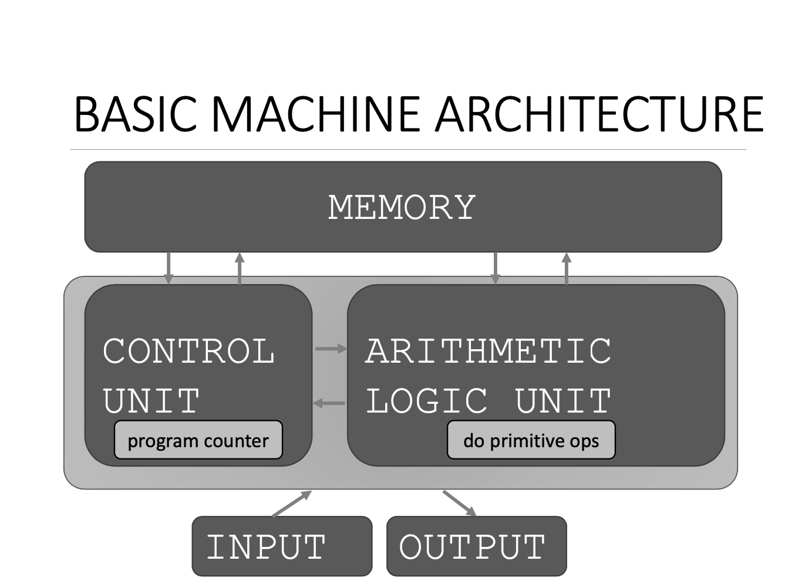
			- There are datas and sequence of instructions in the memory.
			- ALU will do calculations for data in memory.
			- CU will use program counter to point to the instructions in the memory,  and tell when should stop the process and give an output.
			-
	- ### Recursion
		- We can have multiple recursion calls inside of a function body.
		- We can have multiple base conditions inside of a function body.
		- Recursion can be easier way to solve problem when you apply this thinking. Break down the problems into a smaller version of the same problem, assume that can be solved, build your solution with that and other simple operations, and let the recursion then unwind it to get to the solution that you want.
		- Towers of Hanoi
		  ```python
		  def printMove(fr, to):
		    	print('move from ' + str(fr) + ' to ' + str(to))
		      
		  def Towers(n, fr, to, spare):
		    	if n == 1:
		        	printMove(fr, to)
		      else:
		        	Towers(n-1, fr, spare, to)
		          Towers(1, fr, to, spare)
		          Towers(n-1, spare, to, fr)
		          
		  print(Towers(4, 'P1', 'P2', 'P3'))
		  ```
	- ### Tuple
		- `('one',)` must have comma to indicate this is tuple.
		- Tuples can conveniently used to *swap* variable values. `(x, y) = (y, x)`
		- Used to return more than one value from a function.
	- ### List
		- `sorted(L)` sort the list but not modify the list, must assign result to a variable.
		- `L.sort()` mutates the list, returns nothing.
		- ```python
		  warm = ['red', 'yellow', 'orange']
		  sorted_warm = warm.sort()
		  
		  cool = ['grey', 'green', 'blue']
		  sorted_cool = sorted(cool)
		  ```
		- 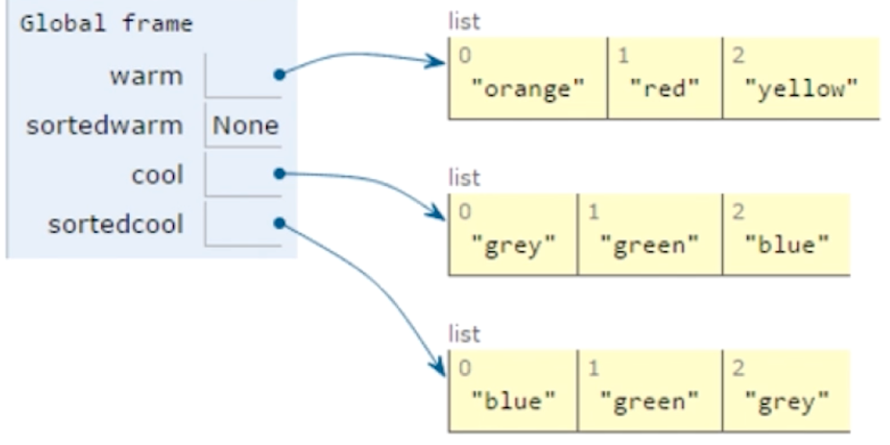{:height 268, :width 507}
		- Clone
			- `cool = ['a', 'b', 'c'] chill = cool[:]`
			- Get another object instead of pointing to the same one.
		- Be aware of mutating when have operations on list.
			- 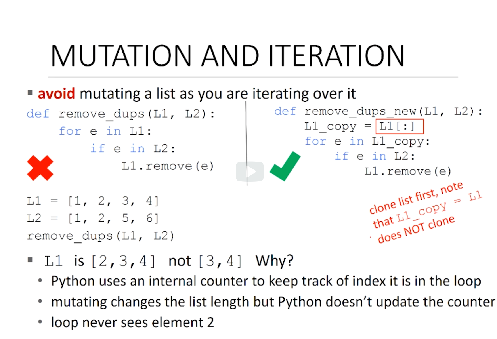
			- 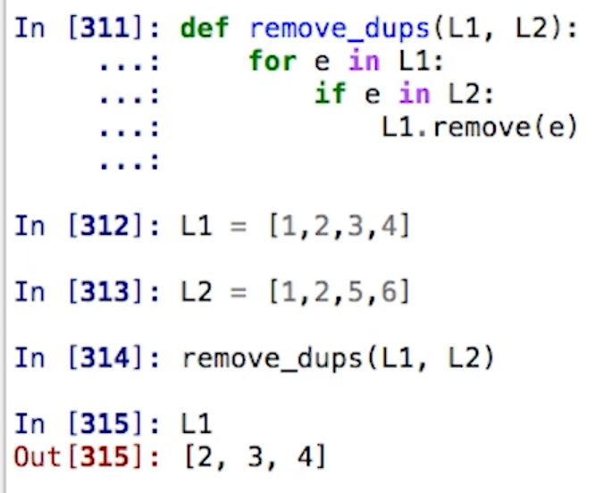{:height 421, :width 484}
			- Since the loop index never see `2` element.
			-
			-
			-
	- ### Functions
		- functions are **first type object**
			- have types
			- can be elements of data structures like lists
			- can appear in expressions
				- as part of assignment statement
				- as an argument to a function
	- ### Dictionary
		- Keys and Values:
			- Values:
				- Any type(immutable and mutable)
				- can be duplicates
				- dictionary values can be lists, even other dictionaries!
			- Keys:
				- must be unique
				- immutable type(int, float, string, tuple, bool)
					- Actually need an object that is hashable, but think of as immutable as all immutable types are hashable
				- careful with float type as a key
			- no order to keys and values
		- Using dict as cache(memorization)
			- Like in Fibonacci calculation
			- 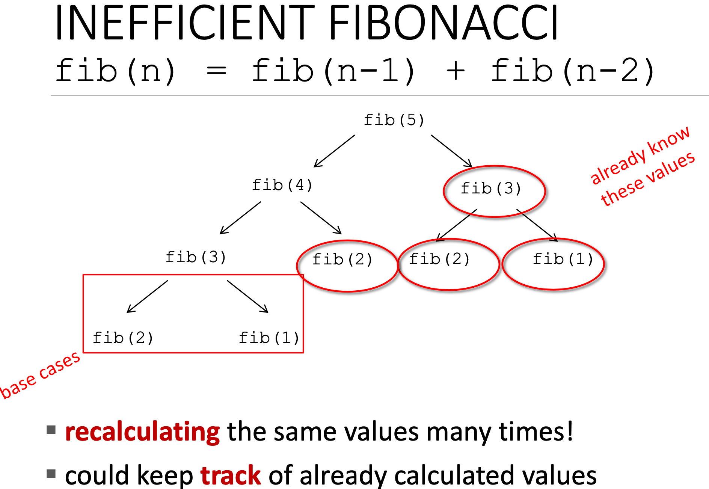
			- 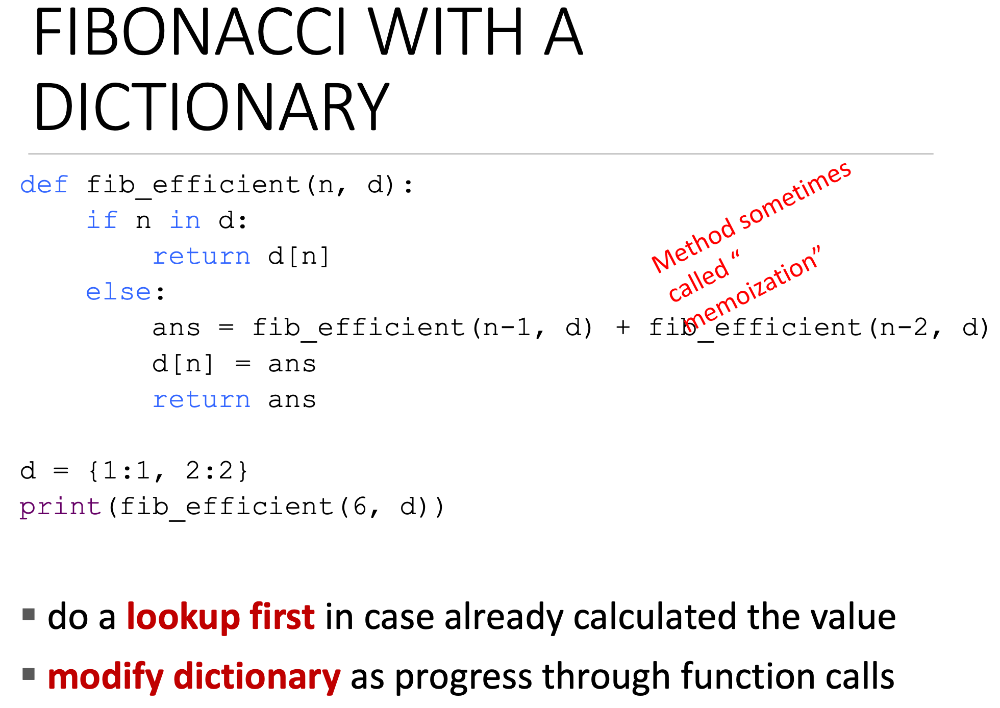
			- Instead of using too much calculation and stack, using dictionary can using heap and can be more efficacy.
			- 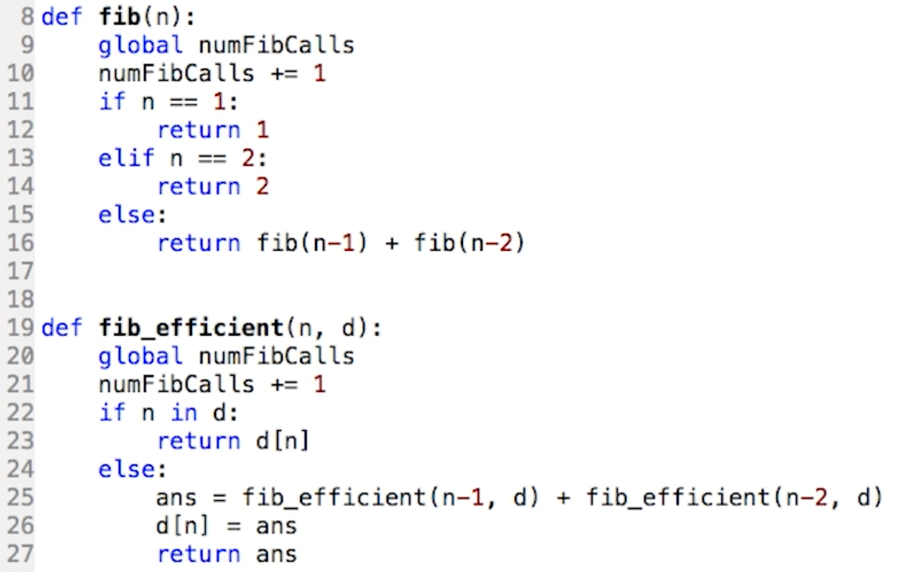
			- 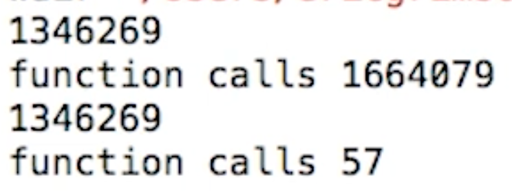{:height 105, :width 265}
			-
	- ### Global Variables
	- ### 7. Testing and Debugging
		- Defensive Programming
			- Write specifications for functions.
			- Modularize programs.
			- Check conditions on inputs/outputs(assertions)
		- Testing/Validation
			- Compare input/output pairs to specification
			- "It's not working!"
			- "How can I break my program?"
		- Debugging
			- Study events leading up to an error
			- "Why is it not working?"
			- "How can I fix my program?"
		- Glass Box Test & Black Box Test
	- ### 8. Exceptions and Assertions
		- Where to use assertions?
			- use as a **supplement** to testing
			- raise **exceptions** if users supplies **bad data input**
			- use **assertions** to
				- check **types** of arguments of values
				- check that **invariants** on data structures are met
				- check **constraints** on return values
				- check for **violations** of constraints on procedure (e.g. no duplicates in a lists)
	- ### 9. Classes and Inheritance
		- Every function in Python always passed in a *self*, as a parameter to refer to the instance of the class
			- 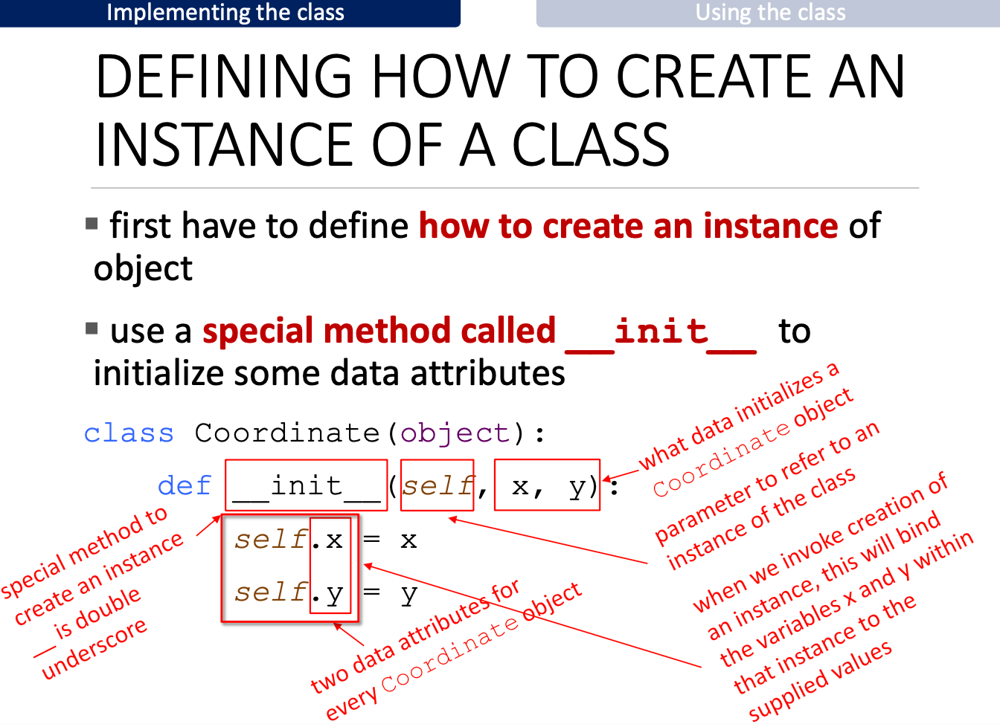{:height 488, :width 634}
			- 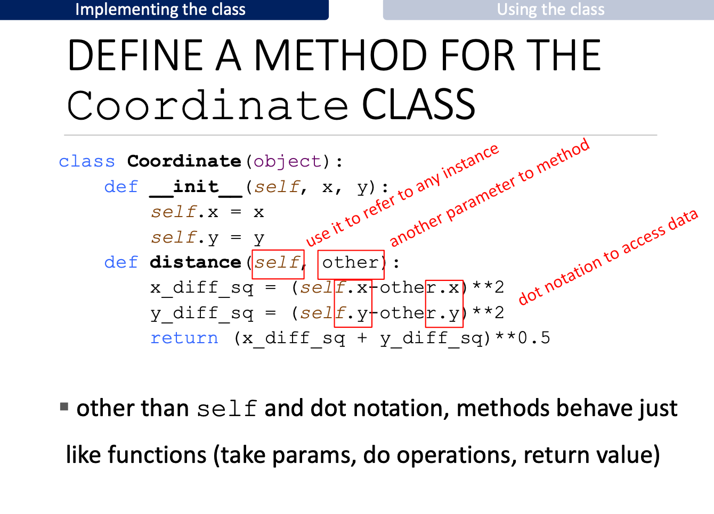{:height 481, :width 636}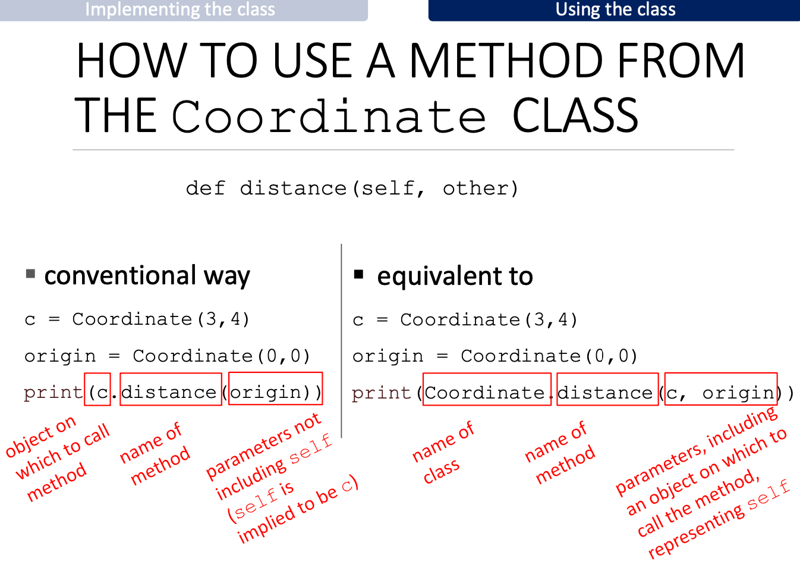{:height 470, :width 636}
			- 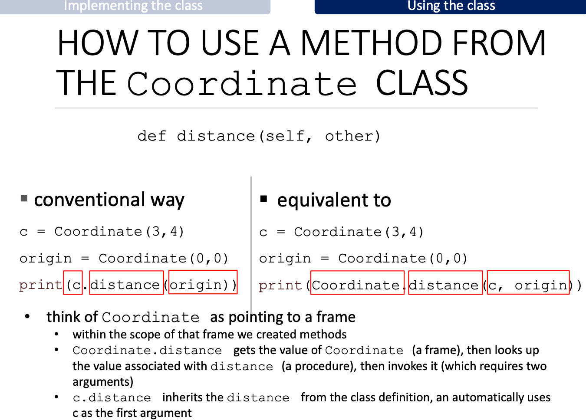{:height 486, :width 654}
		- When one object have multiple inheritances, Python first searches the object's instance variables then uses a simple left-to-right, depth first search through the class hierarchy.
		- TODO compare with Java and Swift and JavaScript 
		  ```Python
		  class Person(object):
		    	this_is_class_variable
		      def __init__(self):
		        	self.this_is_instance_variable = this_is_class_variable
		          this_is_class_variable += 1
		          
		  ```
		- How to compare objects?
			- use `__lt__` method first to determine how to sort the objects.
			- ```Python
			  # there are two classes Person and MITPerson
			  p1 = MITPerson('Eric')
			  p2 = MITPerson('John')
			  p3 = MITPerson('John')
			  p4 = Person('John')
			  ```
			- 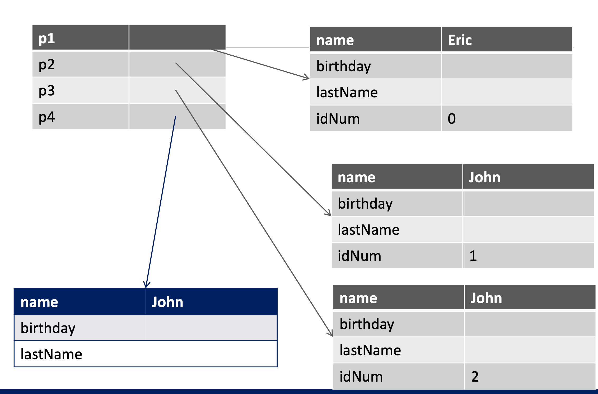
			- When we try to compare:
			  ```bash
			  $ p1 < p2
			  $ True
			  
			  $ p1 < p4
			  $ Attribute Error
			  
			  $ p4 < p1
			  $ False 
			  ```
			- Why we can get `p4 < p1` result?
				- method "shadows" the Person method, meaning that if we compare an MITPerson object, since its environment inherits from the MITPerson class environment, Python will see this version of `__lt__` not the Person version
				- Thus, `p1 < p2` will be converted into `p1.__lt__(p2)` which applies the method associated with the type of `p1`, or the MITPerson version.
				- `p4 < p1` is equivalent to `p4.__lt__(p1)`,  which means we use the `__lt__` method associated with the type of `p4`, namely a Person(the one that compares based on name)
				- `p1 < p4` is equivalent to `p1.__lt__(p4)`, which means we use the `__lt__` method associated with the type of `p1`, namely an MITPerson(the one that compares based on IDNum) and since p4 is a Person, it does not have an IDNum.
		-
	- ### 11. Computational Complexity
		-