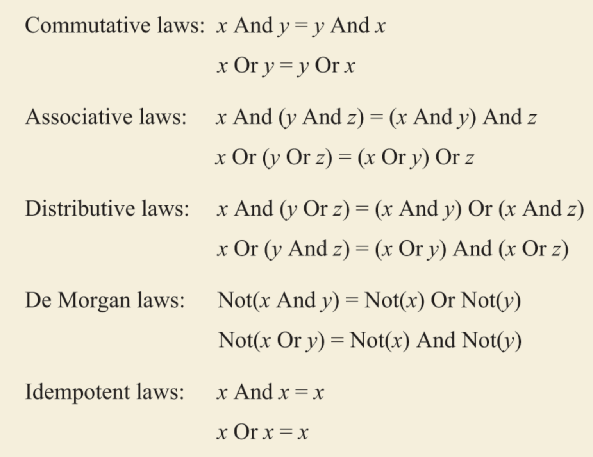
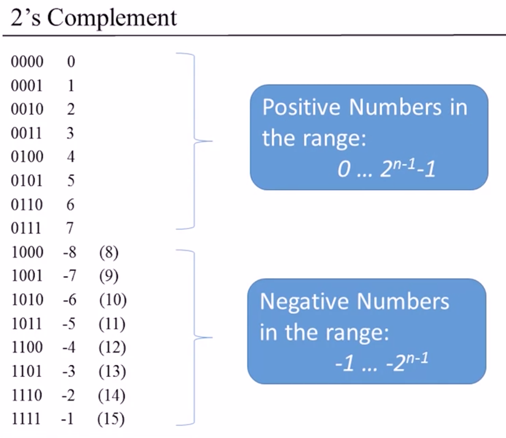
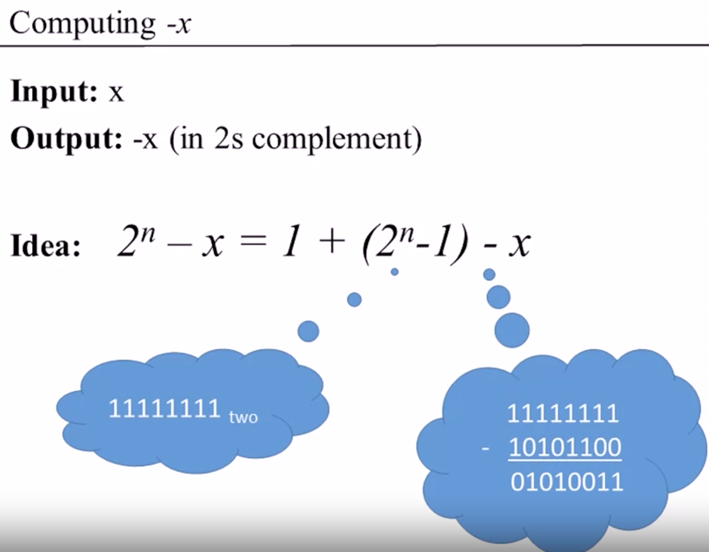
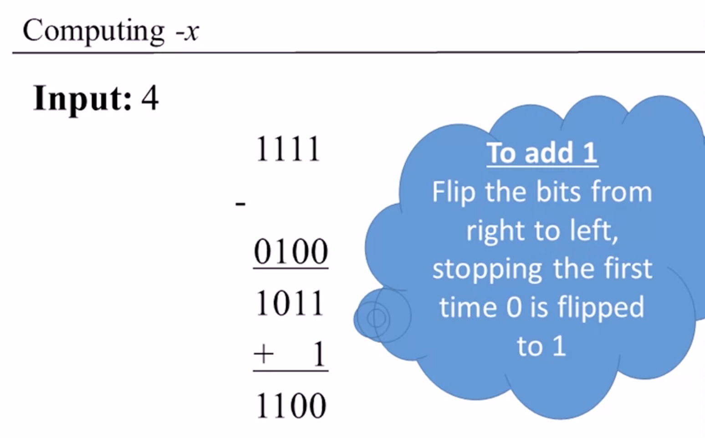
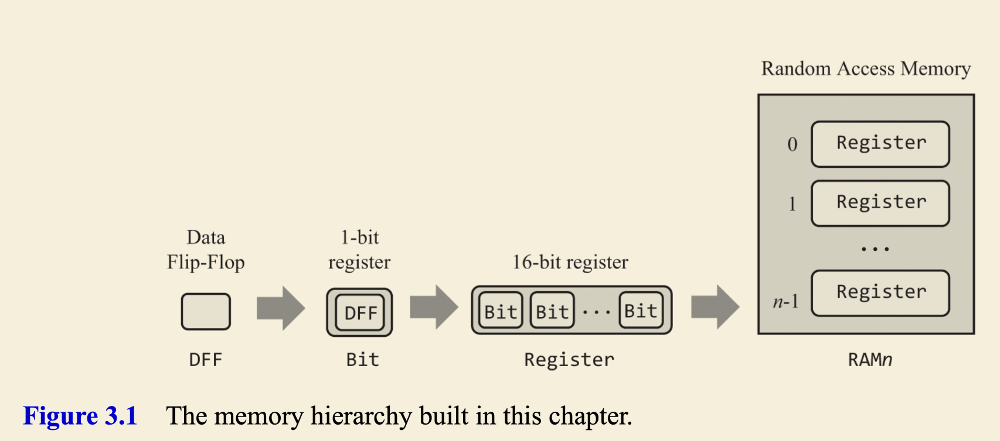
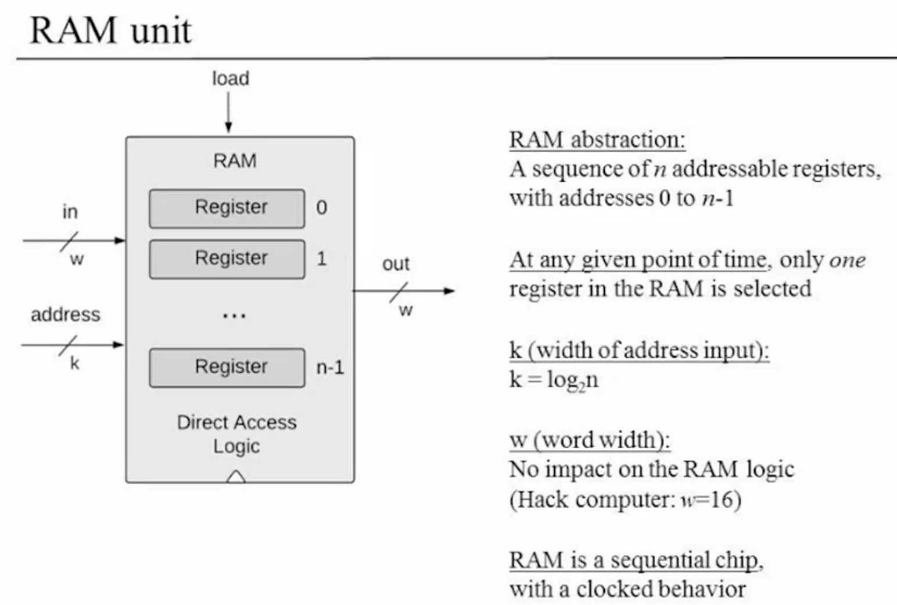
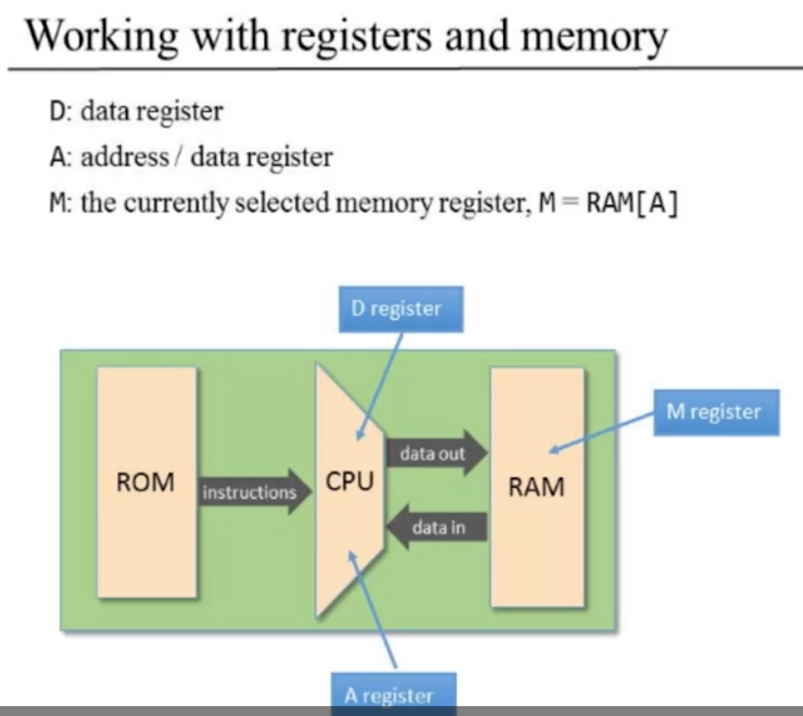

- # 1. Boolean Functions and Gate Logic
	- ## Unit 1.1: Boolean logic
		- {:height 388, :width 494}
	- ## Unit 1.2: Boolean Functions Synthesis
		- ### NAND
			- {:height 197, :width 164}
			- ```
			  (x NAND y) = NOT(x AND y)
			  ```
			- ```
			  NOT(x) = (x NAND x)
			  (x AND y) = NOT(x NAND y)
			  ```
	- ## Unit 1.3: Logic Gates
		- ### Logic Gates:
			- Elementary(Nand, And, Or, Not)
		- Boolean algebra can be used to abstract the behavior of logic gates.
		- Don't worry about physical artifacts.
		- **The art of logic design:** Given a gate abstraction (also referred to as *specification* or *interface*), find an efficient way to implement it using other gates that were already implemented.
	- ## Unit 1.4: Hardware Description Language
		- Multi-Bit Version of Basic Gates
			- The bits are indexed from right to left, the rightmost bit being the 0'th bit and the leftmost bit being the 15'th bit (in a 16-bit setting).
- # 2. Boolean Arithmetic
	- ## Unit 2.3: Negative Numbers
		- ### 2's Complement
		  collapsed:: true
			- {:height 395, :width 504}
			- {:height 556, :width 505}
			- 
			- 
- # 3. Memory
	- ## Combinational vs. Sequential
		- The chips which are time independent, are called *combinational*: they respond to different combinations of their inputs without delay, except for the time it takes their inner chip-parts to complete the computation.
		- The outputs of *sequential* chips depend not only on the inputs in the current time but also on inputs and outputs that have been processed previously.
	- ## Unit 3.1: Sequential Logic
		- Combinatorial: `out[t] = function(in[t])`
		- Sequential: `state[t] = function(state[t-1])`
		- ### Time Matters
			- #### In reality, outputs are always delayed, due to at least two reasons:
				- First, the inputs of the chips don’t appear out of thin air; rather, the signals that represent them travel from the outputs of other chips, and this travel takes time.
				- Second, the computations that chips perform also take time; the more chip-parts the chip has—the more elaborate its logic—the more time it will take for the chip’s outputs to emerge fully formed from the chip’s circuitry.
	- ## Unit 3.2: Flip Flops
		- *Data Flip Flops*: an elementary, time-dependent logic gate that can flip and flop between two stable states: representing 0 and representing 1.
		- 
	- ## Unit 3.3: Memory Units
		- Computer programs use variables, arrays, and objects—abstractions that persist data over time. Hardware platforms support this ability by offering memory devices that know how to *maintain state*.
		- Main memory: RAM
		- Secondary memory: disks
		- Volatile/non-volatile
		- {:height 438, :width 628}
		- RAM: Random Access Memory, irrespective of the RAM size, every register can be accessed at the same time - instantaneously!
	- ## Unit 3.4: Counters
		-
- # Machine Language
	- ## Hack Programming
		- ### Working with registers and memory
			- {:height 511, :width 563}
		- ### Branching
		- ### Variables
		- ### Iteration
		- ### Pointers
		- ### Input/output
	-