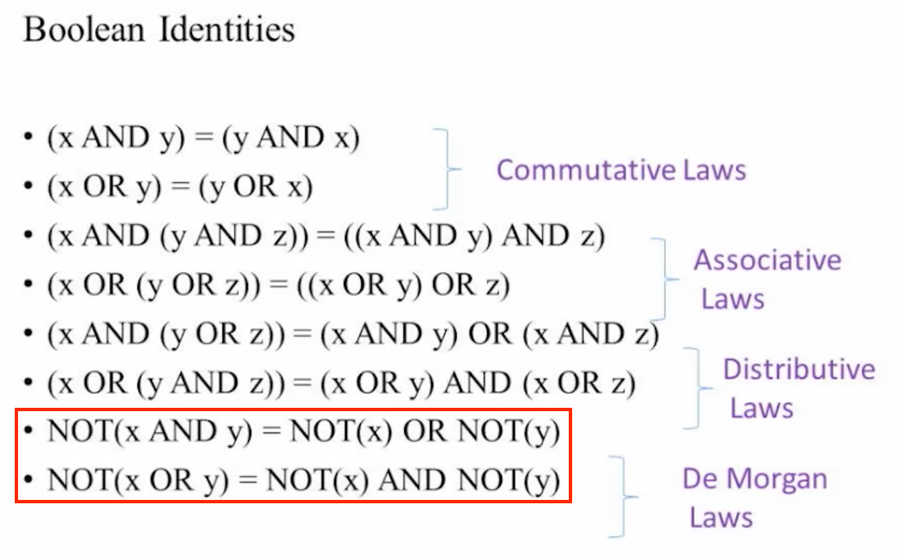
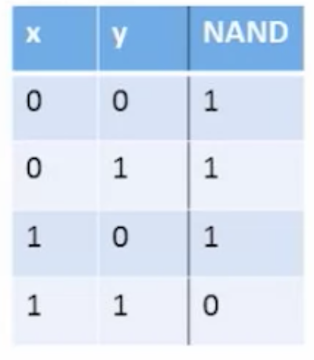

- # Boolean Functions and Gate Logic
	- ## Unit 1.1: Boolean logic
		- 
	- ## Unit 1.2: Boolean Functions Synthesis
		- ### NAND
			- {:height 197, :width 164}
			- ```
			  (x NAND y) = NOT(x AND y)
			  ```
			- ```
			  NOT(x) = (x NAND x)
			  (x AND y) = NOT(x NAND y)
			  ```
	- ## Unit 1.3: Logic Gates
		- ### Logic Gates:
			- Elementary(Nand, And, Or, Not)
	- ## Unit 1.4: Hardware Description Language
		-