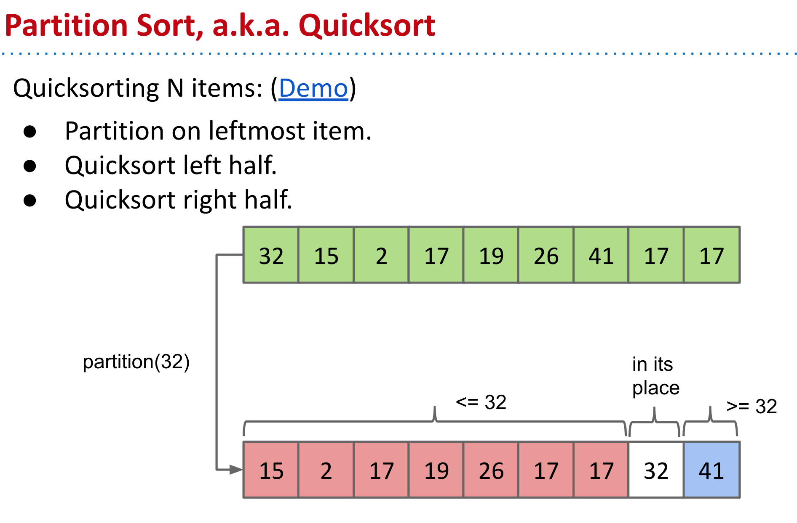
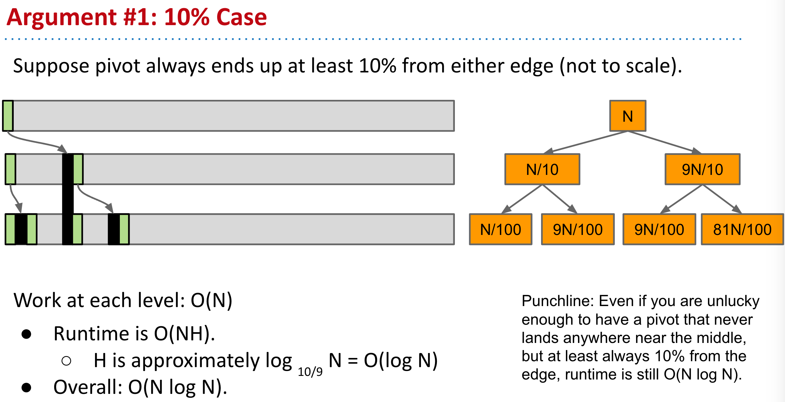
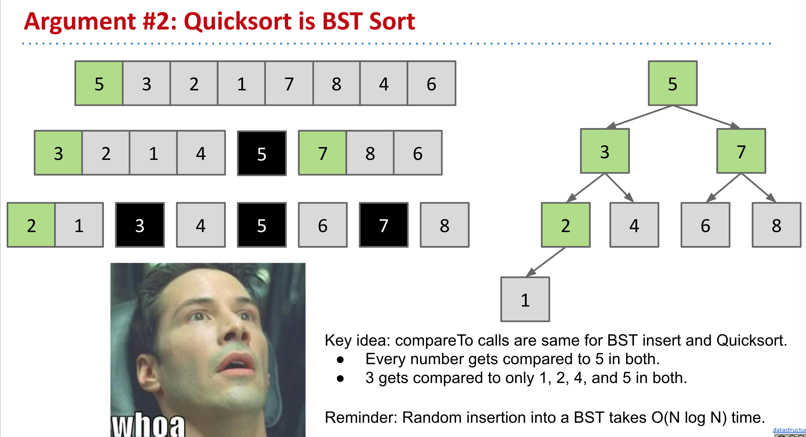
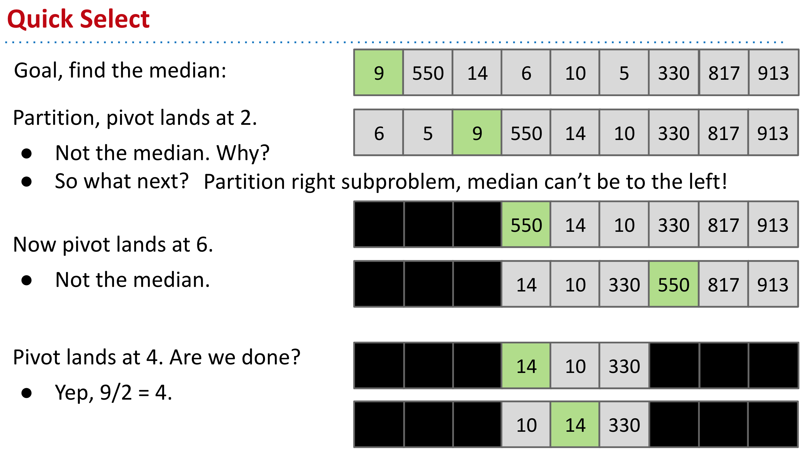
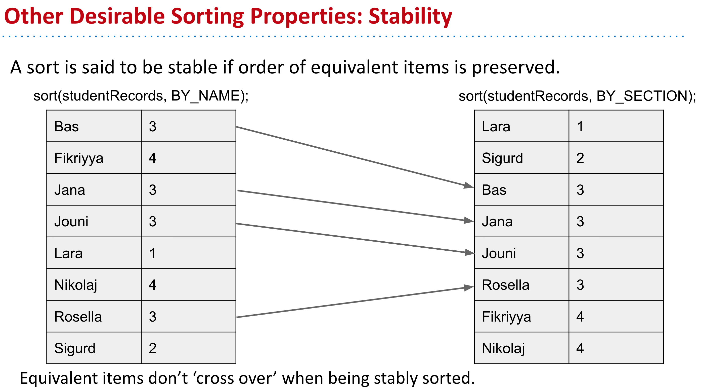
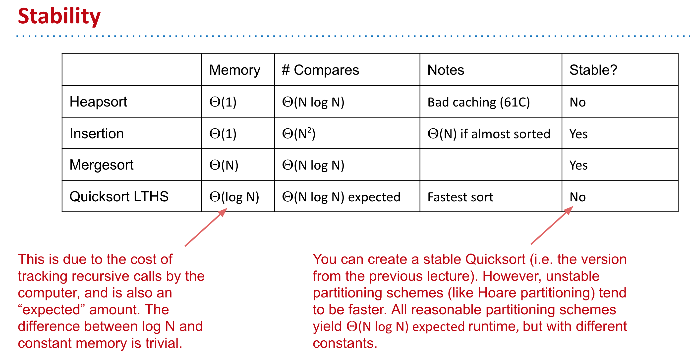
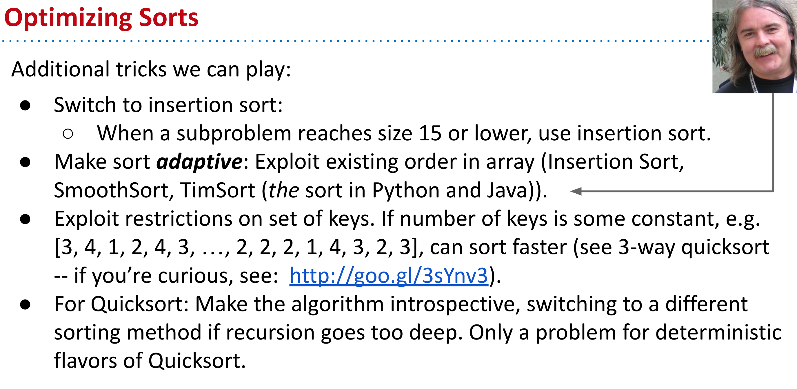

- 
- ### Why Runtime is $$O(N log N)$$
	- 
	- 
- ## Avoiding the Worst Case
	- ### If pivot always lands somewhere “good”, Quicksort is $$Θ(N log N)$$ . However, the very rare  $$Θ(N^2)$$ cases do happen in practice, e.g.
		- Bad ordering: Array already in sorted order (or almost sorted order).
		- Bad elements: Array with all duplicates.
	- ### Four philosophies:
		- 1. **Randomness**: Pick a random pivot or shuffle before sorting.
		- 2. **Smarter pivot selection**: Calculate or approximate the median.
		- 3. **Introspection**: Switch to a safer sort if recursion goes to deep.
		- 4. **Preprocess the array**: Could analyze array to see if Quicksort will be slow. No obvious way to do this, though (can’t just check if array is sorted, almost sorted arrays are almost slow).
- ## Quick Select
	- 
	- ### On average, Quick Select will take $$Θ(N)$$ time.
- ## Other Desirable Sorting Properties
	- ### Stability
		- 
		- 
- ## Optimizing Sorts
	- 
- ## The Sorting Lower Bound
	- ### Any comparison based sort requires at least order $$N log N$$ comparisons in its worst case.
	-