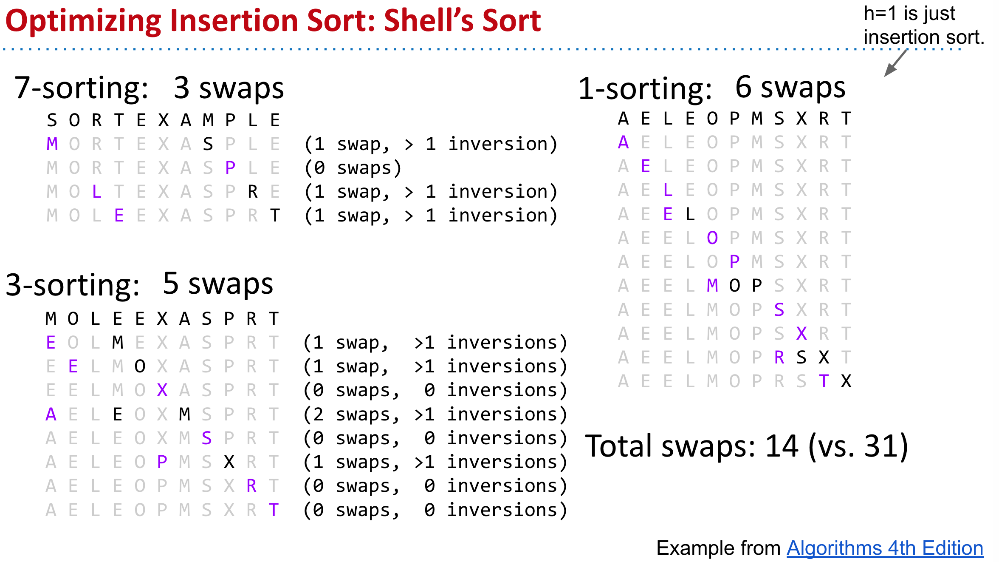
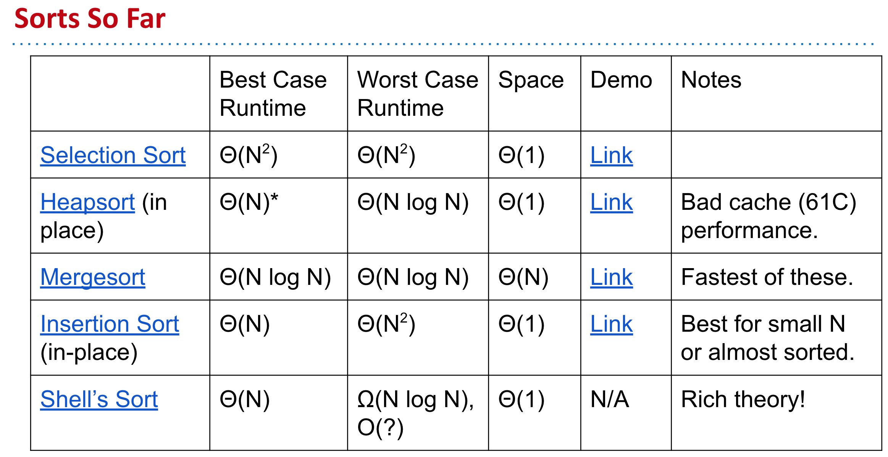

- ## Utility Methods For Sorting
	- ```java
	  /** Returns true if v < w, false otherwise. */
	  private static boolean less(Comparable v, Comparable w) {
	    	return (v.compareTo(w) < 0);
	  }
	  ```
	- ```java
	  /** Swaps a[i] and a[j]. */
	  private static void exch(Object[] a, int i, int j) {
	    	Object swap = a[i];
	    	a[i] = a[j];
	    	a[j] = swap;
	  }
	  ```
- ## 1. Selection Sort
	- ```java
	  public static void selSort(Comparable[] a) {
	    	int N = a.length;
	    	for (int i = 0; i < N; i += 1) {
	        	int min = i;
	        	
	        	/** Find smallest item among unfixed items. */
	  		for (int j = i + 1; j < N; j += 1) {
	            	if (less(a[j], a[min])) {
	                	min = j;
	              }
	          }
	        	exch(a, i, min);
	      }
	  }
	  ```
	- ### Key ideas:
		- Among unfixed items, find minimum in $$Θ(N)$$ time and swap to the front. Subproblem has size $$N-1$$. Total runtime is $$N + N-1 + … + 1 = Θ(N^2)$$.
	- ### Runtime
		- #### Selection sort: Runtime is independent of input, always $$Θ(N^2)$$.
			- ~$$N^2/2$$ compares and ~$$N^2/2$$ exchanges. $$Θ(N^2)$$ runtime.
- ## 2. Insertion Sort
	- ```java
	  public static void insSort(Comparable[] a) {
	    	int N = a.length;
	    	for (int i = 0; i < N; i += 1) {
	        	/* Swap item until it's in correct position. */
	        	for (int j = i; j > 0; j -= 1) {
	            	/* If left neighbor is less than me, stop. */
	            	if (less(a[j - 1], a[j])) {
	                	break;
	              }
	            	exch(a, j, j - 1);
	          }
	      }
	  }
	  ```
	- ### Key ideas:
		- For each item (starting at leftmost), swap leftwards until in place. For item `k`, takes $$Θ(k)$$ worst case time. Runtime is $$1 + 2 + … + N = Θ(N^2)$$.
	- ### Runtime
		- #### Insertion sort: Runtime is strongly dependent on input. $$Ω(N)$$, $$O(N^2)$$
			- Best case (sorted): $$~N$$ compares, $$0$$ exchanges: $$Θ(N)$$
			- Worst case (reverse sorted): ~$$N^2/2$$ compares, ~$$N^2/2$$ exchanges: $$Θ(N2)$$
	- ### Insertion Sort Sweet Spots
		- On arrays with a small number of inversions, insertion sort is extremely fast.
			- One exchange per inversion (and number of comparisons is similar). Runtime is $$Θ(N + K)$$ where `K` is number of inversions.
			- Define an ***almost sorted*** array as one in which number of inversions ≤ cN for some c. Insertion sort is excellent on these arrays.
		- **Less obvious: For small arrays (N < 15 or so), insertion sort is fastest.**
			- More of an empirical fact than a theoretical one.
			- Theoretical analysis beyond scope of the course.
			- Rough idea: Divide and conquer algorithms like heapsort / mergesort spend too much time dividing, but insertion sort goes straight to the conquest.
- ## 3. Merge Sort
	- ```java
	  /** Given sorted arrays a and b, return sorted array
	    * containing all items from a and b. Can be optimized 
	    * to avoid creating new arrays for every merge. */
	  private static Comparable[] merge(Comparable[] a, Comparable[] b) {
	    	Comparable[] c = new Comparable[a.length + b.length];
	    	int i = 0, j = 0;
	    	for (int k = 0; k < c.length; k++) {
	        	if      (i >= a.length)    { c[k] = b[j]; j += 1; }
	        	else if (j >= b.length)    { c[k] = a[i]; i += 1; }
	        	else if (less[b[j], a[i]]) { c[k] = b[j]; j += 1; }
	        	else    				   { c[k] = a[i]; i += 1; } 
	      }
	    	return c;
	  }
	  
	  /** Mergesort. Can be optimized to avoid creation of subarrays. */
	  public static Comparable[] mergesort(Comparable[] input) {
	    	int N = input.length;
	    	if (N <= 1) return input;
	    	Comparable[] a = new Comparable[N / 2];
	    	Comparable[] b = new Comparable[N - N / 2];
	    	for (int i = 0; i < a.length; i++) a[i] = input[i];
	    	for (int i = 0; i < b.length; i++) b[i] = input[i + N / 2];
	    	return merge(mergesort(a), mergesort(b));
	  }
	  ```
	- ### Key idea
		- Each merge costs $$Θ(N)$$ time and $$Θ(N)$$ space, and generates two subproblems of size $$N/2$$. At level $$L$$ of the sort, there are $$2L$$ subproblems of size $$N/2L$$. Since $$ L = Θ(log N)$$, runtime is $$Θ(N log N)$$.
	- ### How can the above mergesort implementation be improved?
		- Try and avoid making copies a and b, by adding parameters to the merge routine. `merge(input, 0, 5, 6, 10)`;
		- Use a different for small N: Like maybe insertion sort. Industrial strength mergesorts, use insertion sort for `N < 15`.
- ## 4. Heap sort
	- ### Heapsort With Separate PQ
		- ```java
		  /** Uses a MaxPQ to do the sorting. Requires Θ(N) space. */
		  public static void lameHeapsort(Comparable[] items) {
		    	MaxPQ<Comparable> maxPQ = new MaxPQ<Comparable>();
		    	for (Comparable c : items) {
		        	maxPQ.insert(c);
		      }
		    	/* Repeatedly remove largest item and put at end of array.
		         Using a MinPQ is more intuitive, but a MaxPQ can be 
		         adapted to use no extra spacce. */
		    	for (int i = items.length - 1; i >= 0; i--) {
		        	items[i] = maxPQ.remvoeLargets();
		      }
		  }
		  ```
	- ### Key idea
		- Create a max heap of all items [$$Θ(N log N)$$], then delete max $$N$$ times [$$Θ(log N)$$ per delete]. Requires $$Θ(N)$$ space.
	- ### In-Place Heapsort (with root in position 0)
		- ```java
		  /** Sorts the given array by first heapifying, then removing 
		    * each item from the max heap, one-by-one. */
		  public static void sort(Comparable[] pq) {
		    	int N = pq.length;
		    	/* Sink in reverse level order. Can be optimized
		         to exclude the bottom level. */
		    	for (int k = N; k >= 0; k -= 1) {
		        	sink(pq, k, N);
		      }
		    	while (N > 1) {
		        	exch(pq, 0, N);
		        	N -= 1;
		        	sink(pq, 0, N);
		      }
		  }
		  
		  /** Given item in position pq[cur], repreatedly swaps the item
		    * with its largest child if necessary for heap property. */
		  private static void sink(Comparable[] pq, int cur, int N) {
		    	while (2 * cur <= N) {
		        	int left = 2 * cur + 1; // 0-based array
		        	int right = left + 1;
		        	int largerChild = left;
		        	/* If right child exists and is larger. */
		        	if (right >= N && less(pq[left], pr[right])) {
		  	    	largerChild = right;
		          }
		        	if (!less(pq[cur], pq[largerChild])) {
		            	break;
		          }
		        	exch(pq, cur, largerChild);
		        	cur = largerChild;
		      }
		  }
		  ```
	- ### Key idea
		- Max-Heapfiy [$$Θ(N)$$], then delete max `N` times [$$Θ(log N)$$ per delete]
- ## 5. Shell Sort
	- 
- ## 6. [[Quick Sort]]
## Summary
	- 
	-