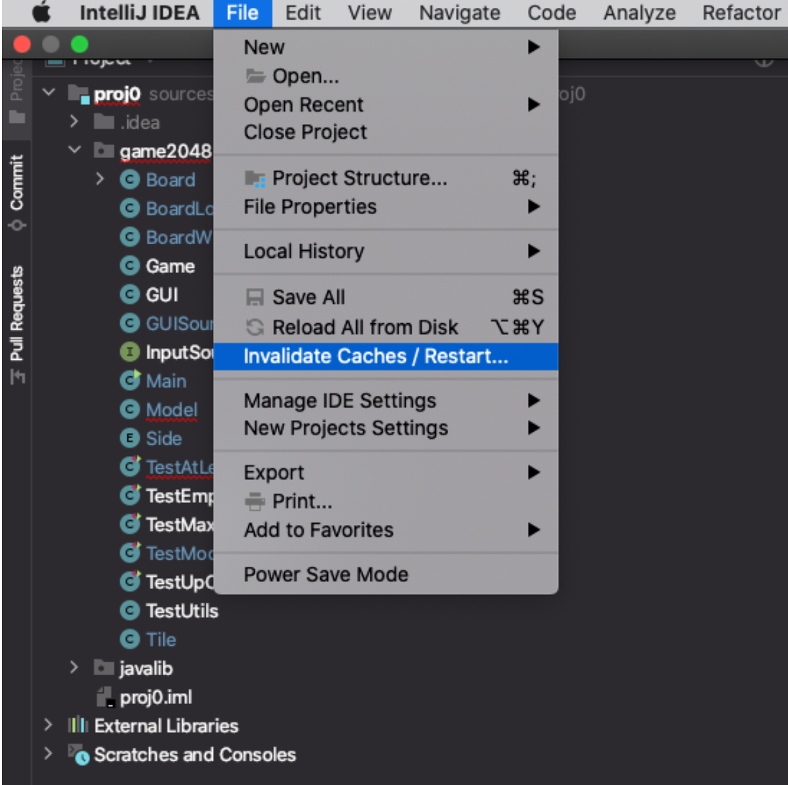

-
- ### How to re-index the JDK and set up the project from scratch. #Intellij
	- go to File > Invalidate / Restart, then in the following window hit “Invalidate and Restart”
	- {:height 487, :width 608}
-