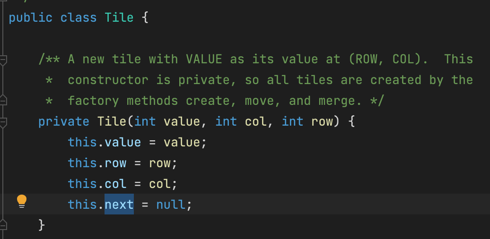

-
- ### How to re-index the JDK and set up the project from scratch. #Intellij
	- go to File > Invalidate / Restart, then in the following window hit “Invalidate and Restart”
	- {:height 487, :width 608}
- ## Private constructor #constructor #java
	- {:height 317, :width 619}
- ## Main Task
	- ```java
	      /**
	       * Tilt the board toward SIDE. Return true iff this changes the board.
	       * <p>
	       * 1. If two Tile objects are adjacent in the direction of motion and have
	       * the same value, they are merged into one Tile of twice the original
	       * value and that new value is added to the score instance variable
	       * 2. A tile that is the result of a merge will not merge again on that
	       * tilt. So each move, every tile will only ever be part of at most one
	       * merge (perhaps zero).
	       * 3. When three adjacent tiles in the direction of motion have the same
	       * value, then the leading two tiles in the direction of motion merge,
	       * and the trailing tile does not.
	       */
	      public boolean tilt(Side side) {
	          boolean changed;
	          changed = false;
	          // TODO: Modify this.board (and perhaps this.score) to account
	          // for the tilt to the Side SIDE. If the board changed, set the
	          // changed local variable to true.
	          board.setViewingPerspective(side);
	          for (int c = 0; c < size(); c++) {
	              changed = tileColumn(c) || changed;
	          }
	          board.setViewingPerspective(Side.NORTH);
	  
	          checkGameOver();
	          if (changed) {
	              setChanged();
	          }
	          return changed;
	      }
	  
	      private int findTargetRow(int row, int col, int ceilingRow) {
	          int value = tile(col, row).value();
	          while (row + 1 < size() && tile(col, row + 1) == null) {
	              row += 1;
	          }
	          if (ceilingRow <= row) return ceilingRow;
	          if (row + 1 < size() && tile(col, row + 1).value() == value) {
	              row += 1;
	          }
	          return row;
	      }
	  
	      private boolean tileColumn(int col) {
	          int ceilingRowTimes2 = 7;
	          // this is a math, the first item: ceiling row is 7 / 2 = 3
	          // the second item: ceiling row is 6 / 2 = 3
	          // the third item: ceiling row is 5 / 2 = 2
	          // the fourth item: ceiling row is 4 / 2 = 2
	          boolean changed = false;
	          for (int r = size() - 1; r >= 0; r--) {
	              Tile currTile = tile(col, r);
	              if (currTile != null) {
	                  int ceilingRow = ceilingRowTimes2 / 2;
	                  int targetRow = findTargetRow(r, col, ceilingRow);
	                  // if we have a different target row than the original one, it's changed.
	                  if (targetRow != r) {
	                      changed = true;
	                  }
	                  // if this is a merge, update the score
	                  if (board.move(col, targetRow, currTile)) {
	                      score += 2 * currTile.value();
	                  }
	                  ceilingRowTimes2--;
	              }
	          }
	          return changed;
	      }
	  ```