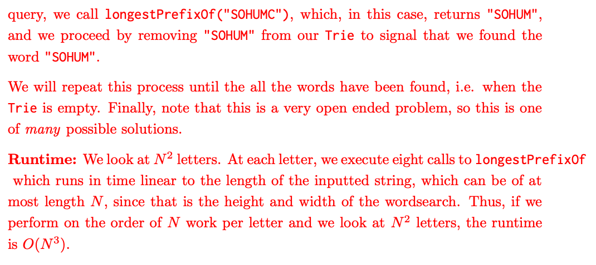

- # Basic
	- 
- # Problem
	- ## LATER 1. A Wordsearch
	  :LOGBOOK:
	  CLOCK: [2023-02-19 Sun 17:50:16]--[2023-02-19 Sun 17:50:16] =>  00:00:00
	  :END:
		- 
		- 
		- 
		- {{video https://www.youtube.com/watch?v=ynUkvpOUTec&list=PLHnsju1DjvZPBjJ-03FP6XBrxhNNRcv3x&index=4}}
- # Leetcode
	- [[1233. Remove Sub-Folders from the Filesystem]]